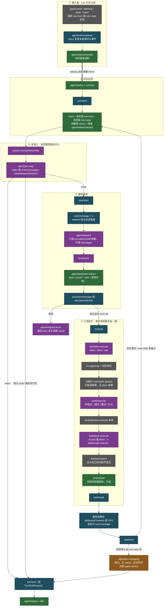

# Agent 循环与工具执行管线

> **本文定位**：`dev_docs` 是 deepseek-harness 的**中文导航层**，不是事实的归属地。回合流程的权威描述归 [`docs/architecture.md`](../docs/architecture.md)，时序细节归 [`docs/agent-lifecycle.md`](../docs/agent-lifecycle.md)，工具管线归 [`docs/tool-execution-pipeline.md`](../docs/tool-execution-pipeline.md)，事件产消清单归生成产物 [`docs/event-producer-consumer.md`](../docs/event-producer-consumer.md)。本文不复述它们，只补一件上游没做的事：把这些拼成一张**拦截决策地图**——你想在哪一步插手，就该挂哪个事件。
>
> **与 `docs/` 冲突时一律以 `docs/` 为准**，并立即修正本文。

## 1. 本文定位与上游事实源

上游按 one-home-per-fact 把这条链路拆在了四个地方：`architecture.md` 讲"回合是什么"，`agent-lifecycle.md` 画时序，`tool-execution-pipeline.md` 画管线，`subsystems/*.md` 定义类型。四篇各自完备，但没有一篇回答工程师最常问的那个问题：**"我要加的这个行为，应该挂在哪一步？"** 本文就是那张地图。

读法只有一条：**先看第 3 节那张图定位阶段，再去第 10 节的配方表找具体挂点，然后顺着链接进 `docs/` 看权威语义。** 中间几节（4–9）是配方表要用到的前置约束，遇到不确定再回头读。

| 你要找的东西 | 权威归属地 |
|---|---|
| 回合流程的文字描述、事件三域的定义 | [`docs/architecture.md#turn-flow`](../docs/architecture.md#turn-flow)、[`#events`](../docs/architecture.md#events) |
| turn / step / round 的规范定义 | [`docs/glossary.md#loop-hierarchy`](../docs/glossary.md#loop-hierarchy) |
| 完整时序图（谁在什么时候对谁说话） | [`docs/agent-lifecycle.md`](../docs/agent-lifecycle.md) |
| 工具管线流程图（含 approval / guard / 归一化分支） | [`docs/tool-execution-pipeline.md`](../docs/tool-execution-pipeline.md) |
| `Agent` 句柄、取消语义、拦截决策类型 | [`docs/subsystems/core.md#the-agent-handle`](../docs/subsystems/core.md#the-agent-handle)、[`#interception-decisions`](../docs/subsystems/core.md#interception-decisions) |
| `agent/*` 事件逐个签名 | [`docs/subsystems/core.md#agent-events`](../docs/subsystems/core.md#agent-events) |
| 工具执行类型（`ToolExecution`、三种 Decision、`ToolGuard`） | [`docs/subsystems/tools.md#execution-extensible-waterfalls-plus-monotonic-policy`](../docs/subsystems/tools.md#execution-extensible-waterfalls-plus-monotonic-policy) |
| `tools/*` 事件逐个签名 | [`docs/subsystems/tools.md#tools-events`](../docs/subsystems/tools.md#tools-events) |
| 瀑布（waterfall）的分发语义 | [`docs/cordis-primer.md#cordis-waterfall-semantics`](../docs/cordis-primer.md#cordis-waterfall-semantics) |
| **每个事件当前有哪些包在产、哪些包在消** | 生成产物 [`docs/event-producer-consumer.md`](../docs/event-producer-consumer.md) |
| 每个工具的模型可见 schema | 生成产物 [`docs/tool-catalog.md`](../docs/tool-catalog.md) |
| 每个插件的可配置字段 | 生成产物 [`docs/config-catalog.md`](../docs/config-catalog.md) |

生成产物**只链接不复制**：它们由 `pnpm run gen-doc-graphs` 一类的生成器从源码重算，手抄一份到这里必然过期。想知道"现在到底谁在监听 `agent/pre-step`"，永远去查 [`docs/event-producer-consumer.md`](../docs/event-producer-consumer.md)，不要信任何文档里的手写清单（包括本文第 10 节的示例列，那只是**举例**，不是清单）。

相关中文兄弟文档：[`architecture_overview.md`](architecture_overview.md) 给整体插件树与启动组合，[`capability_seams.md`](capability_seams.md) 给能力接缝的三角色视角，[`AI_Coding_Context.md`](AI_Coding_Context.md) 给面向 AI 协作的仓库速览。

## 2. turn 与 step 的准确定义

> **上游事实源**：[`docs/glossary.md#loop-hierarchy`](../docs/glossary.md#loop-hierarchy)、[`docs/architecture.md#turn-flow`](../docs/architecture.md#turn-flow)

三个词在这个仓库里各有精确含义，混用会让你把拦截点挂错层：

- **[turn（回合）](../docs/glossary.md#turn)**——一次 session 内对已准入输入的完整排空。它在第一份输入被 claim 之前就打开，在"没有任何东西被欠着"之后才关闭。
- **[step（步）](../docs/glossary.md#step)**——一次模型请求，加上这次响应引发的全部工具执行。**一个 turn 含零个或多个 step。**
- **[round（轮）](../docs/glossary.md#round)**——外层策略的一次迭代，里面包着一个 turn，比如 [goal round](../docs/glossary.md#goal-round) 或一次 [Ralph round](../docs/glossary.md#ralph-round)。round 的计数归那个策略所有，**不等于 session 里的 turn 数**。

三条容易踩的推论：

**turn 可以是零 step 的。** `agent/pre-step` 返回 reject，或者首次 enter 被改写成空消息批，turn 依然会以 `turn/start` / `turn/end` 的形式落进日志——**这次尝试被记录了，只是没花掉模型调用**。所以"turn 数"不是"请求数"的代理指标。

**step 边界是重新 claim 的时机。** 工具还欠着下一次请求、或者 next-step 输入到了，driver 就会在 step 之间再 claim 一次，进入下一个 step，仍在同一个 turn 内。这就是 steering（转向）能在回合中途生效的机制。

**turn/step 边界是持久 session 事件，不是 `agent/*` 通知。** `turn/start`、`turn/end`、`step/start`、`step/end` 都写进日志；想要可重放的记录就消费 `session/event`，`agent/*` 是活的协调 API（详见 [`session_and_events.md`](session_and_events.md)）。

## 3. 一次 turn 的完整时序：拦截决策地图

> **上游事实源**：[`docs/agent-lifecycle.md`](../docs/agent-lifecycle.md)（时序图）、[`docs/tool-execution-pipeline.md`](../docs/tool-execution-pipeline.md)（管线图）、[`docs/architecture.md#turn-flow`](../docs/architecture.md#turn-flow)

上游那两张图分别从"谁对谁说话"和"一次工具调用怎么走完"的角度画。下图是第三个角度：**按时间顺序把整条链路铺开，并给每个节点标注它属于哪一类事件**——因为"这是持久事件还是瀑布"直接决定了你能不能在那里改东西。



**图例（决定你能做什么的关键）：**

| 颜色 | 类别 | 你能做什么 |
|---|---|---|
| 深蓝 | **持久 session 事件**（`turn/*`、`step/*`、`user/message`、`assistant/*`、`tool/*`、`agent/inbox/spliced`） | **只能观察**。它们是可重放的事实。想加新的模型可见输入，就得扩 `SessionEventMap` 并从日志渲染——"模型可见 ⟺ 已记录"是仓库级不变式 |
| 紫 | **瀑布**（`agent/pre-step`、`agent/request`、`agent/request-error`、`llm/stream`、`system-prompt/assemble`、三个 `tools/*`） | **可以改**。监听器拿到 `(...args, next)`，可以改写、可以短路。见第 4 节 |
| 橙 | **串行**（`agent/turn-stopping`） | 可以 `await` 做事，**但没有返回值也没有 `next()`**。要影响结果得靠数据（`agent.steer()`） |
| 绿 | **emit 通知**（`agent/status`、`agent/inbox/*` 三兄弟、`agent/assistant-stream`、`tools/result`） | **只能观察**，观察者异常被容纳，不影响主流程 |
| 灰 | 服务方法 / 定义自有回调 | 直接调用或在自己的工具定义里实现 |

一个上游没有并排讲、但踩过就记住的细节：**`agent/inbox/spliced` 是持久 session 事件，而 `agent/inbox/inserted` / `claimed` / `discarded` 是活的 `agent/*` emit**。整队消费者（UI 队列投影）从 splice 重建 `nextTurn` / `nextStep`；跟踪单条消息的消费者用后三个通知。挑错了，重放时队列就对不上。

分发模式是事件公开契约的一部分，用 `@mode` 标注并由生成的 catalog 校验，见 [`docs/cordis-primer.md#dispatch-modes`](../docs/cordis-primer.md#dispatch-modes)。

## 4. 瀑布契约：为什么监听器必须调用 `next()`

> **上游事实源**：[`docs/cordis-primer.md#cordis-waterfall-semantics`](../docs/cordis-primer.md#cordis-waterfall-semantics)、仓库根 [`AGENTS.md`](../AGENTS.md) 的 Conventions 一节

Cordis 的 `waterfall` 是**环绕式中间件**（around-middleware）：监听器签名是 `(...args, next)`，调用 `next()` 把（可能已被包装的）结果委托给下一个监听器，**不调用 `next()` 就短路整条链**。值通过 `next()` 的返回值向上传播。

仓库根 `AGENTS.md` 把这条写成了标准命令：**瀑布监听器必须调用 `next()` 来委托；不调用就短路整条链。**

**不调用会怎样？** 短路本身不是 bug，是设计——单一决策事件（比如某个策略插件确实拥有这次拒绝）就该短路。真正的 bug 是**只想观察或只想附加一点东西却忘了委托**：

- 挂在 `agent/pre-step` 上只想加一条时间上下文，却直接返回自己造的 decision → 下游所有插件的注入全丢，压缩策略、skill 注入、hook 桥接一起失效。
- 挂在 `tools/post-execute` 上只想计数，却返回 `{ kind: 'accept' }` → 后面的 spill 落盘、hook 反馈、搜索结果改写全部消失。
- 更隐蔽的一种：调用了 `next()`，但**用字面量重建返回值而不是展开下游结果**，把下游写在别的字段上的声明（如 `startsRequestSeries`、`additionalContexts`）悄悄丢掉。第 5 节专门讲这个。

**正例：`tools/execute` 的超时包装器。** 这是环绕式的教科书写法——先判断该不该介入，不该介入就 `return next()` 原样委托；该介入就在 `next()` 前后做手脚，并保证 `finally` 里恢复现场：

`packages/guard/timeout-policy/src/index.ts:56-80`（symbol: `apply`）

```ts
  ctx.on('tools/execute', async (exec, next): Promise<ToolExecutionResult> => {
    const timeoutMs = ctx.tools.get(exec.name, exec.agent)?.timeoutMs
    // A tool that declares no budget: no deadline, delegate unchanged.
    if (timeoutMs === undefined) return next()

    using d = deadline(exec.signal, timeoutMs, TOOL_TIMEOUT)
    // Swap the derived deadline onto exec for dispatch, then restore the
    // caller's own signal so post-execute listeners never see this plugin's
    // (possibly already-aborted) timeout signal.
    const upstream = exec.signal
    exec.signal = d.signal
    try {
      const result = await next()
      // If OUR timer fired (scoped by code — a nested outer deadline reads as
      // undefined here), the tool/capability saw the abort and reached
      // quiescence; replace whatever it returned (its own abort result) with the
      // structured TOOL_TIMEOUT the model sees.
      if (timeoutOf(d.signal, TOOL_TIMEOUT) !== undefined) {
        return toolTimeoutResult(timeoutMs)
      }
      return result
    } finally {
      exec.signal = upstream
    }
  })
```

三个可复用的要点：**（a）** 不介入的路径是 `return next()`，一个字都不多；**（b）** 替换 `exec.signal` 后在 `finally` 恢复，让下游的 `tools/post-execute` 看到的是调用方自己的 signal，而不是这个插件（可能已 abort 的）超时 signal；**（c）** 它用自己拥有的 code 给 deadline 打标，所以嵌套的外层超时不会被误读成自己的。

**正例：`tools/post-execute` 的"先委托后折叠"。** 想附加东西又不想抢走下游决策权，就先 `await next()` 拿到下游结果，再把自己的东西叠上去：

`packages/guard/repeat-tool-reminder/src/index.ts:213-224`（symbol: `apply` 内的 `tools/post-execute` 监听器）

```ts
  ctx.on('tools/post-execute', async (exec, _result, next): Promise<PostToolDecision> => {
    const reminder = observe(exec)
    const downstream = await next()
    if (!reminder) return downstream
    if (downstream.kind === 'block') {
      return { kind: 'block', feedback: downstream.feedback, additionalContexts: prependContext(reminder, downstream.additionalContexts) }
    }
    return {
      ...downstream,
      additionalContexts: prependContext(reminder, downstream.additionalContexts),
    }
  })
```

注意它对两个 decision 变体分别处理，并且都保留了下游的 `additionalContexts`——`prependContext` 把自己的消息放在前面而不是覆盖。`{ ...downstream, ... }` 展开是关键：`accept` 变体上还有 `content` / `value` 字段，字面量重建会把它们抹掉。

需要在普通注册之前运行时，用 `ctx.on(..., { prepend: true })`——`packages/context/time-context/src/index.ts:220` 就是这么做的。

## 5. `agent/pre-step`：决定模型看到什么

> **上游事实源**：[`docs/subsystems/core.md#interception-decisions`](../docs/subsystems/core.md#interception-decisions)、[`docs/subsystems/core.md#agentpre-step--waterfall`](../docs/subsystems/core.md#agentpre-step--waterfall)、[`docs/architecture.md#turn-flow`](../docs/architecture.md#turn-flow)

`agent/pre-step` 是**唯一能改写进入本步的模型消息**的瀑布链——注意不是"请求推导之前唯一的瀑布"：同一个 `preStep()` 里 `system-prompt/assemble` 先于它派发（`packages/core/agent-loop/src/agent.ts:242`），请求侧还有 `agent/request` 与 `llm/stream`，但 `agent/request` 明确不能改 messages。它拿到的 payload 是：`agent`（发起的 agent）、本步独占的已 claim 批次（`messages`）、拟进入的坐标（`turn`、`step`）、以及当前 turn 的取消 `signal`。它返回 `PreStepDecision`：`reject`（不开这一步）或 `enter`（带上完整的消息批次，可选 `startsRequestSeries`）。

driver 提供的**终端默认决策**长这样——它就是"你不改的话会发生什么"：

`packages/core/agent-loop/src/agent.ts:246-252`（symbol: `ReactLoopAgent.preStep`）

```ts
    const decision = await this.dispatch.waterfall(
      'agent/pre-step', { messages: claimed, ...position, signal },
      (): Promise<PreStepDecision> => Promise.resolve<PreStepDecision>({
        kind: 'enter',
        messages: context === undefined ? claimed : [...claimed, context],
      }),
    )
```

**四件你可以在这里做的事，以及各自的代价：**

**（a）reject —— 不开这一步。** 已 claim 的批次**保持被删除状态**（不回滚回 inbox），已打开的 turn 不花任何 step。如果这是首次 claim，日志里仍会留下一个 `turn/start` / `turn/end` 对，`TurnEndReason` 记为 `blocked`。真实用例：hook 桥接把外部 SessionStart/UserPromptSubmit 钩子的否决映射过来（`packages/hooks/hooks-claude-code`），goal 驱动发现预约失效时撤回本轮（`packages/goal/goal-round-driver/src/index.ts:423`）。

**（b）enter + 重写 messages —— 改模型看到的内容。** 最常见的用法是**追加**上下文。写法模板是"先委托、检查 reject、再展开追加"：

`packages/context/time-context/src/index.ts:180-186`（symbol: `apply` 内的 `agent/pre-step` 监听器）

```ts
  ctx.on('agent/pre-step', async (
    { agent, turn, step, signal },
    next,
  ): Promise<PreStepDecision> => {
    const decision = await next()
    if (decision.kind === 'reject' || signal.aborted) return decision
    const now = Date.now()
```

第 185 行那句是必写的：**下游可能已经 reject 了，`decision.messages` 在 reject 变体上根本不存在**；同时 `signal.aborted` 说明这个 turn 已被取消，再做工作是浪费。

**（c）`startsRequestSeries: true` —— 开一个新的模型消息序列。** 设了它，loop 会记一条新的 `request/header`（reason 为 `series`；如果同时 envelope 也变了，则记 `change` 并带 `startsSeries: true`）。goal 驱动就是用它把每一轮 goal round 标成独立序列：

`packages/goal/goal-round-driver/src/index.ts:419-425`（symbol: `apply` 内的 `agent/pre-step` 监听器）

```ts
      if (!valid) {
        state.attempt = undefined
        restoreOtherClaimed(agent, decision.messages, submitted.id)
        requestDrive(state)
        return { kind: 'reject' }
      }
      return { ...decision, startsRequestSeries: true }
```

**（d）纯观察 / 纯重置 —— 什么都不改，直接 `return next()`。** 第 8 节的循环卫生守卫用的就是这一招。

**最容易犯的错：重建 enter decision 时不展开。** `{ kind: 'enter', messages }` 看起来完整，但它会丢掉下游设置的 `startsRequestSeries`。规范写法永远是 **`{ ...decision, messages }`**。上游把这条写进了 [`docs/architecture.md#turn-flow`](../docs/architecture.md#turn-flow) 和 [`docs/agent-lifecycle.md`](../docs/agent-lifecycle.md)：返回的决策是权威的，包装 `next()` 的监听器**除非有意替换，否则必须保留下游的 messages 和 `startsRequestSeries`**。

还有两点边界：**已 claim 但被最终决策省略掉的消息，保持被删除**（不会自己回到 inbox，要还就得自己塞回去，`restoreOtherClaimed` 就是干这个的）；**claim 之后才插入的输入保持 pending**，等下一次 claim。

每个 step 都会读取插件注册的 prompt sections 和 tool schemas——那是 `system-prompt/assemble` 瀑布的地盘，见 [`prompt_management.md`](prompt_management.md)。

## 6. inbox 与 `agent.inject()`：输入怎么进来

> **上游事实源**：[`docs/subsystems/core.md#the-agent-handle`](../docs/subsystems/core.md#the-agent-handle)

输入只有**一个 inbox** 通往 driver，但 inbox 内部是**两条有序队列**：`next-turn` 和 `next-step`（`InboxTarget`）。统一入口是 `agent.send(message, target, wakeup)`，另外三个方法是它的固定预设别名：

| 方法 | target | wakeup | 语义 |
|---|---|---|---|
| `followup(message)` | `next-turn` | 是 | 排一个普通后续回合；该条成为它自己那个 turn 的唯一普通消息 |
| `steer(message)` | `next-step` | 是 | 转向：idle 时开一个新 turn，running 时在下一个 step 边界被消费 |
| `inject(message)` | `next-step` | **否** | 塞模型可见上下文，**不唤醒 driver** |

**`inject()` 的认领时机是最容易误解的地方。** 它不唤醒任何东西：running 的 driver 会在**最近的后续 step 边界**认领它；idle 的 driver 会让它一直挂着，直到某条 followup 或 steer 把 driver 唤醒。而且它**可能错过某次请求**——如果那一步的 pre-step 已经完成了自己的 claim，注入的内容就只能等下一步。取消或释放（dispose）可能丢弃 pending 的注入。

一句话判断：**要保证"下一次模型请求一定看得到"，不能只 `inject()`，必须有一条会唤醒的消息跟上。**

`claim(target)` 做的是"纯删除 splice"——它移除拟进入步的批次（全部 `next-step` 输入，加上在 turn 边界时的一条 `next-turn` 消息），**不发 discarded 通知**；inbox 自己在 `claim()` 里按条发 `agent/inbox/claimed`（`packages/core/agent/src/inbox.ts:76`）。相对地，普通的 `remove()` / `clear()` 才是取消，会发 discarded。

`agent/session-start` 是唯一在第一个 turn 之前触发一次的时机，上游明确建议在那里用 `agent.inject()` 播种模型可见上下文（它是通知，不是否决点）。

## 7. 工具执行三阶段

> **上游事实源**：[`docs/tool-execution-pipeline.md`](../docs/tool-execution-pipeline.md)、[`docs/subsystems/tools.md#execution-extensible-waterfalls-plus-monotonic-policy`](../docs/subsystems/tools.md#execution-extensible-waterfalls-plus-monotonic-policy)

`ctx.tools.execute()` 把一次调用依次送过：`tools/pre-execute` → 注册的 monotonic guards → `tools/execute` → `tools/post-execute` → 可选的定义自有 `finalizeContent` → `tools/result`。上游那张流程图还画了 approval、异常归一化、UI 卡片等分支，本节只回答一件事：**每个阶段你能做什么、不能做什么。**

| 阶段 | 模式 | 决策类型 | 能做 | **不能做** |
|---|---|---|---|---|
| `tools/pre-execute` | waterfall | `PreToolDecision`：`allow` / `deny` / `ask` | 放行、拒绝、发起一次性询问 | **不能改写 arguments**——参数早已写进 `tool/call` 日志并渲染到 UI，历史、审计、UI、执行必须一致 |
| monotonic guards（`ctx.tools.guard()`） | 服务方法 | `string \| undefined` | 返回 reason 作最终拒绝 | **没有 allow 结果**——只能减权限，所以注册顺序无法把别人的拒绝翻案 |
| `tools/execute` | waterfall | `ToolExecutionResult` | 环绕式包装：超时、重试、打点；**唯一能替换 `signal` 的位置** | 不能移除 signal；registry 会把每次替换与调用方 signal 重新融合 |
| 工具本体 `execute()` | 定义自有 | — | 干活；`deferContext()` 挂上下文；`concludeTurn()` 标记本回合终结 | 文件系统改动仍要过 `fs/write-intent` / `fs/edit-intent` |
| `tools/post-execute` | waterfall | `PostToolDecision`：`accept` / `block` | 替换 `content` **或** `value`（二选一）、附加 `additionalContexts`、把纠正反馈变成错误结果 | **不能同时替换 content 和 value**；`block` 会清掉 value 并变成 `isError` |
| `finalizeContent` | 定义自有回调 | — | 强制该工具自己的同步内容不变式 | 只碰 content |
| `tools/result` | emit | — | 观察冻结的权威结局（审计、遥测） | **不能改任何东西**；观察者异常被容纳 |

几条跨阶段的真实约束：

**`ask` 的语义比想象中严格。** `ctx.approval` 只有返回 `allowed-once` 才继续；非授权、缺少 approval 通道或服务、以及没有 agent 的请求，一律变成拒绝。这意味着**你不能靠"没有 approval 服务时默认放行"来做降级**。

**被拒绝的调用照样走完 post-execute。** registry 把 deny 也送进同一条管线，所以计数类、审计类的 post-execute 监听器会看到它——`repeat-tool-reminder` 正是靠这一点抓住"模型反复撞同一个被拒调用"。

**内容替换是展示策略，不是保密策略。** `accept` 的 content 替换保留了原始 canonical `value` 和已有 metadata。要真正藏掉程序可见的值，必须 `block` 或者替换 `value`。

**`additionalContexts` 的追加时机在整批之后。** 它不是紧跟在这一条 `tool/result` 后面插入，而是在**整个工具批次结算完、全部 `tool/result` 都记完**之后，按 FIFO 追加为 `user/message`。PTC 模式的子调用**不带** `additionalContexts`，以保持 call/result 相邻。

**未知工具和抛异常的工具都变成结构化错误**（`ToolNotFoundError` 映射到 `UNKNOWN_TOOL`），**调用失败但回合不结束**。

调度层面：loop 先按 `ToolExecutionMode` 给每个待执行调用分类，`exclusive` 独占并形成排序屏障，`parallel` 进入有界滚动池；策略、持久结果和结果上下文始终保持模型顺序。实现见 [`packages/core/agent-loop/src/tool-calls.ts`](../packages/core/agent-loop/src/tool-calls.ts)，注册与执行契约见 [`packages/core/tools/README.md`](../packages/core/tools/README.md)。

## 8. 超时与循环卫生守卫

> **上游事实源**：[`packages/guard/README.md`](../packages/guard/README.md)、[`packages/guard/timeout-policy/README.md`](../packages/guard/timeout-policy/README.md)、[`packages/guard/repeat-tool-reminder/README.md`](../packages/guard/repeat-tool-reminder/README.md)

[`packages/guard/`](../packages/guard/) 只有两个插件，但它们是"在正确的阶段挂正确的钩子"的最佳范本，两个都默认随 `dsh-base` bundle 启用。

**`timeout-policy` —— 协作式超时，挂 `tools/execute`。** 时限来自每个工具自己的 `timeoutMs` 声明（registry 在注册时校验它必须是正的有限数），插件本身零配置。它的关键性质是**协作式**：它只能通过 `exec.signal` 请求工具停止，**不会 race 掉、也不会抛弃 tool promise**。一个忽略取消信号的工具会继续跑并继续拖着调用方，直到它自己结算。代码见第 4 节的正例。

设计上有一处值得学：超时结果里的 `error.code` 与内部 deadline 分类码是**同一个** `TOOL_TIMEOUT` 常量，所以重试插件、沙箱插件乃至重放都能按它路由；而 `timeoutOf(d.signal, TOOL_TIMEOUT)` 按 code 作用域判断，让嵌套的外层 deadline（另一个 `tools/execute` 包装器先触发的定时器）读成普通的上游取消，而不是被误认成自己的超时。

**`repeat-tool-reminder` —— 重复调用检测，挂两个事件。** 它是**纯建议性**的：只在 post-execute 决策上附加日志化的模型上下文，**从不否决也不改写调用**。两个挂点分工明确：

- `tools/post-execute` **计数**——理由在源码注释里写得很清楚：被拒的调用也流经这条瀑布，而"模型不停撞一个被拒的调用"正是最该打断的循环。
- `agent/pre-step` **重置**——用户插话就说明上下文变了，跨越插话的重复不算循环。这是一个纯重置钩子，永远委托：

`packages/guard/repeat-tool-reminder/src/index.ts:229-232`（symbol: `apply` 内的 `agent/pre-step` 监听器）

```ts
  ctx.on('agent/pre-step', ({ agent, messages }, next): Promise<PreStepDecision> => {
    if (messages.some(message => message.source.kind === 'user')) chains.delete(agent)
    return next()
  })
```

四行里有三个可复用的判断：per-agent 状态用 `WeakMap<Agent, …>` 存（agent 释放即回收）；直接 `ctx.tools.execute()` 的调用方没有 agent 也没有模型可提醒，所以 `exec.agent` 为空就跳过；注入的提醒必须打上 `{ kind: 'plugin' }` 的 source——**没标注的上下文会在派生历史里渲染成用户 prompt**。

配置字段（`thresholds`、`include`、`exclude`、`argumentsPreviewChars`）以生成的 [`docs/config-catalog.md`](../docs/config-catalog.md) 为准。它遵循仓库的"配置错误必须响亮失败"约定：空 thresholds、非整数、小于 2、重复值，一律在插件加载时抛错，绝不静默回退。

## 9. 取消与错误恢复

> **上游事实源**：[`docs/subsystems/core.md#the-agent-handle`](../docs/subsystems/core.md#the-agent-handle)、[`docs/subsystems/core.md#agentrequest-error--waterfall`](../docs/subsystems/core.md#agentrequest-error--waterfall)、[`docs/subsystems/session.md#why-a-turn-ended-turnendreasonmap`](../docs/subsystems/session.md#why-a-turn-ended-turnendreasonmap)

**取消。** `agent.cancel(cause, options)` 清掉排队和转向中的工作（除非传 `keepInbox`），并中止活跃的 turn 或回合间任务。`AgentCancelCause` 是四个变体的闭合联合：`user` / `parent` / `hook`（带 reason）/ `disposed`。**同一次活动的第一个 cause 获胜**；没有活跃活动时取消是 no-op，**不会给后续工作"预埋"取消**。

活跃的取消持有者把 cause 复制进运行时的 `AbortSignal.reason`，但**signal 本身不授予监听器任何分类权威**——想知道"为什么被取消"，读持久 `turn/end` 里的 `{ kind: 'aborted', reason: TurnEndCancelCause }`，那才是权威落点。

取消后未派发的模型工具调用会收到合成的 `tool/call` 加 `ABORTED_BEFORE_DISPATCH` 结果对，保证 call/result 成对；被取消的流会把已经交付给用户的文本定稿，所以下一次请求里包含的正是用户看到的内容。

**错误恢复的分界线要记清楚**（这条上游写在 [`packages/core/agent-loop/README.md`](../packages/core/agent-loop/README.md) 里，容易漏）：

- **最终 adapter 选择、派发、迭代失败** → 作为终端 finish 到达，进入 `agent/request-error` 瀑布。处理方返回 `{ kind: 'retry' }` 且**不调用 `next()`**；默认的 `undefined` 让失败保持终结。
- **中间件、结果处理、工具及其他扩展失败** → **保持抛出并直接关闭回合**。插件失败结束的是回合，不是整个 loop。

`agent/request-error` 的运行窗口很窄但很有用：**在失败的 step 关闭之后、它所属的 turn 关闭之前**，此时失败 turn 的 signal 仍然有效。这就是 `compaction-basic` 能在上下文溢出时修复持久状态、并只在裁剪或摘要真的推进了 surface 替换代数时才**授权同一 step 内的一次新请求尝试**的原因；否则原始请求错误保持权威。注意 retry **不开新 turn、也不开新 step**——`step()` 内是一个 `while (true)` 循环，`turn` 与 `step` 在进入循环前就已解构固定，`{ kind: 'retry' }` 只是 `continue`（`packages/core/agent-loop/src/agent.ts:344`，symbol: `ReactLoopAgent.step`）。真实消费者还有 `packages/llm/llm-retry`。

另外，`agent/error`（emit）报告 step 或 turn 出错——**即使这个错误没有对应的回合内位置可写持久记录**。做 UI 和遥测时两者都要接：`agent/error` 给活的信号，`turn/end` 的 `TurnEndReason` 给可重放的结论。

`whenIdle()` 观察的是**整个 agent** 的静默，会跟随在被观察 driver 退休前启动的替换工作，但**不标识任何一条特定消息的结算**。`followup()` 也不返回句柄——它的 `MessageId` 标识的是持久的 inbox 插入、认领、丢弃事实，**不是之后某个助手输出或回合结束**。

## 10. 拦截配方：我想做 X → 挂哪儿 → 注意什么

> **上游事实源**：[`docs/architecture.md#where-new-behavior-goes`](../docs/architecture.md#where-new-behavior-goes)（扩展点总表）、[`docs/event-producer-consumer.md`](../docs/event-producer-consumer.md)（当前产消关系）

上游的"Where new behavior goes"表按**能力**组织（加模型提供方、加工具、加命令……）。本表按**时刻**组织：你已经知道要在回合的哪一步插手，缺的是挂点和坑。"参考实现"列是**举例**，不是完整清单——完整清单永远查生成的事件矩阵。

**`agent/*` 域：控制模型看到什么、请求怎么发、回合怎么结束**

| 我想做什么 | 挂哪儿 | 注意什么 | 参考实现 |
|---|---|---|---|
| 每步给模型追加时间 / 环境 / 会话引用上下文 | `agent/pre-step`（先 `await next()`，再 `{ ...decision, messages: [...] }`） | 必须先检查 `decision.kind === 'reject'` 和 `signal.aborted`；注入消息要打 `{ kind: 'plugin' }` source，否则在派生历史里渲染成用户 prompt | [`packages/context/time-context`](../packages/context/time-context)、[`packages/context/session-reference`](../packages/context/session-reference)、[`packages/context/agent-instructions`](../packages/context/agent-instructions) |
| 在上下文窗口撑爆前压缩历史 | `agent/pre-step`（压力检测）+ `agent/request-error`（溢出兜底） | 两个触发器都要；只有裁剪或摘要**推进了 surface 替换代数**才授权同一 step 内重发一次请求（不开新 turn/step），否则原始错误保持权威 | [`packages/compaction/compaction-basic`](../packages/compaction/compaction-basic) |
| 否决这一步（外部 hook 说不） | `agent/pre-step` 返回 `{ kind: 'reject' }` | 已 claim 的批次**保持被删除**，不会自动回到 inbox；首次 claim 被 reject 仍会留下一个零 step 的持久 turn | [`packages/hooks/hooks-claude-code`](../packages/hooks/hooks-claude-code)、[`packages/hooks/hooks-codex`](../packages/hooks/hooks-codex) |
| 撤回一步并把别人的消息还回队列 | `agent/pre-step` 返回 reject **之前**自己把消息塞回 inbox | claim 是纯删除，loop 不替你回滚 | [`packages/goal/goal-round-driver`](../packages/goal/goal-round-driver)（`restoreOtherClaimed`） |
| 开一个新的模型消息序列（换 persona、换路由后重置） | `agent/pre-step` 的 enter 上设 `startsRequestSeries: true` | 必须 `{ ...decision, startsRequestSeries: true }`；字面量重建会丢下游的 messages | [`packages/goal/goal-round-driver/src/index.ts:425`](../packages/goal/goal-round-driver/src/index.ts) |
| 按会话动态换 provider / model / maxTokens / reasoningEffort | `agent/request` | **不能改 messages**——模型可见内容必须走已记录的通道；`await next()` 拿到 loop 本会使用的 config，返回替换值来切换 | [`packages/webhook/webhook`](../packages/webhook/webhook) |
| 模型请求失败后按策略重试 | `agent/request-error` 返回 `{ kind: 'retry' }` 且**不调用 `next()`** | 只覆盖最终 adapter 失败；中间件 / 工具 / 扩展异常**不走这里**，它们直接关闭回合 | [`packages/llm/llm-retry`](../packages/llm/llm-retry) |
| 在回合真正结束前再插一脚（跑收尾 hook、决定要不要续） | `agent/turn-stopping`（serial） | **没有 `next()` 也没有返回值**；要让回合继续，方式是调 `agent.steer(...)` 让 loop 重读 inbox。数据决定结果，所以监听器顺序无关 | [`packages/hooks/hooks-claude-code`](../packages/hooks/hooks-claude-code) |
| 不唤醒 driver 地塞一条模型可见上下文 | `agent.inject()` | 可能错过已完成 claim 的那一步；idle 时会一直挂着直到有 waking 消息；取消或释放可能丢弃它 | [`packages/core/agent/README.md`](../packages/core/agent/README.md) |
| 在第一个 turn 之前播种上下文 | 监听 `agent/session-start`，在里面 `agent.inject()` | 它是通知不是否决点；lifecycle owner 请求的释放会在 driver 启动前被重新检查 | [`packages/goal/goal`](../packages/goal/goal) |
| 让拦截只对某一个 agent 生效 | 用 `agent.ctx` 注册监听器 / 工具 / prompt section | scope 是**两级扁平**的：scoped 注册**不向 subagent 继承**；子树行为用 lineage 数据表达，不用 scope 结构 | [`docs/subsystems/scope.md`](../docs/subsystems/scope.md)、[`docs/glossary.md#agent-scope`](../docs/glossary.md#agent-scope) |
| 做可重放的转录 / 持久投影 | 消费 `session/event`，**不要**用 `agent/*` | `agent/*` 是活的协调 API（队列、状态、拦截、构造、转向、续跑、错误）；只有日志能重放 | [`docs/subsystems/session.md`](../docs/subsystems/session.md) |
| 做增量 UI（打字机效果） | `agent/assistant-stream` 的 start / chunk / end | chunk 帧是**瞬态进程本地**的；重放要读 `assistant/message` 或 `assistant/attempt` 两种持久结算之一 | [`docs/subsystems/core.md#agentassistant-stream--emit`](../docs/subsystems/core.md#agentassistant-stream--emit) |

**`tools/*` 域：控制工具调用怎么被批准、怎么执行、结果怎么回到模型**

| 我想做什么 | 挂哪儿 | 注意什么 | 参考实现 |
|---|---|---|---|
| 按策略允许 / 拒绝 / 询问某次调用 | `tools/pre-execute` 返回 `allow` / `deny` / `ask` | **不能改写 arguments**（已入日志和 UI）；`ask` 只有 `allowed-once` 才放行，缺 approval 服务一律变拒绝 | [`packages/hooks/hooks-claude-code`](../packages/hooks/hooks-claude-code)、[`packages/jobs/tool-jobs`](../packages/jobs/tool-jobs) |
| 下一个**不可翻案**的最终拒绝 | `ctx.tools.guard()` 注册 monotonic guard | guard 没有 allow 结果，只能减权限，所以注册顺序无法把拒绝变回许可；用普通 context 注册是全局的，用 `agent.ctx` 注册只对该 agent 生效 | [`docs/subsystems/tools.md#ctxtools--toolruntime`](../docs/subsystems/tools.md#ctxtools--toolruntime) |
| 给工具调用加超时 / 重试 / 打点（环绕式） | `tools/execute` | **唯一能替换 `signal` 的位置**，且替换后必须在 `finally` 恢复；不要 race 掉或抛弃 tool promise | [`packages/guard/timeout-policy`](../packages/guard/timeout-policy) |
| 改写工具结果的模型可见内容 | `tools/post-execute` 返回 `{ kind: 'accept', content }` | content 与 value **只能改一个**；content 替换保留原 canonical value，**是展示策略不是保密策略** | [`packages/fs/tool-fs-search`](../packages/fs/tool-fs-search) |
| 把超大结果落盘 / 截断后再给模型 | `tools/post-execute` | 完整结果（含包装与 metadata）的界限在这一步才完全已知 | [`packages/spill/spill-policy`](../packages/spill/spill-policy) |
| 把纠正反馈变成错误结果，逼模型改路 | `tools/post-execute` 返回 `{ kind: 'block', feedback }` | block 会**清掉 value** 并变成 `isError`；`additionalContexts` 在 block 变体上同样可带 | [`packages/hooks/hooks-codex`](../packages/hooks/hooks-codex) |
| 在工具结果之后追加一条模型可见上下文 | pre / post decision 的 `additionalContexts`，或工具体内 `deferContext()` | 追加发生在**整批 `tool/result` 都记完之后**，按 FIFO；PTC 子调用不带它，以保持 call/result 相邻 | [`packages/guard/repeat-tool-reminder`](../packages/guard/repeat-tool-reminder) |
| 检测模型原地打转并提醒 | `tools/post-execute` 计数 + `agent/pre-step` 重置 | 先 `await next()` 再折叠；**被拒的调用也走 post-execute**，正好用来抓"反复撞被拒调用" | [`packages/guard/repeat-tool-reminder`](../packages/guard/repeat-tool-reminder) |
| 只观察最终结局（审计、遥测、副作用触发） | `tools/result`（emit） | 拿到的 execution 与 result 都已冻结，**改不了**；观察者异常被容纳不影响主流程 | [`packages/context/agent-instructions`](../packages/context/agent-instructions) |
| 让一次成功的工具调用直接结束回合 | 工具体内调 `concludeTurn()` | 数据决定，不是事件顺序决定；它**不短路**同批的 `additionalContexts` 或竞态的 steering，回合要等那些排空才关 | [`docs/subsystems/tools.md#execution-extensible-waterfalls-plus-monotonic-policy`](../docs/subsystems/tools.md#execution-extensible-waterfalls-plus-monotonic-policy) |
| 给某个 agent 缩小可见工具集 | `ctx.tools.restrict()`（scope 级） | 限制过滤的是**全局**工具集（多个限制按交集组合），scope 本地注册在过滤之后合并；被过滤掉的全局工具**既不出现在 prompt 也拒绝执行**，与不存在无法区分 | [`docs/subsystems/tools.md#toolrestriction--one-scopes-live-filter-over-what-it-inherits`](../docs/subsystems/tools.md#toolrestriction--one-scopes-live-filter-over-what-it-inherits) |
| 拦截文件系统改动本身 | `fs/*` 事件（`fs/write-intent` / `fs/edit-intent`），**不是** `tools/*` | 读改前检查留在 `tool-fs` 下面的 `fs/*` 层；`tools/*` 是跨工具族的通用策略层，两者不要混 | [`docs/subsystems/filesystem.md`](../docs/subsystems/filesystem.md) |

**一条压倒性的元规则：插件，而不是改 loop。** 仓库根 [`AGENTS.md`](../AGENTS.md) 把它定为标准命令——新行为挂在有文档的扩展点上；**要改 `agent-loop` 本身，就必须同步更新 [`docs/architecture.md`](../docs/architecture.md)**。如果你发现上面所有挂点都不合适，那通常说明需求本身该重新表述，而不是该动 loop。

配套的还有一条：**模型可见 ⟺ 已记录**。任何能到达模型请求的东西都必须能从 session 日志重建，有运行时不变式断言它。所以"加一种新的模型可见输入"不是找个事件挂上去就完了，而是要扩 `SessionEventMap` 并从日志渲染。

## 11. 延伸阅读

**权威事实源（英文源 + 同名 `.zh.md` 中文对照）**

- [`docs/architecture.md`](../docs/architecture.md) / [`architecture.zh.md`](../docs/architecture.zh.md) —— 回合流程、事件三域、扩展点总表。
- [`docs/agent-lifecycle.md`](../docs/agent-lifecycle.md) / [`agent-lifecycle.zh.md`](../docs/agent-lifecycle.zh.md) —— 完整时序图（生成产物）。
- [`docs/tool-execution-pipeline.md`](../docs/tool-execution-pipeline.md) / [`tool-execution-pipeline.zh.md`](../docs/tool-execution-pipeline.zh.md) —— 工具管线流程图（生成产物）。
- [`docs/subsystems/core.md`](../docs/subsystems/core.md) —— `Agent` 句柄、创建与所有权、拦截决策、`agent/*` 事件签名。
- [`docs/subsystems/tools.md`](../docs/subsystems/tools.md) —— `ToolDefinition`、schema DSL、执行类型、`tools/*` 事件签名。
- [`docs/subsystems/session.md`](../docs/subsystems/session.md) —— `SessionEventMap`、`deriveMessages()`、`TurnEndReasonMap`。
- [`docs/subsystems/scope.md`](../docs/subsystems/scope.md) —— per-agent 作用域注册原语。
- [`docs/cordis-primer.md`](../docs/cordis-primer.md) / [`cordis-primer.zh.md`](../docs/cordis-primer.zh.md) —— 五个 Cordis 概念、分发模式表、瀑布语义。
- [`docs/glossary.md`](../docs/glossary.md) —— turn / step / round / scope 的规范定义。

**生成产物（只查不抄）**

- [`docs/event-producer-consumer.md`](../docs/event-producer-consumer.md) —— 每个事件的模式、声明位置、产者、消费者。
- [`docs/tool-catalog.md`](../docs/tool-catalog.md) —— 每个工具的模型可见 schema。
- [`docs/config-catalog.md`](../docs/config-catalog.md) —— 每个插件的可配置字段。
- [`docs/module-graph.md`](../docs/module-graph.md) —— 包依赖图。

**源码入口**

- [`packages/core/agent`](../packages/core/agent) —— `Agent` 接口、注册表、inbox、`agent/*` 事件词汇。扩展插件依赖这个包，**不依赖 `agent-loop`**，loop 才保持可替换。
- [`packages/core/agent-loop`](../packages/core/agent-loop) —— 默认 driver 的唯一具体实现（`src/agent.ts` 是 turn/step 状态机，`src/tool-calls.ts` 是工具调度）。
- [`packages/core/tools`](../packages/core/tools) —— 作用域化工具注册表与守卫执行管线。
- [`packages/core/scope`](../packages/core/scope) —— 零依赖的作用域注册原语，位于 `session` / `system-prompt` 之下以避免环。
- [`packages/guard`](../packages/guard) —— 循环卫生插件族：超时策略与重复调用提醒。

**兄弟中文导航文档**

- [`architecture_overview.md`](architecture_overview.md) —— 插件树、profile/bundle 组合、能力接缝、双编译面。
- [`capability_seams.md`](capability_seams.md) —— 三角色接缝视角与替换路径。
- [`session_and_events.md`](session_and_events.md) —— session 日志、事件三域与投影。
- [`prompt_management.md`](prompt_management.md) —— prompt section 与 tool schema 的装配。
- [`plugin_development_guide.md`](plugin_development_guide.md) —— 从零写一个插件。
- [`troubleshooting.md`](troubleshooting.md) —— 常见故障与排查路径。
