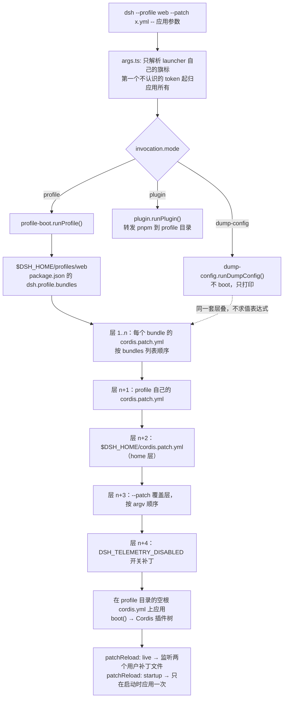

# CLI 与 Web 应用装配

> **本文定位**：`dev_docs` 是 deepseek-harness 的**中文导航层**，不是事实的归属地。应用启动规则归 [`docs/architecture.md`](../docs/architecture.md)，Client 模块划分归 [`docs/subsystems/client-modules.md`](../docs/subsystems/client-modules.md)，各包契约归其 README，面向最终用户的使用说明归 [`docs/user/`](../docs/user/index.md)。本文不复述它们，只串一条上游分散的链路：**从 `dsh` 命令到插件树，再到你想改的那个 UI 包。**
>
> 面向自动化的入口（ACP、JSON-RPC SDK、Python SDK、hooks）见 [SDK 与外部协议](sdk_and_protocols.md)。
>
> **与 `docs/` 冲突时一律以 `docs/` 为准**，并立即修正本文。

---

## 1. 本文定位与上游事实源

> **上游事实源**：[`docs/architecture.md` — Application launch](../docs/architecture.md#application-launch)、[`docs/architecture.md` — Profiles and bundles](../docs/architecture.md#profiles-and-bundles)

这两个入口——`dsh` 命令行与浏览器 GUI——是 deepseek-harness 面向**人类用户**的全部产品面。它们不是两套独立实现：Web 是 `dsh --profile web` 的一种 profile 组合，headless 是另一种，两者共享同一个 `dsh-base` 内核。因此本文的组织方式不是"CLI 一章 + Web 一章"，而是**一条装配链路**：命令 → profile → bundle 层叠 → 补丁 → 插件树，Web 只是这条链路末端多长出来的一半（浏览器）。

下表是本文引用的全部一手事实源；本文只做串联与定位，任何具体契约以下表为准。

| 事实 | 归属地 |
|---|---|
| 只有 `dsh` 能启动受支持的 Node 应用；哪些不是应用启动器 | [`docs/architecture.md#application-launch`](../docs/architecture.md#application-launch) |
| profile / bundle 的定义与层叠顺序 | [`docs/architecture.md#profiles-and-bundles`](../docs/architecture.md#profiles-and-bundles)、[`app-boot README — Profiles`](../packages/boot/app-boot/README.md#profiles) |
| `dsh` 的命令语法、入口模式、精确层级优先级 | [`apps/cli/README.md`](../apps/cli/README.md)、[`apps/cli/reference/README.md`](../apps/cli/reference/README.md) |
| 各 shipped profile 装了哪些插件行 | [`apps/cli/composition.md`](../apps/cli/composition.md)（生成产物，只链接不复制） |
| 每个配置字段的含义 | [`docs/config-catalog.md`](../docs/config-catalog.md)（生成产物，只链接不复制） |
| Web host 半边的 HTTP 载体 | [`docs/subsystems/web-server.md`](../docs/subsystems/web-server.md) |
| 浏览器插件表、boot graph、bundle 路由 | [`docs/subsystems/client-modules.md`](../docs/subsystems/client-modules.md) |
| Web client 的分层与所有权 | [`docs/subsystems/web-client.md`](../docs/subsystems/web-client.md) |
| Slot 组合系统、槽位层级 | [`docs/subsystems/slots.md`](../docs/subsystems/slots.md) |
| Conversation 节点装配与扩展路径 | [`docs/subsystems/conversation.md`](../docs/subsystems/conversation.md) |
| 浏览器 ↔ Host 的 Remote 调用与流 | [`docs/api-gateway.md`](../docs/api-gateway.md) |
| 样式与 token 归属 | [`docs/web-styling.md`](../docs/web-styling.md) |
| 客户端 UI 文案的 locale 归属约束 | [`packages/client/AGENTS.md — Styling and localization`](../packages/client/AGENTS.md#styling-and-localization)、[`AGENTS.md — Conventions`](../AGENTS.md#conventions) |

**术语提醒（极易混淆）**：`packages/web/` 不是 Web GUI，它是模型可用的**联网能力接缝**（`web_search` / `web_fetch`，见 [`docs/subsystems/web.md`](../docs/subsystems/web.md)）。Web GUI 的两半边分别在 [`packages/host/`](../packages/host/README.md) 与 [`packages/client/`](../packages/client/README.md)，前端构建产物在 [`apps/web/`](../apps/web/package.json)。

---

## 2. 应用启动的硬规则

> **上游事实源**：[`docs/architecture.md#application-launch`](../docs/architecture.md#application-launch)

这是一条**架构硬规则**，不是风格建议：每个受支持的 Node 应用都从 `dsh` CLI 加一个具名 profile 启动。shipped 的应用形态是 `dsh web`（`--profile web` 的刻意别名）、`dsh --profile headless`、`dsh --profile sdk`、`dsh --profile sdk-minimal`、`dsh --profile acp`。TypeScript SDK 解析同版本的 `dsh` 依赖并选择 `sdk` profile；自定义插件组合的表达方式是"一个 profile 加若干有序补丁文件"，**不是**另一个可执行文件，也不是内联的 Cordis 树。

反过来说，下面这些东西看起来像入口，但**都不是** Harness 应用启动器：

| 形态 | 是否合法应用入口 | 说明 |
|---|---|---|
| `dsh --profile <name>` | ✅ 唯一合法形态 | 包括 `dsh web` 这个别名 |
| 包自带的 `bin`（除 `dsh` 本身） | ❌ | 白名单里只有 `apps/cli` 的 `dsh`，以及一个私有的构建期打包器 |
| vendored CLI、构建期/测试期可执行文件 | ❌ | 需要在门禁里显式归类，不是隐式豁免 |
| 进程内直接 mount 插件树 | ❌ | 只有"已经跑起来的应用再加插件"才走这条路 |
| SDK 的 argv 逃逸 / 私有 direct-config 载体 | ❌ | 已移除，没有兼容 bin，也没有回退解析器 |
| 浏览器 WebWorker 预览 | ❌ | 私有实验形态，不是应用启动器 |

强制这条规则的门禁是 [`scripts/verify-application-entrypoints.ts`](../scripts/verify-application-entrypoints.ts)：它把每个包的 `bin`、每个可执行源码文件、每个根 demo 脚本都放进一个显式类别里，任何绕过 `dsh` 的 Node 应用路径直接判失败。它的白名单是**枚举式**的——新增一个可执行文件而不在白名单里登记，门禁就会红。质量门禁的全景见 [质量门禁](quality_gates.md)。

这条规则解释了本文的整个结构：既然只有一个启动器，那么"Web 应用是怎么装起来的"这个问题就等价于"`web` profile 的补丁层叠出了什么插件树"。

---

## 3. 从命令到插件树

> **上游事实源**：[`docs/architecture.md#profiles-and-bundles`](../docs/architecture.md#profiles-and-bundles)、[`app-boot README — Profiles`](../packages/boot/app-boot/README.md#profiles)、[`apps/cli/README.md#profiles`](../apps/cli/README.md#profiles)

一次 `dsh` 调用会经过五个阶段：**参数切分 → profile 解析 → bundle 层叠 → 用户补丁层叠 → 引导插件树**。上游把这五段分散在三处（架构文档讲概念、app-boot README 讲机制、CLI reference 讲精确优先级），本文把它们串成一张图。



**第一段：参数切分。** launcher 只解析自己的旗标（`--profile`、`--patch`、`--dump-config`、`--dump-default-config`），**第一个它不认识的 token 开始就是应用的参数**，原样交给插件树（通过 [`dsh-cmdline`](../packages/boot/cmdline/README.md) 的 `ctx.cmdlineArgs` 不可变快照）。这就是为什么 `dsh --profile web --help` 打印的是 Web 应用自己的帮助，而 `dsh --help` 打印 launcher 的帮助。语法归属见 [`apps/cli/src/args.ts`](../apps/cli/src/args.ts)，精确行为见 [CLI 行为参考 — App arguments](../apps/cli/reference/README.md#app-arguments)。

**第二段：模式分发。** `bin.ts` 只加载被选中的那个 runner，三种模式互斥：

```ts
switch (invocation.mode) {
  case 'profile': {
    const { runProfile } = await import('./profile-boot.ts')
    await runProfile({
      environment: loadLayeredEnv('dsh'),
      profile: invocation.profile,
      patchFiles: invocation.patches,
      args: invocation.args,
    })
    break
  }
```

`apps/cli/src/bin.ts:26-36`

**第三段到第五段：层叠。** 层叠顺序在代码里就是一个数组拼接，这是理解整条链路最省事的一段源码：

```ts
/** The full patch stack of one composed profile, in application order. */
function allPatches(composed: ComposedProfile): PatchOptions[] {
  return [
    ...composed.bundlePatches,
    ...composed.profile.patches,
    ...composed.homePatches,
    ...composed.overlays,
  ]
}
```

`apps/cli/src/profile-boot.ts:136-144`

其中 `bundlePatches` 是 profile manifest 里 `dsh.profile.bundles` 逐个 bundle 的补丁串接，`overlays` 是 `--patch` 覆盖层再加上遥测开关补丁（`resolveTelemetryPatch`，见 `apps/cli/src/profile-boot.ts:101-104`）。**home 层排在 profile 层之后**——机器本地偏好优先于单个 profile 的设置。

三条最容易踩的语义（都归 [app-boot README — Profiles](../packages/boot/app-boot/README.md#profiles)，此处只提醒）：

- **补丁按 id 整块替换 `config`，不做深合并**：想保留的字段必须原样重述一遍。
- **空文件或只有注释的补丁文件会让 boot 失败**：想禁用这一层，写 `[]`。
- **profile 目录的 `cordis.yml` 是一个空条目列表，不要编辑它**：整棵树都是补丁层叠出来的，这个文件每次启动都会被重写（见 `apps/cli/src/profile-boot.ts:106-123` 的 `prepareProfile` 及其注释）。

### 3.1 用 `--dump-config` 排查

`--dump-config` 是这条链路唯一的可观测出口：它按同一套算法把层叠结果渲染成一份可加载的 YAML，每一行都带注释标明它来自哪个源文件、被哪一层改过，且**不 boot、不求值 `!!js`**。

- `dsh --profile web --dump-config` —— 打印完整合成树（含用户层与 `--patch`）。
- `dsh --profile web --dump-default-config` —— **只打印 bundle 层**，跳过 profile 与 home 的 `cordis.patch.yml`。这是"我的 `cordis.patch.yml` 写坏了导致起不来"的恢复诊断：这条命令根本不去解析那个文件。

典型排查路径：

| 症状 | 用哪条命令 | 看什么 |
|---|---|---|
| 某个插件没生效 | `--dump-config` | 该 id 的行是否存在、`disabled` 是否为真、`config` 是否被上层整块替换掉了 |
| 改了 `cordis.patch.yml` 反而起不来 | `--dump-default-config` | 若默认树正常，问题就在用户层；补丁若匹配不到任何行会打印带层标签的 stderr 警告 |
| 不确定某个字段该写在哪一层 | `--dump-config` 对比两个 profile | 同一 id 在不同 profile 下的 `config` 差异，就是该 surface bundle 重述的那部分 |
| 想知道字段有哪些合法值 | 不用命令 | 直接查 [`docs/config-catalog.md`](../docs/config-catalog.md) |

实现在 [`apps/cli/src/dump-config.ts`](../apps/cli/src/dump-config.ts)；两种 dump 都拒绝携带应用参数（否则会打印出一棵与实际 boot 不同的树，属于误导）。

---

## 4. shipped profile 一览

> **上游事实源**：[`docs/architecture.md#profiles-and-bundles`](../docs/architecture.md#profiles-and-bundles)、[`packages/bundle/README.md#packages`](../packages/bundle/README.md#packages)

模板定义在 `packages/boot/app-boot/src/profile.ts:137-158` 的 `PROFILE_TEMPLATES`，首次使用时自动初始化到 `$DSH_HOME/profiles/<name>`；其它名字的 profile 必须通过 `dsh plugin` 创建。

| profile | bundle 栈 | `patchReload` | 面向 | 归属 README |
|---|---|---|---|---|
| `web` | `dsh-base` → `dsh-web-app` | `live` | 人类，浏览器交互 | [`bundle/web-app`](../packages/bundle/web-app/README.md) |
| `headless` | `dsh-base` → `dsh-headless` | `startup` | 人类/脚本，一次性任务 | [`bundle/headless`](../packages/bundle/headless/README.md) |
| `sdk` | `dsh-base` → `dsh-sdk-app` | `startup` | 自动化，JSON-RPC stdio | [`bundle/sdk-app`](../packages/bundle/sdk-app/README.md) |
| `sdk-minimal` | 仅 `dsh-sdk-minimal`（**不叠 base**） | `startup` | 自动化，独立最小树 | [`bundle/sdk-minimal`](../packages/bundle/sdk-minimal/README.md) |
| `acp` | `dsh-base` → `dsh-acp-app` | `startup` | 自动化，ACP stdio | [`bundle/acp-app`](../packages/bundle/acp-app/README.md) |

`dsh-base` 是前四个（`web`/`headless`/`sdk`/`acp`）共享的第一层：模型适配器、工具集、持久化、沙箱与审批策略、设置、凭据、遥测。`sdk-minimal` 是刻意的例外——一个 bundle 自带完整显式树，不应用 `dsh-base`。这层共享正是"换一个 provider 就换掉整个产品行为"的物理基础，见 [能力接缝](capability_seams.md)。

**`patchReload` 的差异不是随意的**：只有 `web` 是 `live`（编辑 `cordis.patch.yml` 会重新合成而不必重启，编辑出错则保留上一份可用的树继续跑）；`headless`、`sdk`、`sdk-minimal`、`acp` 都只在启动时应用一次，因为**在一次性任务或 stdio 应用已经接管工作之后再替换它的依赖，会破坏那个生命周期**。自定义 profile 未声明时默认 `live`。`live` profile 还会在缺少 `hmr` 服务时挂一个"只看配置、不换模块"的 HMR 回退实例（`apps/cli/src/profile-boot.ts:283-313`），`startup` profile 则连这个回退都不装。

各 profile 具体装了哪些插件行，见生成的 [组合图](../apps/cli/composition.md)——那是一份生成产物，本文不复制。

---

## 5. Web 的 host 半边

> **上游事实源**：[`packages/host/README.md#packages`](../packages/host/README.md#packages)、[`docs/subsystems/web-server.md`](../docs/subsystems/web-server.md)、[`docs/api-gateway.md`](../docs/api-gateway.md)

host 半边是 Node 进程里那一半：它开 HTTP 端口、把浏览器需要的东西喂出去、把浏览器的调用接进来。各包契约归各自 README，本文只给职责分工与"该找谁"。

| 角色 | 包 | `ctx` key / 表现 | 一句话职责 |
|---|---|---|---|
| HTTP 载体 | [`host/webserver`](../packages/host/webserver/README.md) | `ctx.webServer` | 一个 `node:http` 服务器 + 具名路由表 + 升级路由 + index 注入 + **唯一的兜底席位**；它不认识任何 Harness 概念，也不服务任何文件 |
| SPA 静态前端 | [`host/frontend-static`](../packages/host/frontend-static/README.md) | 占用 webserver 兜底席位 | 服务 `apps/web` 构建出的 dist；越界 403、非 GET/HEAD 405、未知扩展名按 octet-stream |
| 浏览器插件表 | [`client/modules`](../packages/client/modules/README.md)（host 半边） | `ctx.clientModules` | 扫描 Loader 里声明了 `dsh.client` 的行，合成 `window.__DSH_BOOT__`，并在 `/plugins` 上服务合并后的 bundle 脚本 |
| API 网关 | [`api/gateway`](../packages/api/gateway/README.md) | Remote 分发 | Typert 生成的 Remote 方法派发、取消、逻辑流、被选中的 Host 事件转发 |
| Remote 组装 | [`api/remotes`](../packages/api/remotes/README.md) | `ctx.remote.<namespace>` | 把各 controller 生成的贡献装配成客户端可调用的具体方法 |
| 业务 controller | [`api/session-controller`](../packages/api/session-controller/README.md)、[`api/workspace-controller`](../packages/api/workspace-controller/README.md)、[`api/settings-controller`](../packages/api/settings-controller/README.md) | Host 面持有权威状态 | 会话列表/搜索/跟随流、工作区变更策略、设置读写 |
| 目录选择接缝 | [`host/directory-picker`](../packages/host/directory-picker/README.md) | `ctx.directoryPicker` | 契约与错误词汇；后端由 [`-native`](../packages/host/directory-picker-native/README.md)、[`-browse`](../packages/host/directory-picker-browse/README.md) 提供，[`-auto`](../packages/host/directory-picker-auto/README.md) 在 boot 时按宿主挑一个 |
| 插件清单投影 | [`host/plugin-inventory`](../packages/host/plugin-inventory/README.md) | Remote `pluginInventory/list` | 把当前 Loader 条目只读投影给设置页；不能启用/禁用任何东西 |
| 浏览器 wire 的 host 端 | [`client/connection`](../packages/client/connection/README.md)（host 半边） | `/api` 桥、信任栅栏 | Host/Origin 校验 + token 换签名会话 cookie，之后每个 Host API 方法与 WebSocket 流都要过这道认证 |
| surface 胶水 | [`bundle/web-app`](../packages/bundle/web-app/README.md) | `web-runtime` / `web-startup` | 解析 `--host/--port/--trusted-host/--no-open`、采样 LAN 信任、注入提示词段落与 `DSH_WEB_URL`、打印启动 URL、拉起浏览器 |

**路由匹配顺序是固定的**：精确表 → 最长前缀 → 兜底席位；注册顺序不携带请求语义，重复 `(kind, path)` 直接抛错。兜底席位只有一个所有者，第二次注册会抛错——这就是为什么"换掉前端服务方式"等于"换掉占席位的那个包"。细节见 [`web-server.md#routes`](../docs/subsystems/web-server.md#routes) 与 [`#the-service`](../docs/subsystems/web-server.md#the-service)。

**这些行都在同一棵 Cordis 树里。** 打开 [`packages/bundle/web-app/cordis.patch.yml`](../packages/bundle/web-app/cordis.patch.yml) 你会看到：webserver、connection、modules 这些 host 行，和 `ui-chat`、`ui-sidebar` 这些**浏览器**行，是同一个 `insert` 列表里的相邻条目。浏览器行之所以能出现在 host 的配置树里，是因为 modules 的 host 半边会扫描它们、把它们编成 boot graph 送到浏览器去——host 树里的那一行是"名册登记"，真正的浏览器实例活在另一棵树里。

该 patch 还做了一件对理解 Web 很关键的事：**把 agent 平面搬到 agent preset 后面**。base 里那些进程级的 per-agent 行（工具、提示词段落、委派后端）在 Web 里被禁用，改由每个浏览器会话挂载自己的 preset；而注册表类的服务（jobs、skill、token meter、subagents 注册表）留在 host 平面。判据与逐行理由写在该 patch 的内联注释里，本文不复述。

---

## 6. Web 的 client 半边

> **上游事实源**：[`docs/subsystems/web-client.md#layers-and-ownership`](../docs/subsystems/web-client.md#layers-and-ownership)、[`docs/subsystems/client-modules.md`](../docs/subsystems/client-modules.md)、[`docs/subsystems/slots.md`](../docs/subsystems/slots.md)、[`packages/client/README.md#packages`](../packages/client/README.md#packages)

client 半边是浏览器里那一半：它**也是一棵 Cordis 树**，同样由插件组成，同样靠服务注入决定激活顺序。这是理解整个 Web GUI 的关键——浏览器端不是一个 React 应用，而是一个跑在浏览器里的 Cordis 应用，React 只是它最后一层渲染绑定。

**启动链路**（详见 [`web-client.md#browser-boot`](../docs/subsystems/web-client.md#browser-boot)）：host 把合成好的 `WebBootGraph` 写进 `window.__DSH_BOOT__` 并安装模块加载器门面 → [`client/web`](../packages/client/web/README.md) 的 boot kernel 创建模块系统、预取 `immediately` 条目、挂载 vendored Cordis Loader、创建每个 graph 条目 → 整个名册进入 settled 状态后，[`client/ui-renderer`](../packages/client/ui-renderer/README.md) 水合无框架的 boot DOM 并调用唯一一次 `renderSlot('root')`。一个包要进这份名册，只需在 `package.json` 里声明 `dsh.client` 并在 `exports["./client"]` 导出构建产物（见 [`client-modules.md#the-scan`](../docs/subsystems/client-modules.md#the-scan)）。

**分工**：

| 层 | 主要包 | 职责 |
|---|---|---|
| shell / 内核 | [`client/web`](../packages/client/web/README.md)、[`client/modules`](../packages/client/modules/README.md) | 两阶段启动、懒 CJS 模块表、无框架 boot 页（失败可见而不是白屏） |
| wire | [`client/connection`](../packages/client/connection/README.md)、[`api/gateway`](../packages/api/gateway/README.md)、[`api/remotes`](../packages/api/remotes/README.md) | 建立连接"世代"、`ctx.remote.<namespace>` 方法与流、事件转发、重连语义 |
| object services（客户端模型） | `api/session-controller` 的 client 面、`api/workspace-controller` 的 client 面 | React-free 的 Host 状态镜像：`ClientSessions → SessionManager → Session`、`ClientWorkspaceModel`；解决流/一元请求竞态，维持对象标识 |
| 适配层 | [`client/ui-session`](../packages/client/ui-session/README.md)、[`client/ui-workspace`](../packages/client/ui-workspace/README.md) | 把模型 observable 转成 root / session 作用域的标准 Slot 源与 hook |
| 会话装配 | [`client/ui-conversation`](../packages/client/ui-conversation/README.md) + 目标包 | 事件注册表与视图注册表：把 Session 事件窗口折叠成各目标（Chat / Trajectory）自己的快照 |
| 组合与渲染 | [`client/ui-slots`](../packages/client/ui-slots/README.md)、[`client/ui-renderer`](../packages/client/ui-renderer/README.md)、[`client/ui-layout`](../packages/client/ui-layout/README.md) | 类型化槽位注册表 + 生命周期账本；`ui-renderer` 是唯一绑定裸 observable 到 React 的包 |
| 功能插件 | `packages/client/ui-*`（数十个） | 各自往声明好的槽位里注册组件 |

依赖方向是单向的：**Host 状态 → Remote 传输 → Client 模型 → UI 适配器 → Conversation/展示 → Slots → React**。用户操作沿反方向通过闭包了注入服务的回调走回去。展示组件**永远拿不到 `ctx`**、传输对象、或另一个功能插件的实现。

`ui-*` 包的完整清单会随版本漂移，**不要记忆它**——用 `ls packages/client` 看当前有哪些，用 [`packages/client/README.md#packages`](../packages/client/README.md#packages) 的表看每个包一句话职责。第 7 节只给最常改的那些。

### 6.1 为什么会有两个编译面

host 树和 client 树都是 Cordis 树，而且**在相同的 `ctx` 键名上注册不同的服务**。同一个包可以同时有两个面：`client/modules` 在 host 侧提供 `ctx.clientModules`（扫描与 bundle 服务），在浏览器侧提供 `ctx.modules`（懒模块表）；`api/*-controller` 的 Host 面持有权威状态，Client 面持有本地镜像，两者共享同一批生成的 wire 类型。

这直接导致仓库有两个 TypeScript 检查单元，原因写在配置注释里：

```jsonc
  // Client-side typecheck aggregate: packages/client tests (.ts and .tsx).
  // Split from the host aggregate because both sides merge cordis Context
  // under the same keys (sessions, loader) with different services; shared
  // leaves (session/llm/tools/...) build once and are referenced by
  // both programs through each client package's own references.
```

`tsconfig.client.json:2-6`

```jsonc
  // Host aggregate (one of the two check units; see tsconfig.json). packages/client
  // type-checks in tsconfig.client.json: the two sides merge cordis Context under
  // the same keys, one program cannot see both.
```

`tsconfig.host.json:2-4`

**实践含义**：改一个同时有两面的包时，`*.host.spec.ts` 属于 host 聚合、`*.client.spec.ts` 属于 client 聚合，两边分别检查；一个程序看不见另一边的 Context 增强，所以跨面共享只能走**生成的 wire 类型**或 `import type`，不能靠"反正都是 TypeScript"。构建与工程结构见 [Monorepo 与构建](monorepo_and_build.md)。

### 6.2 Conversation node 怎么注册

这是 client 半边最常被扩展的接缝，也是最容易做错的地方（错误做法：往 `Session`/`SessionManager` 里加事件 switch）。正确路径是两步注册，归 [`docs/subsystems/conversation.md`](../docs/subsystems/conversation.md)：

1. **一个 `ConversationNodeDefinition`**：`match(event)` 只读当前这一条 `SessionEventLike`，按稳定业务 id `(kind, id)` 关联，`update` 把一次 Match 折进确定性 State，并且必须能按 log `seq` 升序确定性重放（因为历史分页、重连、prepend 都会重放）。
2. **一个键控的 `conversation.chat.node` 渲染器**：只读 `node.data` 和受限的 Location hook，**不扫描**事件窗口、Context 集合或已渲染的节点集合。

Chat 与 Trajectory 可以识别同一族事件，但各自持有自己的 Definition State 和最终节点载荷，且不互相 import 运行时值。可运行的范例见 [`docs/subsystems/conversation.md#definition-and-typed-chat-payload`](../docs/subsystems/conversation.md#definition-and-typed-chat-payload)，必须补齐的测试见 [`#verification-obligations`](../docs/subsystems/conversation.md#verification-obligations)。事件本身的产生侧（新增 `SessionEvent`）见 [会话与事件](session_and_events.md)。

---

## 7. "我要改 Web UI 的 X，该动哪个包"

> **上游事实源**：[`packages/client/README.md#packages`](../packages/client/README.md#packages)、[`docs/subsystems/slots.md#current-hierarchy`](../docs/subsystems/slots.md#current-hierarchy)、[`docs/web-styling.md`](../docs/web-styling.md)

这是本文的核心表。**先读这张表定位，再去读那个包的 README。**槽位层级（哪个组件声明了哪个子槽）以 [`slots.md#current-hierarchy`](../docs/subsystems/slots.md#current-hierarchy) 为准；运行中的树还可以用 `cordis_inspect what:"client"` 现场查。

| 我要改的东西 | 主要落点 | 同时要看 |
|---|---|---|
| 会话消息、助手流式气泡、Chat 视图 | [`client/ui-chat`](../packages/client/ui-chat/README.md)（`src/client/conversation-nodes/` + 键控渲染器） | [`conversation.md`](../docs/subsystems/conversation.md) |
| **新增一种 Chat 节点**（把自己的业务事件搬上屏） | 生产者侧加 `SessionEvent`；客户端包注册 `ConversationNodeDefinition` + `conversation.chat.node` 键控渲染器 | [`conversation.md#replayable-event-families`](../docs/subsystems/conversation.md#replayable-event-families)、[会话与事件](session_and_events.md) |
| 工具卡片、工具调用树、工具行折叠 | [`client/ui-tool`](../packages/client/ui-tool/README.md)（占 `tool.call.toolview` 等键控槽） | [`slots.md#cardinality-and-scope`](../docs/subsystems/slots.md#cardinality-and-scope) |
| 某个 Cordis 工具的专属视图 | [`extensions/ui-cordis`](../packages/extensions/ui-cordis/README.md)（占 `tool.view.cordis`） | [插件开发指南](plugin_development_guide.md) |
| 侧边栏（工作区 / 会话导航） | [`client/ui-sidebar`](../packages/client/ui-sidebar/README.md)；数据来自 [`client/ui-workspace`](../packages/client/ui-workspace/README.md) + `api/workspace-controller` | [`docs/subsystems/workspace.md`](../docs/subsystems/workspace.md) |
| 设置页壳、分区、页签扩展点 | [`client/ui-settings`](../packages/client/ui-settings/README.md)；通用项 [`-general`](../packages/client/ui-settings-general/README.md)；模型供应商 [`-models`](../packages/client/ui-settings-models/README.md)；插件页 [`-plugins`](../packages/client/ui-settings-plugins/README.md)；只读 Loader 清单页签 [`-plugin-inventory`](../packages/client/ui-settings-plugin-inventory/README.md) | [`docs/subsystems/settings.md`](../docs/subsystems/settings.md)、[`host/plugin-inventory`](../packages/host/plugin-inventory/README.md) |
| 主题、配色、排版、阴影、圆角 token | [`client/ui-theme`](../packages/client/ui-theme/README.md) 的 `src/styles/`；功能包只消费 `--dsw-alias-*` 语义别名 | [`web-styling.md#ownership`](../docs/web-styling.md#ownership)、[`#component-rules`](../docs/web-styling.md#component-rules) |
| 页面主区域的排布（主栏 / 详情栏 / 覆盖层） | [`client/ui-layout`](../packages/client/ui-layout/README.md)（它同时负责把主题快照应用到 document） | [`slots.md#current-hierarchy`](../docs/subsystems/slots.md#current-hierarchy) |
| 输入框 / composer / 输入编排、会话外壳 | [`client/ui-conversation`](../packages/client/ui-conversation/README.md) | [`web-client.md#conversation-and-presentation`](../docs/subsystems/web-client.md#conversation-and-presentation) |
| composer 上的模型选择器 / 计划模式条 / 附件 | [`ui-model-selection`](../packages/client/ui-model-selection/README.md) / [`ui-plan`](../packages/client/ui-plan/README.md) / [`ui-attachment`](../packages/client/ui-attachment/README.md)（各占 `conversation.input.*` 槽） | [模型配置](model_configuration.md) |
| 斜杠命令、`@` 引用建议、技能建议 | [`ui-commands`](../packages/client/ui-commands/README.md) / [`ui-input-trigger`](../packages/client/ui-input-trigger/README.md) / [`ui-reference`](../packages/client/ui-reference/README.md) / [`ui-skill`](../packages/client/ui-skill/README.md) | [`docs/subsystems/commands.md`](../docs/subsystems/commands.md) |
| 审批弹窗、权限预设切换 | [`ui-approval`](../packages/client/ui-approval/README.md) / [`ui-permission-presets`](../packages/client/ui-permission-presets/README.md) | [安全与沙箱](security_and_sandbox.md) |
| 目录选择流程（选工作区目录） | 浏览器侧 [`ui-directory-picker-browse`](../packages/client/ui-directory-picker-browse/README.md) / [`-native`](../packages/client/ui-directory-picker-native/README.md)；host 侧 [`host/directory-picker*`](../packages/host/README.md#packages) | 接缝契约在 [`host/directory-picker`](../packages/host/directory-picker/README.md) |
| 子智能体面板、子会话导航 | [`ui-subagent`](../packages/client/ui-subagent/README.md) | [`docs/subsystems/subagent.md`](../docs/subsystems/subagent.md) |
| **任何用户可见文案 / 新增一种语言** | [`client/locale`](../packages/client/locale/README.md) + 各包自己的 locale 命名空间字典；组件通过标准 `t` 座位或已本地化的 prop 拿文案 | ⚠️ 硬编码文案会被 `pnpm run verify-client-ui-i18n` 拒绝，见 [`packages/client/AGENTS.md#styling-and-localization`](../packages/client/AGENTS.md#styling-and-localization) |
| 共享控件、图标、Markdown / 代码块 / diff 渲染 | [`client/ui-primitives`](../packages/client/ui-primitives/README.md)（Markdown 在 `src/markdown/`） | Cordis-free primitive 必须要求完整的 label props，自己不带兜底文案 |
| **新增一个浏览器可调用的 Host 方法或流** | 在对应 `api/*-controller` 的 Host 面加 Typert Remote 装饰；客户端通过 `ctx.remote.<namespace>` 拿到生成的方法 | [`docs/api-gateway.md#programming-model`](../docs/api-gateway.md#programming-model) |
| **新增一条 HTTP 路由 / 升级路由 / 下载端点** | 在自己的插件里 `ctx.webServer.register(...)` / `registerUpgrade(...)`，不要改 webserver 包 | [`web-server.md#the-service`](../docs/subsystems/web-server.md#the-service) |
| 换掉静态前端的服务方式 | [`host/frontend-static`](../packages/host/frontend-static/README.md)——它占着 webserver 唯一的兜底席位 | [`web-server.md#routes`](../docs/subsystems/web-server.md#routes) |
| **让一个新包出现在浏览器名册里** | 该包 `package.json` 声明 `dsh.client`（`platform: 'web'`、`inject` 边、可选 `immediately`）+ `exports["./client"]`；再在 [`bundle/web-app/cordis.patch.yml`](../packages/bundle/web-app/cordis.patch.yml) 插一行 | [`client-modules.md#the-scan`](../docs/subsystems/client-modules.md#the-scan)、[插件开发指南](plugin_development_guide.md) |
| 只想临时禁用/替换某一行来试验 | 不改代码：在 `$DSH_HOME/profiles/web/cordis.patch.yml` 按 id 打补丁，`web` profile 是 live reload | 第 3.1 节的 `--dump-config` |

**跨包的三条硬约束**（[`slots.md#extension-rules`](../docs/subsystems/slots.md#extension-rules)、[`web-client.md#package-boundaries`](../docs/subsystems/web-client.md#package-boundaries)）：功能包之间只能 `import type`，不能运行时 import 或 re-export 对方的值；新的子槽只能在**渲染那个位置的组件**里声明，别的包用 `ctx.slots.inject()` 等它挂载再 `register()`；业务与传输状态留在拥有它的 Cordis 服务或 Client 模型里，Slot store 只放共享的浏览/交互状态。

---

## 8. CLI 侧：`dsh` 自己提供什么

> **上游事实源**：[`apps/cli/README.md`](../apps/cli/README.md)、[`apps/cli/reference/README.md`](../apps/cli/reference/README.md)

`dsh` 本体很薄——它只做四件事：解析自己的旗标、解析并层叠 profile、把内层参数原样交给应用、给整个进程装上失败即响与有界关停。它**不提供任何产品功能**，产品功能全在被组合出来的插件树里。

三种入口模式（语法归 [`apps/cli/README.md`](../apps/cli/README.md)，精确行为归 [CLI 行为参考](../apps/cli/reference/README.md)）：

- **`dsh --profile <name> [应用参数...]`** —— 引导 profile。`dsh web` 是 `--profile web` 的硬编码别名（见 [`#web-alias`](../apps/cli/reference/README.md#web-alias)）。
- **`dsh --profile <name> --dump-config` / `--dump-default-config`** —— 只打印合成树，不 boot。
- **`dsh plugin --profile <name> <pnpm 参数...>`** —— 把参数原样转发给 profile 目录里的 pnpm，用来装/卸出树外插件，也是创建自定义 profile 的方式（见 [`#plugin-management`](../apps/cli/reference/README.md#plugin-management)）。

进程层面的三件事同样由 launcher 拥有：环境按层加载（调用目录的 `.env` 压过 Harness home 的，两者都在继承环境之下）、代理在任何插件挂载**之前**就从这份快照装好（否则 Node 的 fetch 会绕过代理直连）、信号语义固定为 SIGTERM 退 0 / SIGINT 退 130。

**headless 一次性运行**是 CLI 侧唯一的"产品形态"，且它本身也是一个 bundle 而非 launcher 特性：`dsh --profile headless "run the tests"` 创建一个全新的持久化会话，把任务当作普通用户消息提交，把 provider 的推理增量流到 stderr（`dsh: reasoning:` 段），把最终答案打到 stdout，然后退出。退出码只有两种：`turn/end` 为 completed 退 0，其余（aborted / error / 区间内没有 turn）退 1。它不开任何监听端口，适合 CI 与批处理。完整契约见 [`bundle/headless` README](../packages/bundle/headless/README.md)，字段见 [config catalog](../docs/config-catalog.md#deepseek-aidsh-headless)。

Web 侧的 CLI 面则由 web-app bundle 的 `web-startup` provider 提供：`--host`、`--port`、`--trusted-host`、`--no-open`、`--help`。注意 `--host 0.0.0.0` 会在启动时被拒绝——这是刻意的安全姿态。启动后打印的 `dsh web:` URL 携带一次性进程 token，浏览器用它换签名 cookie 再重定向到干净根路径。详见 [`bundle/web-app` README](../packages/bundle/web-app/README.md) 与 [config catalog](../docs/config-catalog.md#deepseek-aidsh-web-app)。

---

## 9. 本地跑起来

> **上游事实源**：[`docs/development.md#first-time-setup`](../docs/development.md#first-time-setup)、[`docs/development.md#profile-runs`](../docs/development.md#profile-runs)、[`AGENTS.md#commands`](../AGENTS.md#commands)

命令清单有唯一归属地，本文不复制，只说三件容易踩的事：

1. **生产运行需要先构建**。前端 dist 缺失时 `dsh --profile web` 会带着构建提示直接停下——没有"从源码现服务"的回退。仓库根的构建命令见 [`AGENTS.md#commands`](../AGENTS.md#commands)，源码检出下的 profile 运行示例见 [`docs/development.md#profile-runs`](../docs/development.md#profile-runs)。
2. **`apps/web` 不是独立应用**。它的 Vite 配置里有一个插件专门在 `serve` 命令下抛错，因为裸 Vite 无法注入 `window.__DSH_BOOT__`（见 [`apps/web/vite.config.ts`](../apps/web/vite.config.ts) 的 `rejectStandaloneServe`）。要看 GUI，走 `dsh web`；要客户端插件热更新，另外开 dev watcher（见 [`client/hmr`](../packages/client/hmr/README.md)）。
3. **检查阶梯要按改动面选**。改了 GUI 代码先跑最窄那一档；能改变浏览器组装结果或可见会话输出的改动才升级到 Web e2e。阶梯定义在 [`packages/client/AGENTS.md`](../packages/client/AGENTS.md)，整体策略见 [测试指南](testing_guide.md) 与 [质量门禁](quality_gates.md)。

源码执行（`pnpm dsh <args...>`）的模块解析契约归 [CLI 行为参考 — Source execution](../apps/cli/reference/README.md#source-execution)。

---

## 10. 延伸阅读

**面向最终用户的使用说明一律看这里，本文不重述**：[`docs/user/`](../docs/user/index.md) 总入口、[用户指南](../docs/user/guide/index.md)（供应商配置、网络代理、GitHub 审查、Schedule、MCP memory、Python SDK）、[开发者实践指南](../docs/user/develop/practice/index.md)、[开发者基础教程](../docs/user/develop/basic/index.md)。

**上游深读**（按你要做的事挑）：

- 组合机制与 profile 契约 → [`app-boot README#profiles`](../packages/boot/app-boot/README.md#profiles)；launcher-to-app 参数交接 → [`dsh-cmdline`](../packages/boot/cmdline/README.md)。
- Cordis 本身（服务、事件、`!!js`、include/group）→ [`docs/cordis-primer.md`](../docs/cordis-primer.md)。
- 生成产物（只链接、永不复制）→ [组合图](../apps/cli/composition.md)、[配置目录](../docs/config-catalog.md)、[术语表](../docs/glossary.md)。

**本仓库中文导航层的兄弟文档**：

- [AI 编码上下文](AI_Coding_Context.md) · [架构总览](architecture_overview.md) · [能力接缝](capability_seams.md)
- [会话与事件](session_and_events.md) · [Agent 循环与工具](agent_loop_and_tools.md) · [提示词管理](prompt_management.md) · [模型配置](model_configuration.md)
- [插件开发指南](plugin_development_guide.md) · [Monorepo 与构建](monorepo_and_build.md) · [质量门禁](quality_gates.md) · [测试指南](testing_guide.md)
- [SDK 与外部协议](sdk_and_protocols.md) · [安全与沙箱](security_and_sandbox.md) · [发布与分发](deployment_guide.md)
- [成本优化](cost_optimization.md) · [评估指标](evaluation_metrics.md) · [故障排查](troubleshooting.md)
