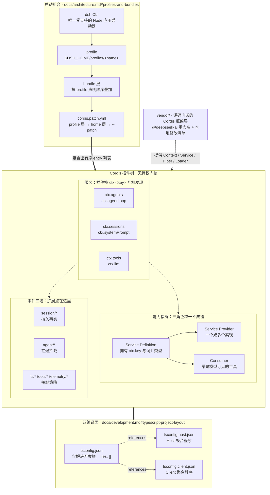
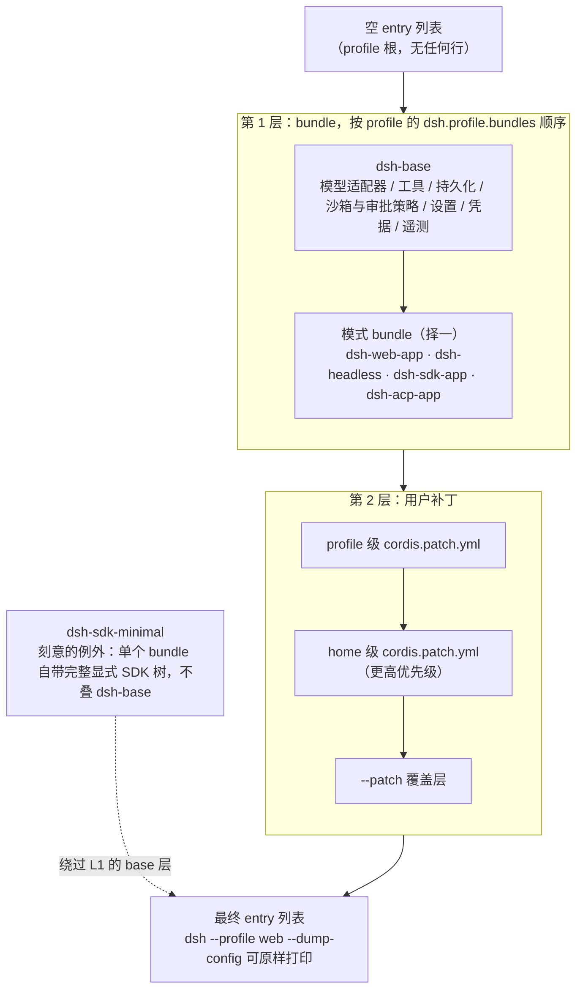
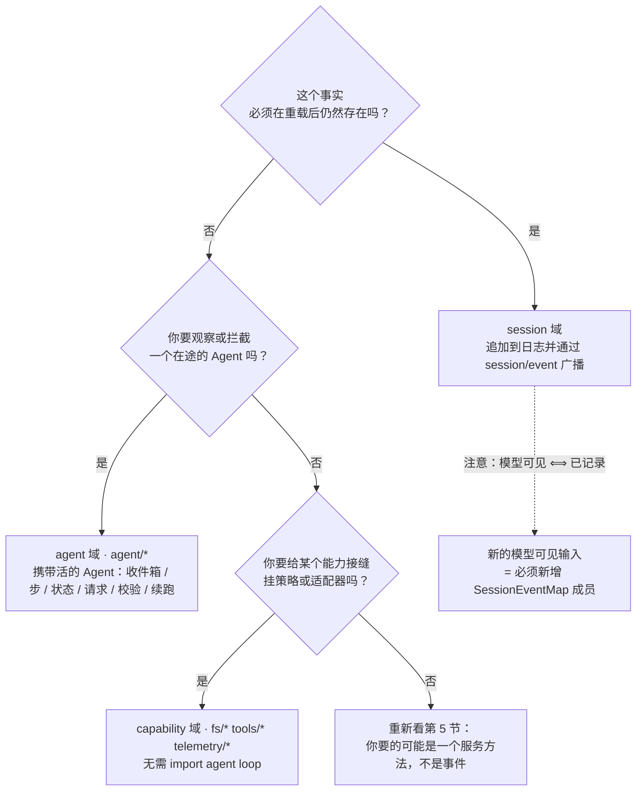
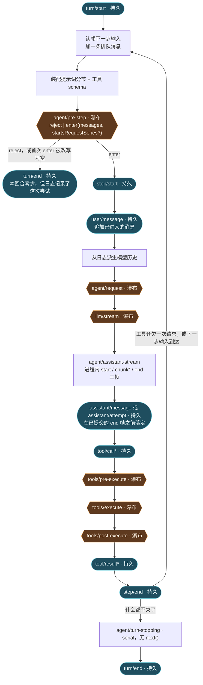

# 架构总览

> **本文定位**：`dev_docs` 是 deepseek-harness 的**中文导航层**，不是事实的归属地。仓库 `docs/` 在双语配对门禁作用域内已全量双语（仅 `scripts/translation-pairing.manifest.json` 显式豁免的 5 篇除外），本文不复述它，只做两件上游按 one-home-per-fact 原则不会做的事：把开发场景映射到对应机制，以及把分散在 `docs/architecture.md`、`docs/subsystems/`、包 README 与 Agent Notes 中的线索串成一条完整脉络。
>
> **与 `docs/` 冲突时一律以 `docs/` 为准**，并立即修正本文。
>
> **主上游事实源**：[`docs/architecture.md`](../docs/architecture.md)（中文版：[`architecture.zh.md`](../docs/architecture.zh.md)）

## 怎么用这篇文档

三种读法，按你手上的问题选一种。

**第一次接触 dsh**：按顺序读第 2 到第 4 节（整体图 → Cordis → profile/bundle），你会知道"一个跑起来的 dsh 是什么"。然后直接跳到第 11 节找你要改的扩展点。

**要改某个具体行为**：跳到[第 11 节的扩展点导航表](#我该改哪里扩展点导航)，从"我想做什么"找到机制，再顺着链接进 `docs/` 的权威页和 `docs/cookbook/` 的步骤指南。

**要理解某段代码为什么这样写**：先在[第 5 节的 `ctx` key 速查表](#核心包与-ctx-key-速查)里定位这个能力归谁所有，进对应的 `docs/subsystems/*.md` 看类型定义与语义，再去包 README 看实现契约。

本文所有小节都以 `> **上游事实源**` 开头。**看到那行就意味着：这一节写的是索引和串联，权威定义在链接指向的地方。**

## 一张图看懂 dsh

> **上游事实源**：[`docs/architecture.md`](../docs/architecture.md)、[`docs/cordis-primer.md`](../docs/cordis-primer.md)、[`docs/capability-seams.md`](../docs/capability-seams.md)、[`docs/development.md#typescript-project-layout`](../docs/development.md#typescript-project-layout)

下图不是任何一篇上游文档的重画，而是把四条彼此独立的上游线索叠在同一张图上：**启动组合**（profile/bundle 如何生成插件树）、**服务与事件**（插件树内部怎么互相找到对方）、**能力接缝**（一个能力如何被整体替换）、**双编译面**（同一份源码为什么分成两个 TypeScript program）。上游按 one-home-per-fact 各自拆在不同页面，这里是它们的交汇处。



读这张图有四个要点，每个都对应下面一节：插件树是**组合出来的**（第 4 节），插件之间靠 **key 与事件**而非 import 耦合（第 3、6 节），一个能力的替换靠**接缝三角色**（第 5 节），而 Host/Client 必须是**两个 program**（第 9 节）。

## Cordis：一切皆插件，无特权内核

> **上游事实源**：[`docs/cordis-primer.md`](../docs/cordis-primer.md)（中文版：[`cordis-primer.zh.md`](../docs/cordis-primer.zh.md)）、[`docs/architecture.md#cordis`](../docs/architecture.md#cordis)、[`docs/cordis-api/context.md`](../docs/cordis-api/context.md)

一句话概括：**Cordis 把"服务 + 类型化事件 + 可回滚副作用"三件事放进同一个 `ctx`，dsh 的每一部分（模型适配器、工具注册表、会话日志、乃至 agent loop 本身）都是挂在这个 `ctx` 上的普通插件，因此都能从配置里被换掉。** 五个核心概念与调度模式表在 [`docs/cordis-primer.md#cordis-in-five-ideas`](../docs/cordis-primer.md#cordis-in-five-ideas) 与 [`#dispatch-modes`](../docs/cordis-primer.md#dispatch-modes)。

这条设计对日常开发的直接后果有三个，它们分散在不同上游文档里，这里集中列出：

- **没有"改内核"这个选项。** 新行为挂到已文档化的扩展点上；确实需要改 `agent-loop` 时，[`AGENTS.md` 的 Conventions 章节](../AGENTS.md#conventions)要求同时更新 [`docs/architecture.md`](../docs/architecture.md)。
- **注册即副作用（registrations are effects）。** 每一项贡献都走 `ctx.effect()` / `ctx.on()`，注册表的 `register()` 返回 disposer；插件卸载时这些注册自动回滚。这条规则由 [`packages/AGENTS.md`](../packages/AGENTS.md) 的 HMR-safety 测试要求兜底：dispose fiber 之后必须观察到贡献消失。
- **依赖用 `inject` 声明，不用手工排启动顺序。** 一个插件声明它需要的服务，Cordis 等到服务存在才激活它。可选服务要用 `ctx.get(name)` 而不是 `ctx.<name>` 属性代理——原因见 [`docs/postmortem/0001-acp-default-export-drops-inject.md`](../docs/postmortem/0001-acp-default-export-drops-inject.md)。

框架本体不是 npm 依赖，而是[源码内嵌在 `vendor/`](../vendor/README.md) 的固定快照，见第 10 节。

## Profile 与 Bundle：启动时的分层组合

> **上游事实源**：[`docs/architecture.md#profiles-and-bundles`](../docs/architecture.md#profiles-and-bundles)、[`packages/boot/app-boot/README.md#profiles`](../packages/boot/app-boot/README.md#profiles)、[`packages/bundle/README.md`](../packages/bundle/README.md)

一句话概括：**一个跑起来的 dsh 是启动时由有序层叠加合成的插件树——profile 声明它要叠哪些 bundle，bundle 是 Cordis 配置行加对应代码的分发格式，用户的 `cordis.patch.yml` 叠在最上面；每一层都按 id 替换整行配置或插入新行。**

下图把上游散在三处的信息（架构文档的层叠顺序、`app-boot` 的 profile 目录约定、`bundle/` 的包清单）合成一张层叠图：



**当前随包发布的 profile 模板有五个**，全部通过同一个 `dsh` 启动器进入（`dsh web` 是 `--profile web` 的别名）：

| profile | 形态 | 对应 bundle | patch 重载策略 |
|---|---|---|---|
| `web` | 浏览器 GUI | [`dsh-base`](../packages/bundle/base/README.md) + [`dsh-web-app`](../packages/bundle/web-app/README.md) | live（编辑补丁即重组） |
| `headless` | 一次性命令行任务，无服务器 | [`dsh-base`](../packages/bundle/base/README.md) + [`dsh-headless`](../packages/bundle/headless/README.md) | startup（仅启动时应用一次） |
| `sdk` | JSON-RPC stdio 服务 | [`dsh-base`](../packages/bundle/base/README.md) + [`dsh-sdk-app`](../packages/bundle/sdk-app/README.md) | startup |
| `sdk-minimal` | 独立最小 SDK 树 | [`dsh-sdk-minimal`](../packages/bundle/sdk-minimal/README.md) 单独一个 | startup |
| `acp` | 仅自动化用途的 ACP stdio 服务 | [`dsh-base`](../packages/bundle/base/README.md) + [`dsh-acp-app`](../packages/bundle/acp-app/README.md) | startup |

**为什么 shipped 模板里只有 `web` 是 live 的**：把一个一次性任务或 stdio 应用的依赖在它已经接管工作之后替换掉，会让那条生命周期失效。注意这只约束随包模板——**自定义 profile 省略 `patchReload` 时仍默认 `live`**。这条判断的归属地是 [`docs/architecture.md#profiles-and-bundles`](../docs/architecture.md#profiles-and-bundles)。

三条容易踩坑、且分散在不同上游页面的组合规则，集中提醒：

- **补丁替换整块 config，不做深合并。** 覆盖一行时必须把你想保留的字段全部重述一遍（[`app-boot` 的 Known Limitations](../packages/boot/app-boot/README.md#known-limitations-and-deferred-work)）。
- **`dsh` 是唯一受支持的 Node 应用启动器。** 包 bin、demo、SDK 的 argv 逃逸都被禁止，由 [`scripts/verify-application-entrypoints.ts`](../scripts/verify-application-entrypoints.ts) 强制（规则见 [`docs/architecture.md#application-launch`](../docs/architecture.md#application-launch)）。
- **配置字段不要手抄。** 每个插件能接受的 `config:` 块由生成的[配置目录](../docs/config-catalog.md)穷举；`dsh-base` 这一层共享 bundle 的确切插件集由生成的[组合图](../apps/cli/composition.md)渲染（它只画 base；mode bundle 与用户层在其之上打补丁，`sdk-minimal` 是独立树）。想看自己机器上完整合成后的结果，用 `dsh --profile <name> --dump-config`。

想看自己机器上实际启动的树：`dsh --profile web --dump-config`。

## 核心包与 `ctx` key 速查

> **上游事实源**：[`docs/architecture.md#core-packages`](../docs/architecture.md#core-packages)、[`docs/architecture.md#where-new-behavior-goes`](../docs/architecture.md#where-new-behavior-goes)、[`docs/subsystems/README.md`](../docs/subsystems/README.md)、[`packages/README.md#package-groups`](../packages/README.md#package-groups)

上游把 `ctx` key 拆在两处：`docs/architecture.md` 的 Core packages 表列出核心脊柱，Where new behavior goes 表按"我要做什么"列出扩展点。下表是**按能力层次重排后的合并索引**——先定位层，再进 subsystem 页看类型定义，再进包 README 看实现契约。

### 产品脊柱

| `ctx` key | 拥有什么 | 权威页 |
|---|---|---|
| `ctx.sessions` | 只追加的 `SessionEvent` 日志与内存存储 | [session](../docs/subsystems/session.md) |
| `ctx.systemPrompt` | 提示词分节与工具 schema 的装配 | [system-prompt](../docs/subsystems/system-prompt.md) |
| `ctx.tools` | 作用域化的工具注册表与受守卫的执行流水线 | [tools](../docs/subsystems/tools.md) |
| `ctx.agents` | `Agent` 接口、活动注册表、`agent/*` 事件 | [core](../docs/subsystems/core.md) |
| `ctx.agentLoop` | 实现该接口的默认驱动器 | [core](../docs/subsystems/core.md) |
| `ctx.llm` | 消息与流式词汇，以及适配器接缝 | [llm-streaming](../docs/subsystems/llm-streaming.md) |
| （库，无 key） | 每个 agent 的作用域注册原语 | [scope](../docs/subsystems/scope.md) |

### 执行世界（沙箱、文件、进程）

| `ctx` key | 拥有什么 | 权威页 |
|---|---|---|
| `ctx.fs` | 文件系统能力与策略，配合 `fs/*` 事件 | [filesystem](../docs/subsystems/filesystem.md) |
| `ctx.shell` | bash / PowerShell 执行接缝 | [shell](../docs/subsystems/shell.md) |
| `ctx.subprocess` | 子进程能力与本地进程树提供方 | [subprocess](../docs/subsystems/subprocess.md) |
| `ctx.terminals` | 持久化 PTY 会话 | [terminal](../docs/subsystems/terminal.md) |
| `ctx.sandbox` | 进程围栏；消费者在 spawn 前包装 argv | [sandbox](../docs/subsystems/sandbox.md) |

### 会话数据平面

| `ctx` key | 拥有什么 | 权威页 |
|---|---|---|
| `ctx.sessionProjections` | 已提交事件的增量折叠与裁剪后的客户端视图 | [session-projection](../docs/subsystems/session-projection.md) |
| `ctx.sessionTitle` | 唯一的会话标题提供方 | [session-title](../docs/subsystems/session-title.md) |
| `ctx.sessionPersistence` | 持久化后端（实现 `SessionPersistence` 抽象类）：`create`/`open`/`stat`/`list`/`export` | [persistence](../docs/subsystems/persistence.md) |

### 协作与编排

| `ctx` key | 拥有什么 | 权威页 |
|---|---|---|
| `ctx.commands` | 人类命令注册表；不经过模型回合即可分发 | [commands](../docs/subsystems/commands.md) |
| `ctx.jobs` | 通用后台作业运行时，`job_*` 工具收集或停止它 | [jobs](../docs/subsystems/jobs.md) |
| `ctx.goals` | 同会话目标的持久状态与生命周期 | [goal](../docs/subsystems/goal.md) |
| `ctx.webhookRuntime` | 认证投递分发与 Workspace Session 创建 | [webhook](../docs/subsystems/webhook.md) |
| `ctx.agentTeams` | 私有的可选加入协调接缝：名册、任务板、信箱 | [agent-team](../docs/subsystems/agent-team.md) |
| `ctx.subagents` | 子 agent 提供方（按名注册），从新建子 agent 到委托给另一产品的一个回合 | [subagent](../docs/subsystems/subagent.md) |

### Host / Client 边界

| `ctx` key | 拥有什么 | 权威页 |
|---|---|---|
| `ctx.remote` / `agentCtx.remote` | Host 生成的可远程调用方法在 Client 侧的命名空间 | [api-gateway](../docs/api-gateway.md) |

**包的全景**在 [`packages/README.md#package-groups`](../packages/README.md#package-groups) 的分组表（注意该表当前列 49 组，漏了 `packages/mcp/`；磁盘实测 50 组）；**包之间的 peer 依赖关系图**是生成产物，见 [`docs/module-graph.md`](../docs/module-graph.md)，不要手抄。

### 能力接缝：为什么换一个 provider 能改变整个产品

**seam（接缝）** 的定义归属地是 [`docs/glossary.md#capability-seam`](../docs/glossary.md#capability-seam)：一个可替换能力必须同时具备 **Service Definition / Service Provider / Consumer** 三个角色，缺一个就不成其为接缝。完整的接缝图谱在 [`docs/capability-seams.md`](../docs/capability-seams.md)。

这条抽象值得单独记住的地方在于它的**杠杆效应**：文件系统与子进程提供方共享同一个执行世界，所以把它们指向远程沙箱，Bash、PTY、LSP 会一起搬过去，不需要为任何一个 provider 开分支。这也是[新增能力必须同时设计三个角色](../docs/architecture.md#capability-seams)的原因。

## 事件三域：session / agent / capability

> **上游事实源**：[`docs/architecture.md#events`](../docs/architecture.md#events)、[`docs/event-producer-consumer.md`](../docs/event-producer-consumer.md)、[`docs/cordis-primer.md#dispatch-modes`](../docs/cordis-primer.md#dispatch-modes)

一句话概括：**事件就是扩展点，而"选哪个域"是大多数改动的第一个决策。** 三个域的定义在 [`docs/architecture.md#events`](../docs/architecture.md#events)；**每个事件的确切生产者与消费者清单是生成产物**，见 [`docs/event-producer-consumer.md`](../docs/event-producer-consumer.md)，任何手抄版本都会漂移。

上游定义了三个域是什么，但没有给"我该选哪个"的决策路径。下面这张决策图是本文的补充：



选定域之后还有一个**调度模式**要选：`emit` / `waterfall` / `parallel` / `serial` / `bail`。模式是事件公开契约的一部分，新事件用 `@mode` 标签声明。语义表在 [`docs/cordis-primer.md#dispatch-modes`](../docs/cordis-primer.md#dispatch-modes)，其中 waterfall 的中间件语义单独在[下一节](#回合turn与步step流程与瀑布契约)强调。

## 回合（turn）与步（step）：流程与瀑布契约

> **上游事实源**：[`docs/architecture.md#turn-flow`](../docs/architecture.md#turn-flow)、[`docs/agent-lifecycle.md`](../docs/agent-lifecycle.md)、[`docs/tool-execution-pipeline.md`](../docs/tool-execution-pipeline.md)、[`docs/glossary.md#loop-hierarchy`](../docs/glossary.md#loop-hierarchy)

术语的归属地是 [`docs/glossary.md`](../docs/glossary.md)：[turn](../docs/glossary.md#turn) 是一次对已接纳输入的排空，[step](../docs/glossary.md#step) 是一次模型请求加上它引发的工具执行，[round](../docs/glossary.md#round) 是外层策略迭代（如 goal round 或 Ralph round）。**一个 turn 包含零个或多个 step**——零步是合法的，被拒绝或被改写为空的首次认领同样会关闭一个持久 turn。

上游的流程文本按时间顺序排列；下图把同一条流程**按事件域重新着色**，这样你能一眼看出哪些节点是持久事实（改它要动 `SessionEventMap`）、哪些是活的扩展点（挂监听器即可）、哪些是瀑布（必须 `next()`）：



图中**深色圆角节点是持久 session 事件**，**橙色六边形节点是瀑布事件**。这个区分是本节唯一需要你背下来的东西，因为它决定了两条硬约束：

**约束一：瀑布监听器必须调用 `next()`。** `ctx.waterfall` 是环绕式中间件，监听器收到 `(...args, next)`；调用 `next()` 把（可能被包装过的）结果委托给下一个服务，**不调用就直接短路整条链**。只有真正拥有该决策的策略监听器才可以刻意短路；只做标注或观察的监听器必须委托。这条语义的归属地是 [`docs/cordis-primer.md#cordis-waterfall-semantics`](../docs/cordis-primer.md#cordis-waterfall-semantics)，并被 [`AGENTS.md` 列为仓库硬约束](../AGENTS.md)。

真实的最小范例（`tools/execute` 上的超时包装器，无预算时原样委托）：

```ts
export function apply(ctx: Context): void {
  ctx.on('tools/execute', async (exec, next): Promise<ToolExecutionResult> => {
    const timeoutMs = ctx.tools.get(exec.name, exec.agent)?.timeoutMs
    // A tool that declares no budget: no deadline, delegate unchanged.
    if (timeoutMs === undefined) return next()
```

<sub>`packages/guard/timeout-policy/src/index.ts:55`（symbol: `apply`）</sub>

同一个文件里还有第二种正确姿势：`const result = await next()` 之后再判断是否替换结果（`packages/guard/timeout-policy/src/index.ts:68`，symbol: `apply`）。**改写下游 enter 决策时要用展开语法** `{ ...decision, messages }`，否则 `startsRequestSeries` 之类的声明会在重建过程中丢失。

**约束二：模型可见 ⟺ 已记录。** 见下一节。

流程的逐帧细节不在本文：时序图在 [`docs/agent-lifecycle.md`](../docs/agent-lifecycle.md)，工具流水线在 [`docs/tool-execution-pipeline.md`](../docs/tool-execution-pipeline.md)，取消与错误恢复在 [`docs/subsystems/core.md#the-agent-handle`](../docs/subsystems/core.md#the-agent-handle)。驱动器实现本身是 `packages/core/agent-loop/src/index.ts:359`（symbol: `AgentLoop`）。

## 会话日志：模型上下文的唯一来源

> **上游事实源**：[`docs/architecture.md#session-log`](../docs/architecture.md#session-log)、[`docs/subsystems/session.md`](../docs/subsystems/session.md)、[`docs/subsystems/persistence.md`](../docs/subsystems/persistence.md)、[`docs/persistence-catalog.md`](../docs/persistence-catalog.md)

一句话概括：**会话日志就是模型所见上下文的来源，`deriveMessages()` 从日志投影出模型历史；fork、resume、转录、遥测、持久化全部从这些持久落定派生。**

这一节对日常开发只有一条不可绕过的规则，值得在这里重复而不是仅仅链接：

> **模型可见即已记录（Model-visible means logged）。** 任何进入模型请求的东西都必须能从日志重建，并有运行时不变量断言这一点。因此**新增一种模型可见的输入 = 必须新增一个会话事件**：扩展 `SessionEventMap`，并从日志渲染。

它把三件看起来不相关的事绑在了一起，这也是新人最容易走错的地方：

- 你想"顺手往提示词里塞点东西" → 走 `agent.inject()`，它会落进下一次被接纳的请求，并且是有日志的（见第 11 节导航表）。
- 你想加一种新的持久状态 → 扩展 `SessionEventMap`，从日志渲染与重放；**事件类型的穷举目录是生成产物**，见 [`docs/persistence-catalog.md`](../docs/persistence-catalog.md)。
- 你想在 UI 上做增量渲染 → 用活的 `agent/assistant-stream`，而不是去改日志格式；日志里存的是落定后的完整紧凑流。

已发布的会话格式遵循**相邻迁移**：读取时可以在旁边发布一个版本命名的后继文件，但绝不移动、覆盖或删除已提交的世代。这条数据契约由 [`AGENTS.md` 的 Pre-stable APIs 章节](../AGENTS.md)列为硬约束，机制细节在 [`docs/subsystems/persistence.md`](../docs/subsystems/persistence.md)。

投影接缝 `ctx.sessionProjections` 是这一层的读侧：注册的单元增量折叠已提交事件，Host 消费者用 `stateOf()` 读一份类型化状态，载体用 `snapshot()` 批量产出裁剪后的客户端视图。agent loop 自己注册共享的 `turnBoundary` 状态给它的读者。详见 [`docs/subsystems/session-projection.md`](../docs/subsystems/session-projection.md)。

## 双编译面（host / client）：为什么必须拆成两个 TS program

> **上游事实源**：[`docs/development.md#typescript-project-layout`](../docs/development.md#typescript-project-layout)

一句话概括：**Host 侧和 Client 侧都用声明合并（declaration merging）往同一个 cordis `Context` 接口上挂服务，而且用的是同一批 key、不同的服务类型；一个 `ts.Program` 同时看到两份合并就会报冲突。** 所以仓库拆成 `tsconfig.host.json` 与 `tsconfig.client.json` 两个聚合程序，`tsconfig.json` 只是引用二者的解决方案根（`files: []`，不构成 program）。

**这个冲突只存在于 `ts.Program` 内部，模块解析永远不会触发它**——这正是为什么解决方案根可以同时引用两个聚合面、而 `tsconfig.base.json` 这一份 `paths` 门面可以横跨两侧。由此派生出三条日常纪律（完整表述见上游）：

| 你在做什么 | 必须遵守 |
|---|---|
| 新建一个包 | 只注册进一个聚合面（Host 或 Client 二选一） |
| 写一个构建全仓 `ts.Program` 的脚本 | 显式 seed `tsconfig.host.json` 或 `tsconfig.client.json`，**绝不 seed 根解决方案** |
| 想给 `tsconfig.base.json` 加 `include` / `files` | 不要。它会泄漏进每个继承它的包工程，并把这份门面的全匹配范围收窄 |

同时拥有 Node loader 入口和浏览器入口**不是**拆包的理由——普通 Client 插件在 Client 构建阶段就会同时产出两种运行时产物。真正需要拆出 `tsconfig.host.json` / `tsconfig.client.json` 双叶子配置的包，以及各自的理由，由 [`docs/development.md#typescript-project-layout`](../docs/development.md#typescript-project-layout) 穷举。

构建顺序（`tsc -b` host → tsdown host → `tsc -b` client → tsdown client → web 构建）与 Typert 只在 Host tsdown 阶段运行这件事，同样归属该页；Host 生成给 Client 用的 Remote 声明的装配关系在 [`docs/api-gateway.md`](../docs/api-gateway.md)。

另有一条与之配套的、写在 [`AGENTS.md`](../AGENTS.md) 里的纪律：**源码平面与产物平面永不混用**——静态门禁与测试通过 tsconfig `paths` 解析到 `src`，消费构建后 `lib/` 的门禁必须显式声明这项依赖。

## Monorepo 与 vendoring

> **上游事实源**：[`AGENTS.md` 的 Repository layout 与 Vendoring policy 章节](../AGENTS.md)、[`vendor/README.md`](../vendor/README.md)、[`docs/rescope.md`](../docs/rescope.md)、[`packages/README.md`](../packages/README.md)

工作区由 pnpm workspaces 组织，成员范围是原样可查的：

```yaml
packages:
  - vendor/*
  - packages/*/*
  # The Landlock launcher is developed with its harness consumers but keeps
  # its native build and publication scripts under native/landlock-run.
  - native/landlock-run
  - native/landlock-run/packages/*
  # Product assemblies over the package tier; apps/cli owns the `dsh` bin.
  - apps/*
  - website
  # Deploy root of the single-exe build: a pure dependency manifest whose
  # closure is what the exe bundles and what the Python runtime distributes.
  - python/sdk-runtime
```

<sub>`pnpm-workspace.yaml:1`（symbol: `packages`）</sub>

四条跨层的连接关系，上游分别记在不同文件里，这里串起来：

1. **`vendor/` 是框架层的源码快照，不是 npm 依赖。** Cordis 及其基础库被复制进仓库以便审计、打补丁、锁定版本。**上游 SHA 清单、每一项本地修改的穷举日志、以及同步流程**都在 [`vendor/README.md`](../vendor/README.md)。改动 `vendor/*/src` 必须与该文件的清单更新同批提交，由 pre-commit 的 vendor manifest guard 强制。
2. **所有 vendored 包被重命名进 `@deepseek-ai` 作用域。** 原因是每个 harness 包都把框架声明为 peer dependency，发布 harness 就等于连带发布这一层；用上游名字发布会在 registry 上抢注它们。**名称映射表**在 [`docs/rescope.md`](../docs/rescope.md)，重命名由 `pnpm run rescope-vendor` 执行，绝不手改。
3. **目录名与上游版本号刻意保持不变**，所以 `vendor/README.md` 的清单表读起来仍然是一份上游快照。`pnpm-workspace.yaml` 的 `linkWorkspacePackages: true` 让这些保留下来的 semver 范围解析到仓库内被固定的工作区。
4. **`packages/<group>/<pkg>` 的分组是强约束**：每个包恰好属于一个组，新包加入已有组，新建组要同时更新组自己的 README 和 [`packages/README.md#package-groups`](../packages/README.md#package-groups) 的表。包与包之间的 peer 依赖是[生成的依赖图](../docs/module-graph.md)。

`vendor/` 里有一条容易被忽略但影响很大的原则：**扩展插件依赖 Service Definition，绝不依赖具体 provider**。`dsh-agent-loop` 本身是可替换的，所以 UI、hook、工具插件一律依赖 `dsh-agent` 而不是 `dsh-agent-loop`（[`packages/README.md#dependencies`](../packages/README.md#dependencies)）。

## 我该改哪里：扩展点导航

> **上游事实源**：[`docs/architecture.md#where-new-behavior-goes`](../docs/architecture.md#where-new-behavior-goes)、[`docs/cookbook/extension-cookbook.md`](../docs/cookbook/extension-cookbook.md)

上游的 Where new behavior goes 表按"目标 → 机制"组织；下表在它之上补一列**"接下来读哪份步骤指南"**，把机制接到 `docs/cookbook/` 的可执行流程上。**机制列的权威定义始终是上游表**，改 loop 就要同步更新它。

| 我想做什么 | 机制（权威定义见上游表） | 接下来读 |
|---|---|---|
| 接入一个新的模型提供方 | 在 `ctx.llm` 上注册适配器 | [adding-an-llm-adapter](../docs/cookbook/adding-an-llm-adapter.md) · [llm-streaming](../docs/subsystems/llm-streaming.md) |
| 给模型加一个新能力（工具） | 在 `ctx.tools` 上注册，其 schema 自动加入提示词装配 | [adding-a-tool](../docs/cookbook/adding-a-tool.md) · [tools](../docs/subsystems/tools.md) · [tool-catalog](../docs/tool-catalog.md) |
| 新建一个包来承载上述内容 | 加入某个 `packages/<group>/`，注册进一个编译面 | [adding-a-package](../docs/cookbook/adding-a-package.md) · [packages/AGENTS.md](../packages/AGENTS.md) |
| 让某个会话拥有不同的能力集合 | 组合一个 agent preset；其中的服务行需要 `isolate` realm | [scope](../docs/subsystems/scope.md) · [glossary#agent-scope](../docs/glossary.md#agent-scope) |
| 加一种 shell 执行方式 | 注册 `ctx.shell` 后端；本地实现通过 `ctx.subprocess` 派生进程 | [shell](../docs/subsystems/shell.md) · [subprocess](../docs/subsystems/subprocess.md) |
| 加持久终端执行 | 注册 `ctx.terminals` 后端，外加 `dsh-tool-terminal` | [terminal](../docs/subsystems/terminal.md) |
| 加一条人类命令（斜杠命令） | 在 `ctx.commands` 上注册；不经过模型回合即分发 | [commands](../docs/subsystems/commands.md) · [glossary#human-command](../docs/glossary.md#human-command) |
| 加后台作业 | 在 `ctx.jobs` 上注册；`job_*` 工具负责收集或停止 | [jobs](../docs/subsystems/jobs.md) |
| 从外部 webhook 启动一个会话 | 在 `ctx.webhookRuntime` 上注册可信规则并挂载提供方适配器 | [webhook](../docs/subsystems/webhook.md) |
| 加文件系统访问或策略 | 注册 `ctx.fs` 提供方，或监听 `fs/*` 事件 | [filesystem](../docs/subsystems/filesystem.md) |
| 约束派生出的进程 | 使用 `ctx.sandbox` 后端；消费者在 spawn 前包装 argv | [sandbox](../docs/subsystems/sandbox.md) |
| 拦截一次请求、一次工具调用或一个回合 | 用对应的 `agent/*` 或 `tools/*` 事件；`agent/turn-stopping` 可停止回合 | 本文[第 7 节](#回合turn与步step流程与瀑布契约) · [event-producer-consumer](../docs/event-producer-consumer.md) |
| 给模型追加上下文 | 调用 `agent.inject()`，它落进下一次被接纳的请求 | [core#the-agent-handle](../docs/subsystems/core.md#the-agent-handle) |
| 加 UI 或编辑器集成 | 驱动 `ctx.agents`，从 `session/event` 渲染 | [extension-cookbook](../docs/cookbook/extension-cookbook.md) · [web-client](../docs/subsystems/web-client.md) |
| 加一个 Web Client 的 Chat 节点 | 注册 `ConversationNodeDefinition` + 键控渲染器 | [conversation](../docs/subsystems/conversation.md) |
| 加一个设置卡片 | 注册设置命名空间与对应 UI | [adding-a-settings-card](../docs/cookbook/adding-a-settings-card.md) · [settings](../docs/subsystems/settings.md) |
| 加一种持久会话状态 | 扩展 `SessionEventMap`；从日志渲染与重放 | 本文[第 8 节](#会话日志模型上下文的唯一来源) · [persistence-catalog](../docs/persistence-catalog.md) |
| 生成会话标题 | 注册唯一的 `ctx.sessionTitle` 提供方 | [session-title](../docs/subsystems/session-title.md) |
| 管理一个同会话目标 | 使用 `ctx.goals`；通过 `agent/*` 续跑 | [goal](../docs/subsystems/goal.md) · [glossary#goal](../docs/glossary.md#goal) |
| 在回合边界 fork 一个会话 | `ctx.agents.create({ sessionId, seed, meta: { parentSession, seedLength } })`（只有 agent-loop 发布的会话才会持久化） | [core](../docs/subsystems/core.md) |
| 换一个会话存储后端 | 在共享 handle 脚手架上实现 `SessionPersistence` | [persistence](../docs/subsystems/persistence.md) |
| 把某项注册限定在单个 agent 内 | 使用该 agent 的 `agent.ctx` | [scope](../docs/subsystems/scope.md) |
| 新增一个 vendored 包 | 走 vendoring 流程，登记清单与本地修改 | [adding-a-vendored-package](../docs/cookbook/adding-a-vendored-package.md) · [vendor/README.md](../vendor/README.md) |
| 加一个 profile 或 bundle | 在 `package.json` 的 `dsh` 字段声明，写 `cordis.patch.yml` | 本文[第 4 节](#profile-与-bundle启动时的分层组合) · [bundle/README.md](../packages/bundle/README.md) |

动手之前，还有三件与"改哪里"同等重要、但不在架构文档里的事：

- **测试策略**在 [`docs/testing.md`](../docs/testing.md)。产品可见的插件需要非单元的 REAL-composition 测试；模型或用户可见的改动需要更新无密钥的录制会话快照。
- **防御式模式**在 [`docs/defensive-patterns.md`](../docs/defensive-patterns.md)，做生命周期、并发、子进程、拆卸相关的工作前必读。
- **Agent Note**：非平凡改动必须在同一个 PR 里附带一份 `.agents/notes/` 记录，只有机械性、局部性的编辑豁免（[`AGENTS.md`](../AGENTS.md)）。

## 延伸阅读

按"从概念到细节"排列，每一条都是权威归属地，不是本文的复述对象。

**必读顺序**

1. [`docs/architecture.md`](../docs/architecture.md) — 本文的主上游源；动 `packages/` 之前必读。
2. [`docs/cordis-primer.md`](../docs/cordis-primer.md) — 框架五概念、调度模式表、瀑布语义、Loader 配置。
3. [`docs/cordis-tutorial/index.md`](../docs/cordis-tutorial/index.md) — 同一批概念的动手教程。
4. [`docs/glossary.md`](../docs/glossary.md) — 术语的唯一定义处；写文档或命名之前先查这里。

**按主题深入**

- 子系统类型定义与生成的 Cordis API：[`docs/subsystems/README.md`](../docs/subsystems/README.md)
- 能力接缝图谱：[`docs/capability-seams.md`](../docs/capability-seams.md)
- 回合与步的时序图：[`docs/agent-lifecycle.md`](../docs/agent-lifecycle.md)
- 工具执行流水线：[`docs/tool-execution-pipeline.md`](../docs/tool-execution-pipeline.md)
- Host/Client 的 Remote 调用装配：[`docs/api-gateway.md`](../docs/api-gateway.md)
- 扩展插件的四种形态与可运行接线：[`docs/cookbook/extension-cookbook.md`](../docs/cookbook/extension-cookbook.md)

**生成产物（只读索引，永远不要手抄）**

- [`docs/event-producer-consumer.md`](../docs/event-producer-consumer.md) — 每个事件的模式、声明处、生产者与消费者。
- [`docs/tool-catalog.md`](../docs/tool-catalog.md) — 每个模型可见工具的 name / description / JSON Schema。
- [`docs/config-catalog.md`](../docs/config-catalog.md) — 每个插件的 `config:` 块可以设什么。
- [`docs/persistence-catalog.md`](../docs/persistence-catalog.md) — 会话日志里可能出现的每一种事件类型。
- [`docs/module-graph.md`](../docs/module-graph.md) — 包之间的 peer 依赖图。
- [`apps/cli/composition.md`](../apps/cli/composition.md) — `dsh-base` 共享 bundle 的确切插件集（不含 per-profile 分解）。
- [`docs/graph-atlas.md`](../docs/graph-atlas.md) — 上述图表的索引页。

**流程与治理**

- [`AGENTS.md`](../AGENTS.md) — 仓库硬约束与常用命令。
- [`packages/AGENTS.md`](../packages/AGENTS.md) — 包级别的补充规则。
- [`docs/AGENTS.md`](../docs/AGENTS.md) — 文档分层标准（one home per fact 的出处）。
- [`docs/development.md`](../docs/development.md) — 环境搭建、双编译面、CI 门禁。
- [`docs/testing.md`](../docs/testing.md) — 测试分层与快照要求。
- [`docs/defensive-patterns.md`](../docs/defensive-patterns.md) — 生命周期与并发的防御式模式。
- [`docs/postmortem/README.md`](../docs/postmortem/README.md) — 事故复盘，唯一允许写"故事"的层。

**dev_docs 内的相关篇目**：

- [`AI_Coding_Context.md`](AI_Coding_Context.md) — dev_docs 总入口与场景导航表。
- [能力接缝](capability_seams.md) — 本文第 6 节那张 `ctx` key 表的展开：三角色如何设计、怎么拆。
- [会话与事件](session_and_events.md) — 本文"事件三域"与"会话日志"两节的深入。
- [Agent 循环与工具](agent_loop_and_tools.md) — 本文第 7 节回合流程图的逐事件展开。
- [插件开发指南](plugin_development_guide.md) — 把"新行为挂扩展点"落到具体代码。
- [AI 编码硬规则](rules/combined/AI_RULES.md) — 动手前必看的红线。
