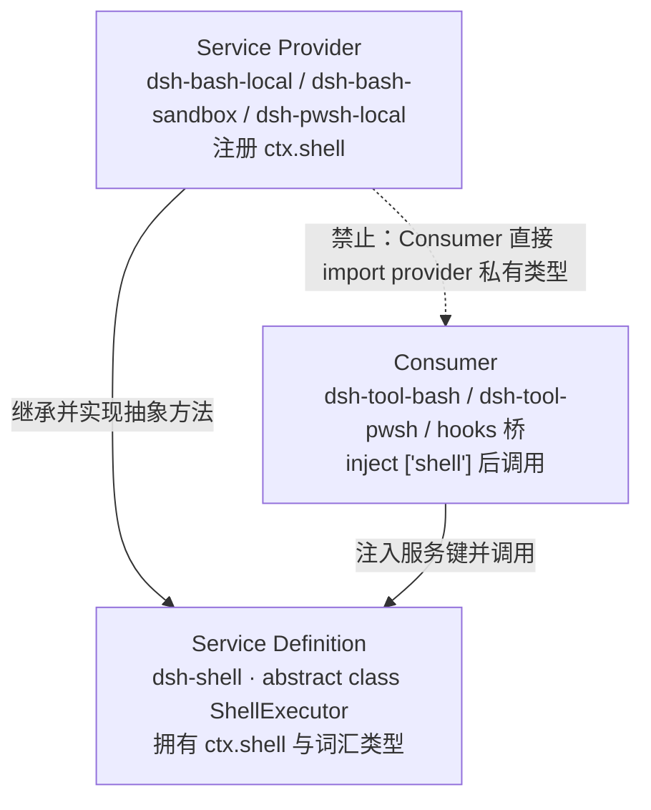

# 能力接缝设计

> **本文定位**：`dev_docs` 是 deepseek-harness 的**中文导航层**，不是事实的归属地。接缝的**定义**归 [`docs/glossary.md`](../docs/glossary.md)，接缝的**清单与图谱**归 [`docs/capability-seams.md`](../docs/capability-seams.md)，每个接缝的**契约**归各自包 README。本文不复述这三者，只补充上游没有集中讲的一件事：**如何设计一个新接缝，以及如何识别设计错了**。
>
> **与 `docs/` 冲突时一律以 `docs/` 为准**，并立即修正本文。

## 1. 本文定位与上游事实源

> **上游事实源**：[`docs/AGENTS.md` — The tier taxonomy: one home per fact](../docs/AGENTS.md#the-tier-taxonomy-one-home-per-fact)

仓库的文档治理规则是"一个事实一个归属地"：任何一条事实只在一处成文，其他地方链接过去。这意味着本文**刻意不提供**下列内容，请直接去上游读：

| 你想找的东西 | 归属地 | 本文的处理 |
| --- | --- | --- |
| 接缝的正式定义与术语边界 | [`docs/glossary.md#capability-seam`](../docs/glossary.md#capability-seam) | 只在第 2 节做一句话概括 + 链接 |
| 全仓接缝清单、ctx key、实现与消费者对照表、依赖图 | [`docs/capability-seams.md`](../docs/capability-seams.md)（生成产物） | 只在第 6 节给场景导航，不复制清单 |
| 架构层面为什么要有接缝 | [`docs/architecture.md#capability-seams`](../docs/architecture.md#capability-seams) | 第 3 节引用其结论并补证据链 |
| 某个具体接缝的完整契约（方法、错误、事件） | 对应的 `docs/subsystems/*.md` 与包 README | 一律链接 |
| 三角角色划分的决策记录与被否决的替代方案 | [能力接缝 Agent Note](../.agents/notes/implemented/architecture/2026-06-13-capability-seams.md) | 第 4 节引其判据 |
| 新包的创建步骤、命名词表、README 模板 | [`docs/cookbook/adding-a-package.md`](../docs/cookbook/adding-a-package.md) | 第 4.6 节链接，不重述步骤 |

本文的读者是"准备新增或改造一项能力"的开发者与 AI。它回答的是**设计动作**问题：先做什么、什么该放进接口、什么必须留在实现里、什么写法一定会被评审打回。

---

## 2. 接缝是什么：三角的三个角色

> **上游事实源**：[`docs/glossary.md#capability-seam`](../docs/glossary.md#capability-seam)、[`docs/architecture.md#capability-seams`](../docs/architecture.md#capability-seams)

一句话概括：**接缝（seam）指的是"可替换能力"这个整体，由 Service Definition、Service Provider、Consumer 三个角色共同构成；只做其中一个角色，不叫加了一项能力。** 精确定义、术语大小写约定（`Service Definition` 用标题式大写、泛指的 provider/consumer 小写）以及"什么不能叫 seam"都在术语表里，本文不复述。



三角的三条边各有不同的变化速率，这正是拆分的理由：Service Definition 随"能力是什么"变化，Service Provider 随"怎么跑"变化，Consumer 随"模型和插件看到什么"变化。把三者塞进一个包，就把三种变化速率焊死在一起——把本地执行器换成沙箱执行器时，模型看到的工具 schema 会跟着抖动，尽管模型侧契约根本没变。

Service Definition 有两种合法形态，选哪种取决于"一个 context 里能不能同时存在多个实现"：

- **抽象类**（一个 context 恰好一个实现）：`ShellExecutor`（`packages/shell/shell/src/index.ts:64`，symbol: `ShellExecutor`）、`SubprocessRuntime`（`packages/subprocess/subprocess/src/index.ts:114`，symbol: `SubprocessRuntime`）、`FileSystem`（`packages/fs/fs/src/index.ts:86`，symbol: `FileSystem`）。装载第二个实现会在 Cordis 的重复服务注册上**失败并抛出**，这是刻意的。
- **具名注册表**（同一 context 里并存多个具名 provider）：`ctx.web` 的搜索/抓取 provider、`ctx.subagents` 的委派后端。

两种形态都**不是 TypeScript `interface`**——Service Definition 必须是一个真实的 Cordis `Service`，因为它要拥有 `ctx.<key>` 这个运行时槽位。

---

## 3. 为什么一个 provider 替换能改变整个产品

> **上游事实源**：[`docs/architecture.md#capability-seams`](../docs/architecture.md#capability-seams)、[`packages/e2b/README.md`](../packages/e2b/README.md)

`docs/architecture.md` 的结论是："接缝是为什么换一个 provider 就能改变整个产品——文件系统与子进程 provider 共享同一个执行世界，把它们指向远程沙箱，Bash、PTY、LSP 会跟着一起搬家，而且不需要 provider 分叉。" 下面是这条结论在本仓库里的完整证据链。

**第一环：两个基础接缝，一个共享世界。** `packages/e2b/` 只有三个包：`e2b` 拥有 `ctx.e2b`（一个共享的 E2B SDK 句柄、远程工作目录与沙箱生命周期），`fs-e2b` 注册 `ctx.fs`，`subprocess-e2b` 注册 `ctx.subprocess`。两个 provider 依赖同一个 `ctx.e2b`，因此它们落在**同一个 Linux 执行世界**里——文件写入和随后读它的命令看到的是同一份状态。

**第二环：上层能力全部经由 `ctx.subprocess` 落地。** 按 [`docs/capability-seams.md`](../docs/capability-seams.md) 生成的 `ctx.subprocess` 直接消费者一行，bash 执行器（`bash-local`、`bash-sandbox`）、PTY 后端（`terminal-bash`）、LSP 宿主（`lsp-stdio`）、以及 ACP / Codex / Claude Code 三个跨进程子代理后端，全都从 `ctx.subprocess` 起进程。它们谁都没有"本地/远程"的分支代码。

**第三环：模型可见面完全不动。** `dsh-tool-bash` 注入的是 `ctx.shell`（`packages/shell/tool-bash/src/index.ts:30`，symbol: `inject`），`dsh-tool-fs` 注入的是 `ctx.fs`。它们看不到 `ctx.e2b`，也看不到 `subprocess-e2b` 的任何私有类型。所以替换执行世界不产生 schema 变更，不产生快照变更，不产生模型行为变更。

**结论**：一次 provider 替换（在 cordis.yml 里换掉 `ctx.fs` 与 `ctx.subprocess` 两行），改变的是 Bash、后台任务、持久 PTY、LSP 导航、跨进程子代理这五条链路的落地位置，而 harness 进程、模型调用、会话状态全部留在本地。**这正是接缝设计的收益兑现点**——如果你新设计的接缝不能带来类似的"换一行配置、改变一类行为"，那它多半不该是接缝（见 4.1）。

同一个接口下 provider 差异能有多大，看 [`packages/subagent/`](../packages/subagent/README.md)：同一个 `ctx.subagents` 之下，既有进程内新起的子 agent、从父 agent 已完成历史 fork 出来的子 agent，也有走 ACP 协议、走真实 Codex app-server、走真实 Claude Code Agent SDK、走 Harness 自己 TypeScript SDK 的跨进程子 agent。它们的实现毫无共同点，但 [provider 契约](../docs/subsystems/subagent.md#the-provider-contract-subagentprovider) 是同一个。

---

## 4. 设计一个新接缝：分步流程

> **上游事实源**：[能力接缝 Agent Note](../.agents/notes/implemented/architecture/2026-06-13-capability-seams.md)、[`AGENTS.md` — Conventions](../AGENTS.md#conventions)、[`packages/AGENTS.md`](../packages/AGENTS.md)、[`docs/subsystems/shell.md#request-vs-spec-the-resolve-split`](../docs/subsystems/shell.md#request-vs-spec-the-resolve-split)

本节是全文的核心。`packages/shell/` 是仓库明确指定的模板，下面每一步都用它的真实代码作证据。

### 4.1 第 0 步：先判断——这真的是接缝吗？

不要预先拆角色。Agent Note 的判据是：**只有当三个角色会独立演化时才拆包**；一个只有一种可想象实现、一个消费者的能力，保持单包，直到第二个实现真的出现。

判断用三个问题，**三个都答"是"才是接缝**：

1. **会不会有第二个实现，且它的差异是"机制/协议/环境/厂商"级别的？** `bash-local` 与 `bash-sandbox` 差在约束机制，`fs-local` 与 `fs-e2b` 差在执行世界——这是真差异。"将来可能加个开关"不是。
2. **消费者是否能在不知道实现的前提下完整表达需求？** 如果消费者必须先判断"当前挂的是哪个 provider"才能构造调用，说明接口漏了信息，或者这根本是两种能力。
3. **模型可见面是否会随实现变化？** 如果换实现必然要改工具 schema 或模型可见文本，那它不是同一个接缝下的两个 provider，而是两个能力。

反例（**不是**接缝，别拆）：只有一个消费者的内部服务方法；只为"可配置性"而抽象的东西——`packages/AGENTS.md` 明确写着"可配置性本身不能证成一个未被支持的默认值、公开操作集、格式或外来概念"，也明确点名了反向气味：**一个只有一个内部调用方的公开服务方法，应该改成传入一个私有能力闭包**。

角色也可以合并，但这两个常被引用的例子都要加限定：

- **`dsh-llm`**：Agent Note [`2026-06-13-capability-seams.md`](../.agents/notes/implemented/architecture/2026-06-13-capability-seams.md) 把它记作"Service Definition 与 Consumer 折在一个包"的范例（消费者是 loop 本身，不是可替换的 schema 面）。但生成产物 [`docs/capability-seams.md`](../docs/capability-seams.md) 现在把 `agent-loop` 与 `compaction-basic` 列为 `ctx.llm` 的直接消费者——**消费者已经在独立包里了**。角色合并的**判据**仍然成立，别把它当成当前的包布局。
- **`dsh-user-approval`**：它合并的是**定义与策略**（`ask` / `never`），不是"定义与唯一实现"。真正的 answerer 是 `approval/request` 瀑布监听器，由 UI 通道与 ACP 桥在**别的包**里提供；该包 `src/` 下只有 `index.ts` / `invariant.ts` / `types.ts`，README 明写 "the service itself never prompts a human"，没有 answerer 时请求解析为 `unavailable` 并 fail closed。

合并的判据仍然是那句话：**它们是否是同一个关注点**。

### 4.2 第 1 步：Service Definition 该放什么、不该放什么

Service Definition 的唯一职责是拥有 `ctx.<key>`、声明抽象方法、并定义这项能力的**词汇类型**。它的依赖应当只覆盖契约本身需要的词汇。

`packages/shell/shell/src/index.ts:64-67`（symbol: `ShellExecutor`）——服务键在构造函数里被钉死，实现类不能改名：

```ts
export abstract class ShellExecutor extends Service {
  constructor(ctx: Context) {
    super(ctx, 'shell')
  }
```

`packages/shell/shell/src/index.ts:78-99`（symbols: `resolve` / `run` / `start`）——三个抽象方法，以及写进 JSDoc 的调用顺序契约：

```ts
  /**
   * Apply implementation-owned defaults and caps to a request before execution.
   * @param request - the caller's request; omitted fields get this
   *   implementation's defaults, capped fields are clamped.
   * @returns the fully-specified spec to hand to {@link run}/{@link start}.
   */
  abstract resolve(request: ShellExecRequest): ShellExecSpec

  /**
   * Run a command in the foreground; resolves when it finishes.
   * @param spec - a resolved spec from {@link resolve}, never a raw request.
   * @returns the outcome; nonzero exits, timeout kills, and abort kills
   *   resolve with a descriptive result rather than reject.
   */
  abstract run(spec: ShellExecSpec): Promise<ShellRunResult>

  /**
   * Start a background process and return its handle immediately.
   * @param spec - a resolved spec from {@link resolve}, never a raw request.
   * @returns the live process handle (reads, kill, quiescence promise).
   */
  abstract start(spec: ShellExecSpec): ShellProcess
```

**该放进来的**：能力词汇（请求、规格、结果、句柄类型）；抽象方法及其语义约束（`run` 只在基础设施故障时 reject，非零退出/超时/中止都以结果值返回）；属于**能力本身**而非某个实现的东西。`SHELL_SETTINGS_NAMESPACE`（`packages/shell/shell/src/index.ts:21`）就是一个精确的例子——它归定义包，因为它命名的是"shell 这项能力"，不是某个执行器；这样一份跨平台携带的 settings 文档在 POSIX 与 Windows 上都能继续解析。

**不该放进来的**：工具 schema、Loader 细节、UI 呈现、传输格式、以及任何 provider 特有的行为。`packages/AGENTS.md` 的措辞是"**为当前所有 Consumer 设计 Service Definition**……不要让某一个 Consumer 支配服务契约"。同样不该放进来的还有已经归属别处的概念：`dsh-shell` 的模块 JSDoc 明确写着后台作业语义属于 `dsh-jobs`，本接缝只暴露进程句柄；受管环境与捕获输出的词汇属于 subprocess 接缝，这里只是**再导出**，好让 bash 消费者保持单一 import 根。

### 4.3 第 2 步：`resolve(request): Spec` —— 显式默认值步骤

这是最容易做错、也最有仓库特色的一步。`AGENTS.md` 的规则原文是："**包边界上显式优于隐式**：默认值填充是拥有它的实现里一个显式的 `resolve(request): Spec` 步骤，而不是 `run()` 内部隐藏的 `?? default`（`dsh-shell` 的 request/spec 拆分是模板）。"

**request 与 spec 的区别，就是"可选"与"必填"的区别。** request 是调用方（模型、插件）能表达的东西；spec 是执行器实际执行的东西，中间那一步就是默认值与上限的**唯一施加点**。

`packages/shell/shell/src/types.ts:38-43`（symbol: `ShellExecRequest`）——调用方视角，`workdir` / `timeoutMs` 都是可选：

```ts
export interface ShellExecRequest {
  command: string
  /** Working directory override (default: implementation-configured). */
  workdir?: string | undefined
  /** Timeout override in milliseconds (implementations cap it). */
  timeoutMs?: number | undefined
```

`packages/shell/shell/src/types.ts:86-94`（symbol: `ShellExecSpec`）——执行器视角，同样两个字段变成必填：

```ts
export interface ShellExecSpec {
  command: string
  workdir: string
  timeoutMs: number
  /**
   * Resolved foreground stdout capture budget in bytes. `run()` uses it for
   * stdout; background jobs and stderr keep the executor's own output cap.
   */
  stdoutMaxBytes: number
```

默认值从哪儿来？从**实现自己的配置**，在 `resolve()` 里一次性填完。`packages/shell/bash-local/src/index.ts:148-173`（symbol: `LocalBashExecutor.resolve`）：

```ts
  resolve(request: ShellExecRequest): ShellExecSpec {
    const timeoutMs = clampTimeout(
      request.timeoutMs,
      this.config.timeoutMs,
      this.config.maxTimeoutMs,
      'bash-local: request.timeoutMs',
    )
    const stdoutMaxBytes = request.stdoutMaxBytes ?? this.config.maxOutputBytes
    assertPositiveFinite('request.stdoutMaxBytes', stdoutMaxBytes)
    return {
      command: request.command,
      workdir: request.workdir ?? this.config.cwd ?? process.cwd(),
      timeoutMs,
      stdoutMaxBytes,
      ...request.signal ? { signal: request.signal } : {},
      // Carry stdin/ordinary env/trusted dshEnv through verbatim — optional,
      // no config default. The subprocess service owns the scrub and merge order.
      ...request.stdin !== undefined ? { stdin: request.stdin } : {},
      ...request.env !== undefined ? { env: request.env } : {},
      ...request.dshEnv !== undefined ? { dshEnv: request.dshEnv } : {},
      // Carry a sandbox policy through verbatim: this executor never
      // confines, so the field is inert here (the seam contract) — a
      // sandboxing subclass overrides resolve() to stamp its default instead.
      sandboxPolicy: request.sandboxPolicy,
    }
  }
```

注意这里同时演示了三种字段处理方式：**填默认值**（`workdir`、`timeoutMs`、`stdoutMaxBytes`）、**原样透传**（`stdin`、`env`、`dshEnv`）、**留给子类填**（`sandboxPolicy`）。第三种由沙箱子类接手，`packages/shell/bash-sandbox/src/index.ts:84-86`（symbol: `SandboxBashExecutor.resolve`）：

```ts
  override resolve(request: ShellExecRequest): ShellExecSpec {
    return { ...super.resolve(request), sandboxPolicy: request.sandboxPolicy ?? this.ctx.sandboxPolicy.resolve() }
  }
```

调用方的义务是**显式走这一步**，`packages/shell/tool-bash/src/index.ts:379-382`：

```ts
      const result = await ctx.shell.run(ctx.shell.resolve({
        ...request,
        signal: exec.signal,
      }))
```

后台路径同样如此，`packages/shell/tool-bash/src/index.ts:369`：

```ts
            const proc = ctx.shell.start(ctx.shell.resolve(request))
```

**为什么默认值不能藏在 `run()` 里的 `?? default`**，四条理由：

1. **默认值会变成不可观测的事实。** `ShellRunResult` 里有一个 `timeoutMs` 字段记录"本次实际生效的超时"。如果默认值在 `run()` 内部才产生，调用方在调用前无从得知自己会被套上什么值，也无法把它写进会话日志或 UI。
2. **多个入口会各自漂移。** `ctx.shell` 有四个直接消费者（bash 工具、pwsh 工具、两个 hooks 桥）。默认值放在 `run()` 里，`start()` 就得重复一遍；再加一个消费者，就多一份漂移风险。集中在 `resolve()` 意味着**只有一处**能产生默认值。
3. **上限（cap）不是默认值，但必须同处施加。** `clampTimeout` 同时做了"缺省填充"和"钳制到 `maxTimeoutMs`"。模型可以传 `timeoutMs`，但不能突破部署配置的上限——这条约束必须在一个既知道请求、又知道配置的地方执行，那就是 `resolve()`。
4. **子类扩展只有一个挂钩点。** 沙箱执行器只需 `override resolve()` 加一行，就补上了 `sandboxPolicy` 默认值，`run()` / `start()` 一行都不用改。默认值散落在 `run()` 里，这种扩展就要复制粘贴。

### 4.4 第 3 步：Provider 实现的义务

Provider 是"注册一个实现"的插件。它的义务清单：

- **继承 Service Definition（或向注册表注册），不要另起服务键。** 服务键归定义包。
- **声明依赖注入。** `packages/shell/bash-local/src/index.ts:103`：`static inject = ['subprocess']`。provider 依赖的是**下层接缝**，不是下层的某个具体实现——正因为 `bash-local`、`terminal-bash`、`lsp-stdio` 都只认 `ctx.subprocess`，把该行换成 `subprocess-e2b` 才能整体搬走执行世界（见第 3 节"第二环"）。
- **把可部署变化的调参做成校验过的 `Config` 字段。** `AGENTS.md` 的规则："插件里不允许硬编码调参；随部署变化的选择必须是可从 cordis.yml 改的、经过校验的 `Config` 字段；一个 `DEFAULT_*` 常量或测试钩子不算可配置。协议常量、外部规范、安全不变量保持固定。" `packages/shell/bash-local/src/index.ts:105-112`（symbol: `LocalBashExecutor.Config`）：

```ts
  static Config: z<Config> = z.object({
    cwd: z.string(),
    timeoutMs: z.number().default(120_000),
    maxTimeoutMs: z.number().default(600_000),
    maxOutputBytes: z.number().default(64_000),
    maxSpillBytes: z.number().default(DEFAULT_MAX_SPILL_BYTES),
    graceMs: z.number().default(DEFAULT_GRACE_MS),
  })
```

- **配置不合法要**在写入点**大声失败，而不是在下一条命令时。** `assertServiceableBashConfig`（`packages/shell/bash-local/src/index.ts:83`）就是这么做的：schema 表达不了"正有限数"和"必须放得进定时器"，所以在构造与 settings 写入时各校验一次。
- **注册必须可撤销。** 所有贡献走 `ctx.effect()` / `ctx.on()`，注册表的 `register()` 返回 disposer。注册表形态的写法见 `packages/web/web/src/index.ts:118-129`（symbol: `WebRuntime.registerProvider`）：

```ts
  private registerProvider<P extends { readonly id: string }>(store: Map<string, P>, provider: P): () => void {
    if (store.has(provider.id)) {
      throw new WebError(`a web provider with id "${provider.id}" is already registered`, 'WEB_DUPLICATE_PROVIDER')
    }
    const dispose = this.ctx.effect(function* () {
      store.set(provider.id, provider)
      yield () => store.delete(provider.id)
    }, 'web.registerProvider()')
    // ctx.effect's disposer returns Promise<void>; our disposer API is
    // synchronous fire-and-forget — discard the (always-resolved) promise.
    return () => void dispose()
  }
```

- **遵守 Service Definition 写在 JSDoc 里的语义约束**，包括错误分类（什么 reject、什么以结果值返回）、增量读取的不重复投递、生命周期归属（后台进程在哪一层的销毁点被杀死并等待）。这些约束是接缝契约的一部分，不是实现细节。
- **注册表贡献要用 HMR 安全测试证明可销毁**：销毁 fiber，观察注册项消失（[testing policy](../docs/testing.md)）。

### 4.5 第 4 步：Consumer 的义务

Consumer 通常是模型可见工具，它是接缝面向模型的那一面。

- **只注入服务键，绝不 import provider 特有类型。** `packages/shell/tool-bash/src/index.ts:30`：`export const inject = ['tools', 'shell', 'systemPrompt', 'shellEnv']`。
- **可选服务用 `ctx.get(name)`，不要用 `ctx.<name>` 属性代理。** `ctx.<name>` 只保留给已声明的注入；属性代理对拓扑敏感，而 `ctx.get` 读全局服务存储（见 [`packages/AGENTS.md`](../packages/AGENTS.md)）。tool-bash 对后台作业就是这么处理的（`packages/shell/tool-bash/src/index.ts:353`，symbol: `jobs`），缺失时给出一条指明该装哪两个包的错误。
- **必须显式调用 `resolve()`**，见 4.3。
- **模型可见契约从模型视角写。** 提示词、工具 schema、结果、诊断只包含与任务相关的概念，不含 UI、传输或实现词汇。哪些字段该暴露给模型、哪些只给受信任的进程内插件，是 Consumer 的决定：`stdin`、`env`、`stdoutMaxBytes` 在 `ShellExecRequest` 里存在，但 `dsh-tool-bash` **不把它们做成工具参数**。
- **schema 省略不等于强制。** 未声明的键是允许传入的，所以 schema 里去掉一个开关还必须在执行处再挡一次——`packages/shell/tool-bash/src/index.ts:349-352` 就为 `run_in_background` 保留了运行时拒绝。`packages/AGENTS.md` 把这条写成"**在做出决定的那个操作里强制它**"。
- **工具的 UI 呈现要一起设计**，`presentCall` / `presentResult` 保持纯函数（见 [`docs/cookbook/adding-a-tool.md`](../docs/cookbook/adding-a-tool.md)）。

### 4.6 第 5 步：包落位与命名

创建工作区包的完整步骤（目录、`package.json`、tsconfig、根配置注册、README 模板、验证命令）归 [`docs/cookbook/adding-a-package.md`](../docs/cookbook/adding-a-package.md)，本文不重述。只提示三件与接缝设计强相关的事：

1. **拓扑决策**见 [Decide the package topology](../docs/cookbook/adding-a-package.md#3-decide-the-package-topology)：角色独立演化才拆包，shell 三件套是模板。
2. **命名要命名"当前存在的角色"**见 [Name the role that exists](../docs/cookbook/adding-a-package.md#name-the-role-that-exists)：定义包命名能力本身；实现包加上区分它的机制、协议、环境或厂商限定词（`local` 只在"同宿主执行"确实是契约的一部分时使用）。那一节还有一张 `Controller` / `Registry` / `Runtime` / `Resolver` / `Executor` / `Provider` / `Backend` 等词的用法表，以及"单数 key 对应单一引擎、复数 key 对应注册表"的规则——新接缝取名前应当逐行对照。
3. **README 是包契约的归属地**，模型/token/KV 缓存影响用 [canonical Model Experience 格式](../docs/cookbook/adding-a-package.md#4-write-the-package-readme) 写；包组 README（如 [`packages/shell/README.md`](../packages/shell/README.md)）负责给出角色对照表并声明子系统归属。

---

## 5. 反模式清单

> **上游事实源**：[`AGENTS.md` — Conventions](../AGENTS.md#conventions)、[`packages/AGENTS.md`](../packages/AGENTS.md)、[能力接缝 Agent Note](../.agents/notes/implemented/architecture/2026-06-13-capability-seams.md)

### 5.1 只做一个角色，就宣称加了一项能力

**为什么错**：`AGENTS.md` 的规则是"接缝是完整能力，永远不是单个角色"。只写了一个 Service Definition 而没有 provider，装载后服务键永远不出现，注入它的 fiber 会一直挂起；只写了一个 provider 而没有 Consumer，这项能力对模型和产品不可见；只写了一个"工具"而绕过接缝直接调实现，那就是把可替换性焊死了。

**正确做法**：一次改动里把三个角色都设计出来（可以合并在同一个包里，但三种职责都要有归属）。同时按 `AGENTS.md` 的要求**规划单元、e2e 与快照覆盖**，接缝、生命周期路径与转录输出都要有对应测试；缺失的快照工具支持要在同一次改动里补上。

### 5.2 在 `run()` 里用 `?? default` 做隐式默认

**为什么错**：违反"包边界上显式优于隐式"。后果在 4.3 已展开：默认值不可观测、多入口漂移、上限无处施加、子类无扩展挂钩点。

**正确做法**：在拥有它的实现上做一个显式的 `resolve(request): Spec` 步骤；`run()` / `start()` 只接收已解析的 spec，签名上就拒绝原始 request（`abstract run(spec: ShellExecSpec)`，JSDoc 明写 "a resolved spec from `resolve`, never a raw request"）。

### 5.3 在 provider 里硬编码可部署变化的调参

**为什么错**：`AGENTS.md` 的"No hardcoded tunables in plugins"。超时、输出上限、溢写上限、kill 宽限期这些值随部署环境变化（CI 机器与开发机的合理超时不同），写死就意味着改它必须改代码并发版。注意规则的第二句同样重要：**一个 `DEFAULT_*` 常量或一个测试钩子不算可配置性**——它只是把硬编码换了个位置。

**正确做法**：做成经过 schema 校验的 `Config` 字段，默认值写在 `static Config` 里（见 4.4 的代码），部署方从 cordis.yml 覆盖。反向也要守住：协议常量、外部规范规定的值、安全不变量**保持固定**，不要为了"灵活"把它们暴露成配置。

### 5.4 不可撤销的注册

**为什么错**：`AGENTS.md` 的"Registrations are effects"。Cordis 的插件可以被卸载、重载、按 agent 作用域挂载与销毁。一次直接 `map.set(...)` 而不带撤销路径，会在插件重载后留下幽灵注册项：重复 id 冲突、旧实现继续服务、HMR 后行为不可预期。

**正确做法**：所有贡献走 `ctx.effect()` / `ctx.on()`，注册表的 `register()` 返回 disposer（见 4.4 `WebRuntime.registerProvider` 的写法：`ctx.effect` 的生成器里 `set`，`yield` 出 `delete`）。并用 HMR 安全测试证明它——销毁 fiber，断言注册项确实消失。

### 5.5 过早拆分角色

**为什么错**：`AGENTS.md` 说"只在角色独立演化时才拆"，Agent Note 补充"不要预先拆分——一个只有一种可想象实现、一个 Consumer 的能力保持单包，直到第二个出现"。拆分不是免费的：每个包要付出 `package.json`、tsconfig、README、注入连线、双语配对的成本，而且拆出来的抽象如果没有第二个实现来校准，它几乎必然是错的——它会把第一个实现的偶然细节固化成契约。

**正确做法**：先写一个包。等第二个实现真的出现时，让它来告诉你哪些是能力词汇、哪些是实现细节，那时再拆。`packages/AGENTS.md` 的配套规则是"**要求当前的所有者与需求**"：每个抽象、状态机、选项、防御性拷贝、兼容路径都要绑定到一个当前的契约或生产消费者。

### 5.6（补充）让单个 Consumer 支配服务契约

**为什么错**：`packages/AGENTS.md` 的"Design Service Definitions for all current Consumers"。当接口是照着第一个消费者的需要长出来的，第二个消费者就会被迫做适配层，或者更糟——去 import provider 的内部类型。反向气味也在同一条规则里：**一个只有一个内部调用方的公开服务方法**，说明它根本不该在公开面上。

**正确做法**：把工具 schema、Loader 细节、UI、传输、provider 特有行为留在 Consumer 或 provider 侧；Service Definition 只保留所有当前 Consumer 都需要的词汇。

---

## 6. 现有接缝速查

> **上游事实源**：[`docs/capability-seams.md`](../docs/capability-seams.md)（生成产物，含完整 ctx key / 角色 / 实现 / 消费者对照表与依赖图）

**下表不是接缝清单**，它只是一张"我要做 X → 该看哪个接缝"的导航表。权威的 ctx key、拥有者包、实现列表、直接消费者、伴生插件一律以生成产物 [`docs/capability-seams.md`](../docs/capability-seams.md) 为准；工具清单见 [`docs/tool-catalog.md`](../docs/tool-catalog.md)，配置清单见 [`docs/config-catalog.md`](../docs/config-catalog.md)，依赖图见 [`docs/module-graph.md`](../docs/module-graph.md)。

| 我要做的事 | 相关接缝 | 起点 |
| --- | --- | --- |
| 把文件与命令挪到别的执行世界（沙箱 / 远程） | `ctx.fs` + `ctx.subprocess` | [`packages/fs/`](../packages/fs/README.md)、[`packages/subprocess/`](../packages/subprocess/README.md)、[`packages/e2b/`](../packages/e2b/README.md) |
| 换一种命令执行器（本地 / 沙箱 / PowerShell） | `ctx.shell` | [`packages/shell/`](../packages/shell/README.md)、[shell 子系统](../docs/subsystems/shell.md) |
| 给模型加一个新的 shell 前端（工具形态） | `ctx.shell` 的 Consumer 角色 | [`packages/shell/tool-bash/`](../packages/shell/tool-bash/README.md) |
| 接入一个新的模型提供方 | `ctx.llm` | [`packages/llm/`](../packages/llm/README.md) |
| 加一个检索或抓取后端 | `ctx.web` | [`packages/web/`](../packages/web/README.md) |
| 加一种委派（子代理）后端 | `ctx.subagents` | [`packages/subagent/`](../packages/subagent/README.md)、[subagent 子系统](../docs/subsystems/subagent.md) |
| 加一个语言服务后端 | `ctx.lsp` | [`packages/lsp/`](../packages/lsp/README.md) |
| 换持久 PTY 的后端 | `ctx.terminals` | [`packages/terminal/`](../packages/terminal/README.md) |
| 加一种进程约束机制 | `ctx.sandbox` | [`packages/sandbox/`](../packages/sandbox/README.md) |
| 换会话持久化后端 | `ctx.sessionPersistence` | [`packages/session/`](../packages/session/README.md) |
| 换非会话数据的存储后端 | `ctx.storage` | [`packages/storage/`](../packages/storage/README.md) |
| 换用户设置的存放方式 | `ctx.settings` | [`packages/settings/`](../packages/settings/README.md) |
| 换凭证来源或加一种授权流 | `ctx.credentials` / `ctx.authorization` | [`packages/credentials/`](../packages/credentials/README.md) |
| 换上下文压缩策略 | `ctx.compaction` | [`packages/compaction/`](../packages/compaction/README.md) |
| 换 PTC 模式的代码执行基底 | `ctx.codeRuntime` | [`packages/code-runtime/`](../packages/code-runtime/README.md) |
| 加一种技能来源 | `ctx.skills` | [`packages/skill/`](../packages/skill/README.md) |
| 换 workflow 引擎的执行基底 | `ctx.workflowEngine` | [`packages/workflow/`](../packages/workflow/README.md) |
| 接管审批或提问的人类一侧 | `ctx.approval` / `ctx.userQuestions` | [`packages/interaction/`](../packages/interaction/README.md) |
| 加一种后台任务登记方 | `ctx.jobs` | [`packages/jobs/`](../packages/jobs/README.md) |

判断"我要加的东西该挂在哪儿"时，先查 [`docs/architecture.md#where-new-behavior-goes`](../docs/architecture.md#where-new-behavior-goes)——不是所有新行为都需要新接缝，很多只需要挂在已有的扩展点或事件上。

---

## 7. 延伸阅读

- [`docs/glossary.md#capability-seam`](../docs/glossary.md#capability-seam) —— 接缝的正式定义与术语边界。
- [`docs/capability-seams.md`](../docs/capability-seams.md) —— 全仓接缝图谱与对照表（生成产物）。
- [`docs/architecture.md#capability-seams`](../docs/architecture.md#capability-seams) —— 接缝在整体架构中的位置。
- [能力接缝 Agent Note](../.agents/notes/implemented/architecture/2026-06-13-capability-seams.md) —— 三角角色划分的决策记录、被否决的替代方案，以及"seam 命名三角而非接口"的术语裁定。
- [`docs/subsystems/shell.md`](../docs/subsystems/shell.md) —— 模板接缝的完整契约，含 [request/spec 拆分](../docs/subsystems/shell.md#request-vs-spec-the-resolve-split) 与 [`ctx.shell` 生成的 Cordis 面](../docs/subsystems/shell.md#ctxshell--shellexecutor-abstract-seam)。
- [`docs/subsystems/subprocess.md`](../docs/subsystems/subprocess.md) —— 下层执行接缝，含 [`ctx.subprocess` 抽象面](../docs/subsystems/subprocess.md#ctxsubprocess--subprocessruntime-abstract-seam)。
- [`docs/subsystems/filesystem.md`](../docs/subsystems/filesystem.md) —— 文件系统接缝，含 [`ctx.fs` 抽象面](../docs/subsystems/filesystem.md#ctxfs--filesystem-abstract-seam) 与 `fs/*` 事件门。
- [`docs/subsystems/subagent.md`](../docs/subsystems/subagent.md) —— 同一接口下 provider 差异最大的接缝，含 [provider 契约](../docs/subsystems/subagent.md#the-provider-contract-subagentprovider)。
- [`docs/cookbook/adding-a-package.md`](../docs/cookbook/adding-a-package.md) —— 新包落位、命名词表与 README 模板。
- [`docs/cookbook/adding-a-tool.md`](../docs/cookbook/adding-a-tool.md) —— Consumer 侧的工具与 UI 呈现设计。
- [`packages/AGENTS.md`](../packages/AGENTS.md) —— 包级规则：服务契约设计、可选服务读取、不变量发布条件、注册可销毁性证明。
- [`AGENTS.md`](../AGENTS.md) —— 仓库级约定，接缝、`resolve(request): Spec`、注册即效果、无硬编码调参四条规则的归属地。

**dev_docs 内的相关篇目**：

- [`AI_Coding_Context.md`](AI_Coding_Context.md) —— dev_docs 总入口与场景导航表。
- [架构总览](architecture_overview.md) —— 接缝在整体装配里的位置，含全部 `ctx` key 的导航表。
- [插件开发指南](plugin_development_guide.md) —— 同一件事的另一面：接缝设计 vs 扩展点落地。
- [实现模式索引](knowledge/patterns/index.md) —— 以 R11 的 `resolve(request): Spec` 拆分等为收录判据的案例目录。
- [AI 编码硬规则](rules/combined/AI_RULES.md) —— R8（接缝三角）、R11（显式默认值）、R12（无硬编码调参）的条文。
