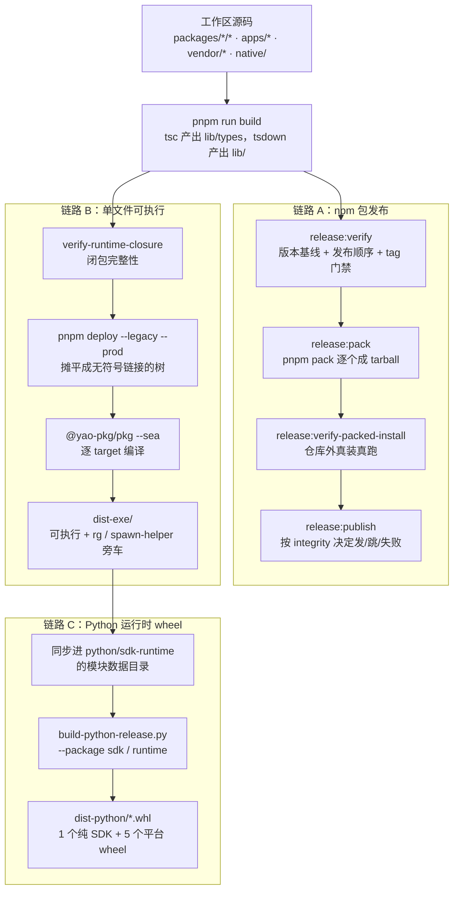

# 发布与分发

> **本文定位**：`dev_docs` 是 deepseek-harness 的**中文导航层**，不是事实的归属地。命令清单归 [`package.json`](../package.json) 与 [`AGENTS.md`](../AGENTS.md)，Python 分发归 [`python/README.md`](../python/README.md)，应用启动规则归 [`docs/architecture.md`](../docs/architecture.md)。本文不复述它们，只把三条并行的分发链路并排放到一起——它们共享构建产物，发布路径却各不相同。
>
> **与 `docs/` 冲突时一律以 `docs/` 为准**，并立即修正本文。

## 1. 本文定位与上游事实源

仓库对外交付的东西不止一种形态：`npx @deepseek-ai/dsh web` 走的是 npm 注册表，Python SDK 用户装的是一个内嵌 Node 运行时的原生可执行文件，而这两者背后是同一棵 `packages/ + apps/` 工作区、同一次 `pnpm run build`。上游文档把每条链路各自讲清楚了，但没有一处把它们摆在一起对比，于是"为什么发 npm 要跑 `release:verify`、发 wheel 却要先跑 `verify-runtime-closure`"这类问题只能靠翻三份文档拼出来。本文补的就是这一块拼图。

下表是本文引用的全部事实归属地。任何具体命令、版本号、平台清单，都请点进对应的源，不要以本文的转述为准。

| 事实 | 归属地 |
|---|---|
| 所有可运行脚本的真实名字与参数 | [`package.json`](../package.json) 的 `scripts` 段 |
| 日常命令与检查纪律 | [`AGENTS.md` → Commands](../AGENTS.md#commands)、[`docs/development.md` → Daily commands](../docs/development.md#daily-commands) |
| 发布家族的定义、排序与门禁 | [`scripts/release/`](../scripts/release/families.ts) 下的脚本本身 |
| 单文件可执行的构建路线 | [`scripts/build-exe-for-python-sdk.ts`](../scripts/build-exe-for-python-sdk.ts) |
| Python 两个发行物的形态与平台矩阵 | [`python/sdk-runtime/README.md`](../python/sdk-runtime/README.md)、[`python/development.md` → Build distributions](../python/development.md#build-distributions) |
| 应用启动只能经由 `dsh` profile 这一规则 | [`docs/architecture.md` → Application launch](../docs/architecture.md#application-launch) |
| vendored 包的清单、本地改动与同步流程 | [`vendor/README.md`](../vendor/README.md) |
| 第三方依赖披露 | [`THIRD_PARTY_NOTICES.md`](../THIRD_PARTY_NOTICES.md) |

## 2. 三条分发链路总览

> **上游事实源**：[`scripts/release/families.ts`](../scripts/release/families.ts)、[`scripts/build-exe-for-python-sdk.ts`](../scripts/build-exe-for-python-sdk.ts)、[`scripts/build-python-release.py`](../scripts/build-python-release.py)、[`python/sdk-runtime/README.md` → Build and distribution](../python/sdk-runtime/README.md#build-and-distribution)

三条链路的共同起点是同一次工作区构建：`tsc` 把类型中间产物写进各包的 `lib/types`，`tsdown` 把运行时入口打进 `lib/`。从 `lib/` 往后，三条路各走各的——npm 链路把每个包 `pnpm pack` 成 tarball 推到注册表；可执行链路把整棵运行时依赖闭包摊平后交给 `@yao-pkg/pkg --sea` 编译成单个原生二进制；wheel 链路则把上一条链路的产物当成"数据文件"塞进 Python 包再打成 wheel。注意第三条链路对第二条是**下游消费关系**，不是并列的另一种打包方式。



一句话记住三者的分工：**npm 面向 Node 生态的开发者，单文件可执行面向"不想装 Node"的宿主，wheel 只是把那个可执行文件送到 Python 用户机器上的载具**。

## 3. npm 包发布

> **上游事实源**：[`scripts/release/families.ts`](../scripts/release/families.ts)、[`scripts/release/verify.ts`](../scripts/release/verify.ts)、[`scripts/release/pack.ts`](../scripts/release/pack.ts)、[`scripts/release/publish.ts`](../scripts/release/publish.ts)、[`AGENTS.md` → Conventions](../AGENTS.md#conventions)

### 3.1 发布家族：三条序列，脚本管两条

`scripts/release/families.ts` 的文件级注释说明仓库有**三条互相独立的发布序列**（`packages/` + `apps/`、`vendor/`、`native/`），而这套脚本只拥有其中两条，用 `--family` 选择：

```ts
class DshFamily extends ReleaseFamily {
  readonly id = 'dsh'
  readonly patterns = ['packages/!(experimental)/*/package.json', 'apps/*/package.json'] as const
  readonly tagPrefix = 'dsh-v'
```

`scripts/release/families.ts:321-324`（符号：`DshFamily`）

```ts
class VendorFamily extends ReleaseFamily {
  readonly id = 'vendor'
  readonly patterns = ['vendor/*/package.json'] as const
  readonly tagPrefix = 'vendor-'
```

`scripts/release/families.ts:372-375`（符号：`VendorFamily`）

两条家族的版本基线截然不同：`dsh` 家族要求**全家共用一个版本号**（`DshFamily.verifyVersions` 发现多个版本就直接抛错），所以一个 `dsh-v<版本>` tag 就能命名整次发布；`vendor` 家族则**每个包各有各的版本线**，tag 前缀按包名展开成 `vendor-<去作用域名>-v`（符号：`VendorFamily.tagPrefixFor`，`scripts/release/families.ts:394-396`）。`native/` 那条序列由独立的 `Landlock Run Release` 工作流负责，不经过这两个脚本。

包命名遵循 `@deepseek-ai/dsh-<name>`；CLI 应用本身就是 `@deepseek-ai/dsh`（见 [`apps/cli/package.json`](../apps/cli/package.json)），vendored 包按 [`docs/rescope.md` → Name mapping](../docs/rescope.md#name-mapping) 的映射改写到同一作用域下。

### 3.2 发布顺序、dist-tag 与幂等

`ReleaseFamily.publishOrder`（`scripts/release/families.ts:163`）在打包前就把发布顺序算出来：安装边（`dependencies` / `optionalDependencies`）是硬约束，成环即报错；peer 边只在不与安装边冲突时排序，冲突就丢弃并**逐条打印**，因为丢一条真实的排序约束是发布决策，不是实现细节。这个顺序会以 `publish-order.txt` 的形式写进打包目录（`scripts/release/tarball.ts:14`，符号：`PUBLISH_ORDER_FILE`），发布步骤只读它，不读工作区当前状态。这样一次被中断的发布留在注册表上的永远是这个顺序的一个**前缀**，不会出现"某个包指向了注册表上还不存在的依赖"。

dist-tag 由版本号形态推导。基类的默认规则是"带 `-` 就打 `next`"，`dsh` 家族则进一步区分预发布通道：

```ts
  override distTagForVersion(version: string): string | undefined {
    const separator = version.indexOf('-')
    if (separator === -1) return undefined
    const [channel] = version.slice(separator + 1).split('.')
    if (channel === 'alpha' || channel === 'canary') return channel
    return 'next'
  }
```

`scripts/release/families.ts:351-357`（符号：`DshFamily.distTagForVersion`）

发布步骤是**按包对注册表逐个判定**的，不依赖任何"本次发布包含哪些包"的清单：注册表没有该版本就发；已有且 tarball integrity 一致就跳过；已有但内容不同则整个发布失败。

```ts
    const state = registryState(name, version)
    if (state.kind === 'present') {
      const local = integrityOf(tarball)
      if (state.integrity !== local) {
        throw new Error(
          `${name}@${version} is already published with different content`
```

`scripts/release/publish.ts:155-160`（符号：`main`）

"integrity 相同即跳过"正是重跑发布步骤安全的原因；"integrity 不同即失败"则意味着有人改了内容却没有改版本号。此外脚本对 `E409` 一类"写入未落定"的注册表返回码做有界退避重试，而对 `E403`（版本已存在）这类被拒绝的负载**不重试**——见 `scripts/release/publish.ts:31`（符号：`TRANSIENT_PUBLISH_CODES`）。

### 3.3 ⚠️ vendored 包的发布状况：以 `vendor/*/package.json` 为准

这里曾有一处**上游表述与仓库实际不符**，写发布流程时必须知道：

- [`AGENTS.md:103`](../AGENTS.md#conventions) 与 [`vendor/README.md` → Local modifications](../vendor/README.md#local-modifications) 第 2 条**原本**都称 vendored 包是 `private: true`。
- 但 2026-09-06 实测九个 `vendor/*/package.json`：**没有任何一个带 `private` 字段**，且全部声明 `publishConfig.access: "public"`。
- **本 fork 已于 2026-09-07 修正这两处**（连同 `scripts/rescope-vendor.ts:249`——那句话其实是该脚本生成并由 `rescope-vendor:check` 门禁强制的，只改文档会搞红门禁；详见 [`UPSTREAM_DOC_ISSUES.md`](../UPSTREAM_DOC_ISSUES.md) U1 与 S7）。合并上游时该处可能回退，届时以 `vendor/*/package.json` 为准。
- 顺带澄清一个**不是**缺陷的现象：`vendor/*/package.json` 的版本高于 [`vendor/README.md` → Manifest](../vendor/README.md#manifest) 表里的版本（如 `cordis` 是 `4.0.2` 而清单记 `4.0.0-rc.7`），这是**设计如此**——清单记的是上游快照，`package.json` 记的是本仓库自己的发布线。`scripts/release/bump.ts` 的 `nextVendorVersion` JSDoc 明写"a vendor re-sync restores upstream's version, which is lower than the release version this repository already reserved"。不要把它当成清单过期。
- 脚本侧也印证"vendored 包是要发布的"：`VendorFamily` 是一个真实的发布家族，`release:vendor` 是 [`package.json`](../package.json) 里的独立 script，`release:verify` 与 `release:publish` 则是接受 `--family vendor` 参数的通用 script（CI 里的用法见 `.github/workflows/release.yml`），`Release publish (vendor)` 是一条独立工作流。

**判断依据的优先级**：清单文件（`vendor/*/package.json`）> 散文描述（`AGENTS.md`、`vendor/README.md`）。原因也写在 `verify.ts` 里——发布前的 `verifyPublishable` 会直接拒绝任何带 `private: true` 的成员（符号：`verifyPublishable`，`scripts/release/verify.ts:44-49`），所以如果那两处散文成立，vendor 家族的发布根本跑不起来。`vendor/README.md` 开头解释了为什么必须发布：每个 harness 包都把 `cordis` 声明为 peer 依赖，发布 harness 就必须一并发布这层框架，而且用上游原名发布会构成注册表抢注。

vendored 包的打包策略也和 harness 包相反。`DshFamily.validatePayload` 走仓库通用策略，拒绝 tarball 里出现 `src/` 与 `.d.ts.map` / `.js.map`（符号：`isForbiddenPublicationFile`，`scripts/publication-payload.ts:33-39`）；`VendorFamily.validatePayload` 则**只要求 tarball 非空**，因为这些清单导出了 `./src/*` 供源码导航，剥掉 `src` 会让导出映射指向不存在的文件（`scripts/release/families.ts:410-412`）。

### 3.4 发布前的卫生门禁

`pnpm run hygiene` 是 npm 链路最贴身的门禁聚合体，其叶子清单在 `scripts/run-gates.ts:683`（符号：`hygieneLeafGates`）。与发布直接相关的几项值得单独知道它们在拦什么：`publint` 检查包清单的可发布性；`rescope-vendor:check` 确保 vendored 改名没有漏项；`verify-package-dependencies` 与 `constraints` 守工作区依赖约束；`verify-application-entrypoints` 落实"只有 `dsh` profile 能当应用入口"这条规则；`verify-dsh-package-licenses` 守许可证声明。门禁体系的整体解释见 [`quality_gates.md`](quality_gates.md)，本文不重复其命令清单。

比门禁更硬的一道是 `release:verify-packed-install`：它把打好的 tarball 装进**仓库之外**的一次性消费者目录，用普通 Node 驱动装好的可执行文件。这条检查证明的是 `files` 选中的负载完整、发布出去的依赖范围能解析——工作区软链或 checkout 里残留的 `lib/` 都顶替不了缺失的文件。因为 harness 包把 vendored 框架声明为 peer 而两者属于不同发布序列，`dsh` 家族的验证会同时喂进 vendor 家族的打包产物，但只发布自己那一份（见 `scripts/release/verify-packed-install.ts:1-17` 的文件级注释）。

## 4. 单文件可执行

> **上游事实源**：[`scripts/build-exe-for-python-sdk.ts`](../scripts/build-exe-for-python-sdk.ts)、[`scripts/verify-runtime-closure.ts`](../scripts/verify-runtime-closure.ts)、[`python/development.md` → Build runtime artifacts](../python/development.md#build-runtime-artifacts)、[`python/sdk-runtime/README.md` → Packaged profile resolution](../python/sdk-runtime/README.md#packaged-profile-resolution)

这条链路要回答的核心问题是：**依赖闭包从哪来**。答案不是"扫描 import"，而是一份**只有 dependencies 的清单包**——[`python/sdk-runtime/package.json`](../python/sdk-runtime/package.json)，包名 `dsh-python-runtime-closure`，它自身 `private: true`，作用就是把要进可执行文件的每一个工作区包显式列一遍。

```ts
/** The closure manifest whose dependencies define the executable. */
const DEPLOY_ROOT_PACKAGE = 'dsh-python-runtime-closure'
/** The sole application launcher inside the deployed closure. */
const ENTRY_BIN = 'node_modules/@deepseek-ai/dsh/lib/bin.js'
/** Python-visible executable basename. */
const OUTPUT_BASENAME = 'deepseek-harness-sdk-runtime'
```

`scripts/build-exe-for-python-sdk.ts:18-23`

打包流程按顺序是四步。第一步 `verify-runtime-closure`：核对这份清单是否供齐了所有随附 agent preset 引用到的插件和依赖图里必需的工作区 peer——由于关闭了 peer 自动安装，任何遗漏否则只会在 Cordis 加载被打包的插件时才炸（见 `scripts/verify-runtime-closure.ts:1-6` 的文件级注释）。第二步 `pnpm deploy --legacy --prod --config.node-linker=hoisted --config.auto-install-peers=false`，把闭包摊成一棵**无符号链接**的实体目录树（`scripts/build-exe-for-python-sdk.ts:283-300`，符号：`SingleExeBuild.deployStaging`）。第三步给这棵树的清单注入 `bin` 与 `pkg.assets` 后交给 `@yao-pkg/pkg --sea` 逐 target 编译；`--sea` 模式一次只接受一个 target，Windows 只支持 x64。第四步把可执行文件同步进 Python 包的模块数据目录。

`pkg` 的静态分析看不见 Cordis 的运行时裸包导入，所以脚本用一组**整树 asset 通配**兜底：`node_modules/**/*.{js,cjs,mjs,json,md,node,so,dylib,dll,wasm,yaml,yml}`，另有根 `package.json`（裸名解析依赖它）与 `node_modules/**/*.so.*`（带版本后缀的共享库，不被 `*.so` 覆盖），外加 `dsh-web-frontend/dist/**/*`（web-app 动态拼路径）与 `dsh-skill-badge/assets/**/*`（经由 `import.meta.url` 解析资源）——清单见 `scripts/build-exe-for-python-sdk.ts:41-62`（符号：`ASSET_GLOBS`）。

有些东西**不能**进虚拟文件系统，必须以旁车文件形式落在可执行文件旁边：ripgrep 二进制（Linux/macOS 叫 `<产物>-rg`，Windows 叫 `<产物>-rg.exe`），以及 macOS 上 `node-pty` 需要的 `<产物>-spawn-helper`。原因是 Node 得在 `pkg` 的虚拟文件系统之外 spawn 它们（ripgrep 见 `scripts/build-exe-for-python-sdk.ts:453`，符号：`copyRipgrepSidecar`；spawn-helper 的拷贝在 `:441-449`，位于 `pack()` 内，符号：`pack`）。同理，因为操作系统符号链接进不了那个虚拟文件系统，被打包的启动过程会在 `$DSH_HOME/profiles/node_modules` 下维护一批**真实的 ESM 代理包**，让内建行和外部插件 peer 共享同一个 Cordis / 模块实例——细节归 [`python/sdk-runtime/README.md` → Packaged profile resolution](../python/sdk-runtime/README.md#packaged-profile-resolution)。

这条链路依赖两个 pnpm patch：`@yao-pkg/pkg` 与 `node-pty`，登记在 [`pnpm-workspace.yaml`](../pnpm-workspace.yaml) 的 `patchedDependencies` 下，补丁文件在 [`patches/`](../patches/@yao-pkg__pkg@6.21.0.patch)。补丁会随安装生效，所以交付物里带的是改过的副本——这也是它们必须出现在第三方披露里的原因（见第 6 节）。

顺带说明：同一次 deploy 出来的目录树还兼任**仅供仓库内使用的 node 载具**（`runtime/node/`），它跑在系统 Node 上，永不被自动选中，也不进 wheel 和 sdist。

## 5. Python 运行时 wheel

> **上游事实源**：[`python/README.md` → Packages](../python/README.md#packages)、[`python/sdk-runtime/README.md` → Installed commands and artifacts](../python/sdk-runtime/README.md#installed-commands-and-artifacts)、[`python/development.md` → Build distributions](../python/development.md#build-distributions)、[`docs/architecture.md` → Application launch](../docs/architecture.md#application-launch)

这一节最容易被误解，所以先把关键事实立住：**运行时 wheel 里装的不是什么"Python 专用的 Node 应用"，而是普普通通的 `dsh` CLI**。`docs/architecture.md` 的 Application launch 一节把这条写成了架构规则——Python SDK 遵循与 Node 侧完全相同的应用架构，其运行时 wheel 打包的就是常规 `dsh` CLI，命名形如 `deepseek-harness-sdk-runtime-<platform>-<arch>`，客户端默认启动的是 `dsh --profile sdk` 并要求显式指定 Harness home。可组合的部分是 **profile + 有序 patch 文件**，而不是"另一个可执行文件"或调用方自带的 Cordis 树。

Python 侧一共两个发行物，分工在 [`python/README.md` → Packages](../python/README.md#packages)：纯 Python 的 `deepseek-harness-sdk`（模块 `deepseek_harness`，跨平台 `py3-none-any`），和携带二进制的 `deepseek-harness-runtime-bin`（模块 `deepseek_harness_runtime`，**只发 wheel**）。后者装完会提供一个 `dsh` 控制台命令，它把参数转交给内嵌可执行文件，并要求 `DSH_HOME` 非空——绝不回落到 `~/.dsh`。

平台矩阵是数据驱动的，写在 [`python/sdk-runtime/platforms.json`](../python/sdk-runtime/platforms.json) 里，wheel tag 与可执行文件名一一对应：

| 平台键 | wheel tag | 可执行文件名 |
|---|---|---|
| `linux-x64` | `manylinux_2_28_x86_64` | `deepseek-harness-sdk-runtime-linux-x64` |
| `linux-arm64` | `manylinux_2_28_aarch64` | `deepseek-harness-sdk-runtime-linux-arm64` |
| `macos-arm64` | `macosx_14_0_arm64` | `deepseek-harness-sdk-runtime-macos-arm64` |
| `macos-x64` | `macosx_14_0_x86_64` | `deepseek-harness-sdk-runtime-macos-x64` |
| `win-x64` | `win_amd64` | `deepseek-harness-sdk-runtime-win-x64.exe` |

也就是一次完整发布产出**六个 wheel**：五个平台 wheel 加一个纯 SDK wheel。没有 Windows arm64 wheel，且 tag 与负载必须严格匹配。

版本的权威来源是**根 `package.json` 的 version**：`scripts/build-python-release.py` 把它注入两个 wheel，并把 SDK 对 `deepseek-harness-runtime-bin` 的依赖钉到同一版本。预发布版本按 PEP 440 规范化后再进文件名与元数据（例如仓库版本 `0.0.1-rc.1` 对应 `0.0.1rc1`），`python-v<仓库版本>` tag 只有与仓库版本匹配时才被接受。这些细节归 [`python/development.md` → Build distributions](../python/development.md#build-distributions)，本文不复制其命令行。

发布前的验证路径也和 npm 链路不同：`Release (Python)` 工作流可以用 `publish=false` 手动跑一次**演练**，构建全部六个 wheel、在 Python 3.10 与 3.14 上安装 Linux 发布集、核对文件名与元数据、检查 PyPI 单文件体积上限，并留下带 SHA-256 的聚合产物；演练运行没有注册表凭据，因此进不了任何发布 job。真正的公开发布跑在私有自动化仓库里，运行时与 SDK 分成两个 job，好让 SDK 上传失败时不必重发已经不可变的运行时文件——细节归 [`python/development.md` → Validate a release candidate](../python/development.md#validate-a-release-candidate)。

## 6. 第三方依赖披露

> **上游事实源**：[`THIRD_PARTY_NOTICES.md`](../THIRD_PARTY_NOTICES.md)、[`scripts/gen-third-party-notices.ts`](../scripts/gen-third-party-notices.ts)、[`LICENSE`](../LICENSE)

项目本体是 MIT（[`LICENSE`](../LICENSE)）。`THIRD_PARTY_NOTICES.md` 是**生成物，不能手改**——文件头两行就是这么写的。它由 `scripts/gen-third-party-notices.ts` 从工作区清单、`vendor/README.md` 的 vendored 清单、Python 的 `pyproject.toml` 以及 pnpm 补丁列表一起产出，许可证与仓库元数据取自已安装的 pnpm store，所以**跑生成器前必须先装好依赖树**。

它披露的是**直接依赖**（外加显式声明的官方 Claude Code 平台负载闭包），分为 vendored 源码、运行时 npm 依赖、官方 Claude Code 平台负载、仅开发期 npm 依赖、Python SDK 依赖、第一方原生包几档。完整的传递闭包不在这份文件里——npm 侧记在 `pnpm-lock.yaml`，Python 侧记在 `python/sdk/uv.lock`。判定"是不是运行时依赖"的口径值得注意：除了仓库工具、测试基建、文档站、原生启动器构建区这几块**永远到不了用户**的区域，其余任何包的运行时声明都算披露相关，因为用户的 `cordis.yml` 能挂载任意插件包（见 `scripts/gen-third-party-notices.ts:33-39`，符号：`DEV_ONLY_AREAS`）。

**新增依赖必须重跑生成器**。三重防线在拦这件事：pre-commit 钩子会在暂存文件改动到其输入时自动重新生成；`scripts/gen-third-party-notices.spec.ts` 在测试道上断言已提交的字节一致（删清单不触发钩子，正是靠这条断言兜住）；`pnpm run verify-third-party-notices` 是独立的检查入口。pnpm 补丁也在披露范围内——交付物里带的是改过的副本，所以补丁文件本身被列为"该修改的完整记录"。

## 7. 版本与稳定性预期

> **上游事实源**：[`README.md` → Developer preview](../README.md#developer-preview)、[`AGENTS.md` → Pre-stable APIs and released Session data](../AGENTS.md#pre-stable-apis-and-released-session-data)

项目处于**开发者预览期**，`README.md` 用全大写写了"**THERE WILL BE COMPATIBILITY-BREAKING CHANGES.**"。对应到发布实践上：公开 API 是 pre-stable 的，改了就一路更新所有消费者，不留兼容层、不做废弃期。这一点和 dist-tag 策略是一致的——当前根版本 `0.1.3-alpha.1` 带预发布通道 `alpha`，按 `DshFamily.distTagForVersion` 会被打成 `alpha` 而非 `latest`。

**唯一的例外是已发布的 Session JSONL**。`AGENTS.md` 把它单列为一节独立约定（`## Pre-stable APIs and released Session data`）：已发布的 Session JSONL 遵循**相邻迁移（adjacent migration）**——读取侧可以新增一个以版本命名的后继格式，但**永不移动、覆盖或删除已提交的世代**；同时"存在前驱"既不意味着提供回落，也不意味着支持降级。SQLite 域另走单调递增的 `SCHEMA_VERSION`。换句话说：代码接口可以随便破坏，用户磁盘上已经写下的会话数据不可以。这条约束的机制层细节归 [`session_and_events.md`](session_and_events.md)。

还有一条与发布强相关的架构规则同样写在那一节：**只有 `dsh` profile 能启动受支持的 Node 应用**，包 bin、demo、公开 SDK 的 argv 逃逸口一律禁止。这直接决定了三条链路的形状——wheel 里装的是 `dsh`，可执行文件里的唯一启动器是 `@deepseek-ai/dsh/lib/bin.js`，`verify-application-entrypoints` 在门禁里守着它。

## 8. 发布前检查清单

> **上游事实源**：[`AGENTS.md` → Commands](../AGENTS.md#commands)、[`docs/development.md` → CI gates](../docs/development.md#ci-gates)、[`quality_gates.md`](quality_gates.md)

本节**不列命令**——命令归 [`package.json`](../package.json) 与 [`AGENTS.md` → Commands](../AGENTS.md#commands)，门禁编排归 [`quality_gates.md`](quality_gates.md)。这里只给一份"按链路分组的确认项"，每一项都指向由谁来证明。

| # | 确认项 | 由谁证明 |
|---|---|---|
| 1 | 版本已提交进仓库（CI 从不回写仓库） | `release:dsh` / `release:vendor`，见 [`scripts/release/bump.ts`](../scripts/release/bump.ts) 文件级注释 |
| 2 | 家族版本基线成立、发布顺序可解、被丢弃的 peer 边已人工过目 | `release:verify` 的 `reportPublishOrder` 输出 |
| 3 | 包清单可发布、依赖约束与许可证声明成立 | `pnpm run hygiene`（详见 [`quality_gates.md`](quality_gates.md)） |
| 4 | tarball 负载不含 `src/` 与 map（vendored 家族除外） | `release:pack` 中的 `validatePayload` |
| 5 | 打好的包在仓库之外能真装真跑 | `release:verify-packed-install` |
| 6 | 发布从正确的 tag 触发、没有成员带 `private: true` | `release:verify` 在 `RELEASE_PUBLISH=true` 下的 `verifyTag` / `verifyPublishable` |
| 7 | 可执行文件的依赖闭包完整 | `pnpm run verify-runtime-closure` |
| 8 | 每个原生 target 在其**本机架构**上构建 | [`python/development.md` → Build runtime artifacts](../python/development.md#build-runtime-artifacts) |
| 9 | 安装态 wheel 的黑盒冒烟通过、快照差异已复核 | `Release (Python)` 的 `publish=false` 演练，见 [`python/development.md` → Validate a release candidate](../python/development.md#validate-a-release-candidate) |
| 10 | 第三方披露是最新的 | `pnpm run verify-third-party-notices` |
| 11 | 文档随代码同步更新 | `pnpm run doc-sync`（见 [`docs/development.md` → CI gates](../docs/development.md#ci-gates)） |

对应的 CI 工作流是 [`Release (dsh)`](../.github/workflows/release.yml)、[`Release publish (dsh)`](../.github/workflows/release-publish.yml)、[`Release (vendor)`](../.github/workflows/release-vendor.yml)、[`Release publish (vendor)`](../.github/workflows/release-vendor-publish.yml)、[`Build single-exe`](../.github/workflows/build-exe-for-python-sdk.yml) 与 [`Release (Python)`](../.github/workflows/python-release.yml)。带 `publish` 的那几条是唯一持有注册表凭据的地方；打包步骤本身**不需要任何凭据**，这正是"打包即发布边界"的含义（见 `scripts/release/pack.ts:1-8` 的文件级注释）。任何凭据都不应出现在本地命令、提交内容或本文中。

## 9. 延伸阅读

- [`monorepo_and_build.md`](monorepo_and_build.md)——三条链路共享的那次构建究竟产出了什么、工作区如何组织。
- [`quality_gates.md`](quality_gates.md)——`hygiene` / `doc-sync` / `check:ci:*` 各聚合体的编排与叶子清单。
- [`architecture_overview.md`](architecture_overview.md)——profile、bundle 与应用启动在整体架构中的位置。
- [`session_and_events.md`](session_and_events.md)——已发布 Session JSONL 的相邻迁移机制。
- [`plugin_development_guide.md`](plugin_development_guide.md)——外部插件如何被 `dsh plugin` 装进 profile，以及它与打包闭包的边界。
- [`AI_Coding_Context.md`](AI_Coding_Context.md)——`dev_docs` 全套文档的入口与阅读顺序。
- [`vendor/README.md` → Sync procedure](../vendor/README.md#sync-procedure) 与 [`docs/cookbook/adding-a-vendored-package.md`](../docs/cookbook/adding-a-vendored-package.md)——新增或同步一个 vendored 包的完整步骤。
