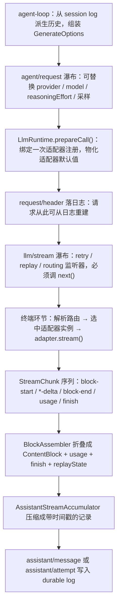

# 模型配置与 LLM 适配器

> **本文定位**：`dev_docs` 是 deepseek-harness 的**中文导航层**，不是事实的归属地。适配器的**接入步骤**归 [`docs/cookbook/adding-an-llm-adapter.md`](../docs/cookbook/adding-an-llm-adapter.md)，**流协议**归 [`docs/subsystems/llm-streaming.md`](../docs/subsystems/llm-streaming.md)，**配置项清单**归生成产物 [`docs/config-catalog.md`](../docs/config-catalog.md)。本文不复述它们，只补两件上游分散的事：接新提供方时**框架替你做了什么、你必须自己做什么**，以及**配置到底在哪一层生效**。
>
> **与 `docs/` 冲突时一律以 `docs/` 为准**，并立即修正本文。

## 1. 本文定位与上游事实源

> **上游事实源**：[`docs/AGENTS.md` — The tier taxonomy: one home per fact](../docs/AGENTS.md#the-tier-taxonomy-one-home-per-fact)、[`packages/llm/README.md`](../packages/llm/README.md)

仓库的文档治理规则是"一个事实一个归属地"：任何一条事实只在一处成文，其他地方链接过去。`docs/` 在配对门禁作用域内已全量双语（仅 manifest 显式豁免的 5 篇除外），所以把上游内容翻译一遍在这里没有价值。本文**刻意不提供**下列内容，请直接去上游读：

| 你想找的东西 | 归属地 | 本文的处理 |
| --- | --- | --- |
| 新增适配器的完整步骤、协议义务清单 | [`docs/cookbook/adding-an-llm-adapter.md`](../docs/cookbook/adding-an-llm-adapter.md) | 第 5 节链接，不重述任何一步 |
| `Message` / `ContentBlock` / `StreamChunk` / `GenerateOptions` 的字段定义 | [`docs/subsystems/llm-streaming.md`](../docs/subsystems/llm-streaming.md) | 第 4 节只讲"一次流经过哪些环节" |
| `LlmAdapter` 抽象类每个方法的契约 | [`llm-streaming.md#service-and-provider-contracts`](../docs/subsystems/llm-streaming.md#service-and-provider-contracts) | 第 5 节按"必做/可选"分类，不抄签名 |
| 每个插件接受哪些 config 字段、默认值是什么 | [`docs/config-catalog.md`](../docs/config-catalog.md)（**生成产物**） | 一律链接，绝不复制 |
| DeepSeek 直连适配器的全部行为（thinking、图片、Files API、错误码） | [`packages/llm/llm-deepseek/README.md`](../packages/llm/llm-deepseek/README.md#use-this-package) | 第 3 节一行定位 + 链接 |
| pi-ai 多 provider 适配器的 profile 语法与登录流 | [`packages/llm/llm-pi-ai/README.md`](../packages/llm/llm-pi-ai/README.md#use-this-package) | 第 3 节一行定位 + 链接 |
| 重试策略字段、`llm/retry` 事件语义 | [`packages/llm/llm-retry/README.md`](../packages/llm/llm-retry/README.md#use-this-package) | 第 5 节只答"是否自动生效" |
| token 计量的度量语义与投影 | [`docs/subsystems/token-meter.md`](../docs/subsystems/token-meter.md) | 第 8 节只讲它与适配器的耦合点 |
| DeepSeek 官方 API 的线上扩展字段格式 | [`docs/deepseek-llm-api-wire-extensions.md`](../docs/deepseek-llm-api-wire-extensions.md) | 第 3 节链接 |
| 终端用户在 Web UI 里怎么加 provider | [`docs/user/guide/providers.md`](../docs/user/guide/providers.md) | 第 6 节链接，本文面向开发者 |

本文的读者是"要接一个新模型提供方"或"在排查某个模型配置为什么没生效"的开发者与 AI。它回答的是两类问题：**接入时的分工边界**，和**配置层叠的优先级**。

---

## 2. `ctx.llm` 接缝的三个角色

> **上游事实源**：[`docs/glossary.md#capability-seam`](../docs/glossary.md#capability-seam)、[`docs/architecture.md#capability-seams`](../docs/architecture.md#capability-seams)、[`packages/llm/llm/README.md`](../packages/llm/llm/README.md)

模型调用在 harness 里不是"一个 SDK 封装"，而是一条标准的能力接缝——Service Definition / Service Provider / Consumer 三个角色齐备才叫一项能力。接缝的设计方法论在 [`capability_seams.md`](capability_seams.md)，这里只把 LLM 这一条接缝的三个角色对号入座：

| 角色 | 由谁承担 | 做什么 |
| --- | --- | --- |
| **Service Definition** | `packages/llm/llm/`（`@deepseek-ai/dsh-llm`） | 拥有 `ctx.llm`，声明消息/内容块/流块词汇表、`LlmAdapter` 抽象类、`llm/stream` 瀑布 |
| **Service Provider** | `llm-deepseek`、`llm-pi-ai`，以及你要写的新适配器 | 继承 `LlmAdapter`，把某个 provider 的线上格式翻译成上述词汇表，用 `ctx.llm.registerAdapter()` 注册路由 |
| **Consumer** | `agent-loop`、会话标题生成、压缩摘要、`token-meter` | 注入 `llm` 后调用 `ctx.llm.stream()` / `prepareCall()` / `resolveModelInfo()`，或读路由元数据 |

这个划分决定了**新提供方不需要新的 ctx key**：你写的是 Provider，注册到既有的 `ctx.llm` 上；只有当你要往某个 provider 的请求体里加**模型不可见的顶层字段**时，才会碰到另一个专用注册表 `ctx.deepseekLlmApiExtensions`（见第 3 节）。

Service Definition 本身不含任何 provider 线上逻辑，也不执行重试——它只做注册表、路由选择、请求冻结、失败归一化与 `llm/stream` 瀑布。这一点在 [`packages/llm/llm/README.md`](../packages/llm/llm/README.md) 的 Summary 里是明写的，也是第 5 节"分工边界"的基础。

一次模型调用在整个 turn 里的位置见 [`docs/architecture.md#turn-flow`](../docs/architecture.md#turn-flow)；agent loop 与会话事件的展开见 [`agent_loop_and_tools.md`](agent_loop_and_tools.md) 与 [`session_and_events.md`](session_and_events.md)。

---

## 3. 现有适配器与各自定位

> **上游事实源**：[`packages/llm/README.md#packages`](../packages/llm/README.md#packages)

`packages/llm/` 下的包清单归上游那张表，本文不复制。下面这张表回答的是另一个问题：**在什么场景下你该看哪个包**。

| 我的场景 | 看这个包 | 定位一句话 |
| --- | --- | --- |
| 只接 DeepSeek 官方 API（或一个 OpenAI 兼容网关代理它） | [`llm-deepseek`](../packages/llm/llm-deepseek/README.md#use-this-package) | 直连 `fetch` + SSE，独占 `deepseek-official` 一条路由，thinking / 图片 / Files API 都在这里 |
| 同一份组合里要跑多家 provider，或接一个自建/网关端点 | [`llm-pi-ai`](../packages/llm/llm-pi-ai/README.md#use-this-package) | 一个插件实例持有一个 `providers` 路由字典，走 pi-ai 的目录与线协议；目录里没有的路由可以整条手写声明 |
| 我要写一个新适配器，找参考实现 | 上面两个都要看 | 二者是**结构上完全不同**的两种实现方式：一个手写线上层，一个包库 |
| 模型请求失败要自动重试 | [`llm-retry`](../packages/llm/llm-retry/README.md#use-this-package) | 纯执行器，自身无配置；策略写在各适配器的 `retryPolicy` 上 |
| 我要知道当前上下文压力有多大 | [`token-meter`](../packages/llm/token-meter/README.md#use-this-package) | 从 durable session log 回放测量，不发模型调用 |
| 我要往 DeepSeek 官方请求里加模型不可见的顶层字段 | [`deepseek-llm-api-extensions`](../packages/llm/deepseek-llm-api-extensions/README.md) | `ctx.deepseekLlmApiExtensions` 注册表，线上格式见 [wire 参考](../docs/deepseek-llm-api-wire-extensions.md#body-extension-transaction) |
| 我要看那个字段的现成实现 | [`plugin-package-inventory-deepseek`](../packages/llm/plugin-package-inventory-deepseek/README.md) | 贡献 [`dsh_plugin_packages`](../docs/deepseek-llm-api-wire-extensions.md#dsh_plugin_packages)，默认开启 |
| 我要在没有 API key 的情况下跑快照测试 | [`test-support/llm-replay`](../packages/test-support/llm-replay/README.md#use-this-package) | 安装一个回放适配器，从录制好的 session JSONL 重建模型流 |

两个 DeepSeek 适配器**可以同时挂载**，因为它们的路由名不冲突；把另一个适配器注册到同一条路由名上会以 `DUPLICATE_ADAPTER` 失败。默认组合（`dsh-base` bundle）就是两个都挂：直连的那个带路由启动，pi-ai 那个**以零路由休眠挂载**，直到用户设置文档里出现 `llm-pi-ai:` section 才注册路由。

---

## 4. `StreamChunk` 与 `llm/stream` 瀑布：一次流式响应经过哪些环节

> **上游事实源**：[`llm-streaming.md#streamchunk--the-raw-protocol`](../docs/subsystems/llm-streaming.md#streamchunk--the-raw-protocol)、[`llm-streaming.md#llmstream--waterfall`](../docs/subsystems/llm-streaming.md#llmstream--waterfall)

`StreamChunk` 的联合类型定义、`FinishReason`、`TokenUsage`、`ReplayEnvelope` 的字段全在上游，本文不抄。这里补的是**一次流式响应的环节顺序**——上游把这些事实分散在"服务契约""适配器契约""BlockAssembler""会话日志"四处，串起来才看得清谁在什么位置能插手。



几个容易踩的位置，值得单独记住：

**适配器查找发生在 `llm/stream` 瀑布的终端环节**，不是之前。所以一个监听器可以在适配器被选中之前短路整次调用（回放、缓存、路由改写都靠这个）；反过来说，你在瀑布中间拿不到"哪个适配器会服务这次调用"。

**适配器抛出的异常不会穿透到消费者。** `LlmRuntime.stream()` 把适配器选择、分发、迭代阶段的失败归一化成终端的 `error` / `aborted` finish 块；中间件、嵌套调用、清理、消费者自身的失败才保持抛出。这是消费者只需要处理一种失败形态的原因。

**块重组不是适配器的事。** 适配器只要按 `index` 发出格式良好的块，`BlockAssembler` 负责折叠；`max-tokens` 截断时丢弃工具调用、并同步裁剪 replay 信封的对应条目这类一致性规则也在装配器里，不在适配器里。

**loop 构建的请求是深冻结的**，写操作会抛。`llm/stream` 的监听器读它、不改它——因为它的内容是 session log 的纯函数（"model-visible ⟺ logged"）。手工构建的一次性调用不带这个标记。

---

## 5. 接一个新提供方：路径导航

> **上游事实源**：[`docs/cookbook/adding-an-llm-adapter.md`](../docs/cookbook/adding-an-llm-adapter.md)（**权威步骤**）、[`llm-streaming.md#the-adapter-contract`](../docs/subsystems/llm-streaming.md#the-adapter-contract)

**步骤去读 cookbook，本节一步都不重述。** 本节回答 cookbook 之外的那个问题：哪些事框架已经替你做了、哪些事你必须自己做。这个边界在上游散落在四个包的 README 里，第一次接适配器的人最容易在这里判断错。

### 5.1 框架已经替你做了的

| 事项 | 谁做的 | 你需要做什么 |
| --- | --- | --- |
| **重试** | `dsh-llm-retry`，挂在 agent loop 的 `agent/request-error` 瀑布上 | **什么都不用做**。省略 `providerRetryPolicy()` 即采用 normal 默认策略。只有想改预算/可重试码/退避时才实现它 |
| **块重组** | `BlockAssembler`（[契约](../docs/subsystems/llm-streaming.md#blockassembler)） | 按 `index` 发出格式良好的块即可 |
| **失败归一化** | `LlmRuntime.stream()` | 按两条合法错误路径之一报错（抛出 / in-band `finish`），不要自创第三种 |
| **token 计量** | `ctx.tokenMeter` 从 durable log 回放测量（见第 8 节） | **纯文本路由什么都不用做**。只有当你的 provider 对请求图片单独计视觉 token 时，才需要实现 `imageRequestPricing()` |
| **请求可重建性** | loop 记录 raw chunks 与 `request/header` 快照 | 不要在适配器里引入日志之外的模型可见输入 |
| **路由注册的原子性** | `registerAdapter()` 全有或全无，重复路由抛 `DUPLICATE_ADAPTER` | 注册是 effect，随 fiber 卸载自动回收 |
| **凭证解析** | credentials 接缝（见第 7 节） | 配置里只放**引用**（环境变量名），每次请求解析一次 |
| **压缩与上下文管理** | `compaction` 接缝 + token-meter | 通过 `resolveModel()` 报出 `contextWindow` 即可 |

一句话概括：**重试与 token 计量是"挂上去就生效"的，不需要适配器配合**；前者的前提是组合里挂了 `dsh-llm-retry` 且调用走 agent loop，后者的前提只是挂了 `dsh-token-meter`。

### 5.2 你必须自己做的

**注册在 `ctx.llm` 上，而不是新建 ctx key。** 插件形态是函数插件（具名导出 `name` / `inject` / `Config` / `apply`，**不要有 default export**），注入 `llm`：

```ts
export const name = 'llm-deepseek'
export const inject = ['llm']
```

`packages/llm/llm-deepseek/src/index.ts:84-85`，symbol：`name`、`inject`。

注册动作本身是一行，返回的句柄同时是 disposer 和"原子替换本次注册路由集"的 `replace()`：

```ts
  const registration = ctx.llm.registerAdapter([PROVIDER], adapter)
```

`packages/llm/llm-deepseek/src/index.ts:476`，symbol：`apply` 内的 `registration`。

剩下必须自己承担的清单（每一条的**具体要求**都在 cookbook 与 [`#the-adapter-contract`](../docs/subsystems/llm-streaming.md#the-adapter-contract)，这里只列职责边界）：

- **实现 `stream()`**——`LlmAdapter` 唯一的抽象方法，其余方法都有默认实现。
- **遵守协议义务**——`usage` 在 `finish` 之前、`finish` 之后什么都不发；工具参数端到端保持原始 JSON 字符串；块 `index` 按首见顺序分配。
- **两条错误路径二选一**，并为每类失败写清楚选了哪条；上下文溢出必须归到规范码 `CONTEXT_WINDOW_EXCEEDED`；空补全必须归到 `EMPTY_RESPONSE`（默认重试策略会重试它）。
- **尊重 `options.signal`**，并给流设一个有界的 idle 超时（两个在产适配器都暴露正数有限的 `streamIdleTimeoutMs`，默认五分钟）。
- **发送 app 归属头**（`attributionHeaders()`），并用线级测试证明它确实发出去了。
- **关掉库自身的重试**——一次适配器调用必须等于一次 provider 尝试，否则 agent 层的 durable 重试边界会被打乱。
- **实现 `resolveModel()`**——报出精确路由的 `contextWindow`、`defaultMaxTokens`、有序的 reasoning effort id。这是压缩、占用率 UI、请求默认值的唯一权威来源。
- **不硬编码可调项**——随部署变化的选择必须是 `Config` 里经校验的字段，`DEFAULT_*` 常量不算可配置性（仓库约定，见 [`AGENTS.md`](../AGENTS.md)）。
- **想出现在配置界面里**，还要额外调 `registerConfigurableProviders()`（声明"这条路由可以被配置激活"）与 `registerModelDiscovery()`（回答"这个端点提供哪些模型"）。这两件事不是必需的，但不做就意味着用户只能改 `settings.yaml` 文本。
- **测试**——真实 API 的 e2e（无 key 自跳过）加无 key 的录制回放快照，覆盖要求归 [`docs/testing.md`](../docs/testing.md#when-a-snapshot-test-is-required)，回放插件见 [`llm-replay`](../packages/test-support/llm-replay/README.md#use-this-package)。测试方法论见 [`testing_guide.md`](testing_guide.md)。

### 5.3 什么时候需要 `ctx.deepseekLlmApiExtensions`

只有一种情况：你要往某个 provider 的请求**顶层**加一个模型看不见的字段（遥测、清单、日志后缀之类）。这不是适配器的扩展点，而是一个独立注册表——贡献方用 `register(field, provider)` 认领一个字段，适配器在序列化基础请求体之后、HTTP 之前调 `prepare(request)` 合并，2xx 之后才跑 `accept()` 事务。语义归 [`llm-streaming.md#official-deepseek-request-extensions`](../docs/subsystems/llm-streaming.md#official-deepseek-request-extensions)，线上格式归 [wire 参考](../docs/deepseek-llm-api-wire-extensions.md#body-extension-transaction)。这条路径目前只有官方 DeepSeek 适配器实现，pi-ai 路径上没有。

插件本身的写法（导出形态、effect、HMR 安全、README 要求）见 [`plugin_development_guide.md`](plugin_development_guide.md)。

---

## 6. 配置在哪一层生效

> **上游事实源**：[`docs/architecture.md#profiles-and-bundles`](../docs/architecture.md#profiles-and-bundles)、[`apps/cli/reference/README.md — Profile boot`](../apps/cli/reference/README.md#profile-boot)、[`packages/boot/app-boot/README.md#profiles`](../packages/boot/app-boot/README.md#profiles)、[`docs/subsystems/settings.md`](../docs/subsystems/settings.md#registration)、[`packages/credentials/credentials-local/README.md#where-keys-come-from`](../packages/credentials/credentials-local/README.md#where-keys-come-from)

这是本文的核心。"我改的那个值为什么没生效"几乎总是因为把三条**互相正交**的链混成了一条。它们分别决定三件不同的事：

| 链 | 决定什么 | 什么时候生效 |
| --- | --- | --- |
| **A. Cordis 组合层** | 挂载了哪些插件行、每行 `config` 的字面值 | boot 时组合；`patchReload: live` 的 profile 可热重组 |
| **B. 用户设置层** | 已注册命名空间中**用户可编辑的那个子集**的最终值 | 每次操作重读，下一次请求即生效，不需重启 |
| **C. 凭证层** | 密钥这一类**值本身**（配置里只存引用） | 每次请求解析一次；进程环境层在启动时快照冻结 |

三条链不是一条优先级序列：**A 决定有哪些行与它们的基线值，B 在 A 之上覆盖用户子集，C 完全不经过 A/B**。

### 6.1 A：Cordis 组合层的四层叠加

对空的条目列表按此顺序叠加，**后面的层按行 id 覆盖前面的层**：

1. profile manifest `dsh.profile.bundles` 里列出的**每个 bundle 的 `cordis.patch.yml`**，按列出顺序；
2. profile 自己的 `$DSH_HOME/profiles/<name>/cordis.patch.yml`；
3. **home 级** `$DSH_HOME/cordis.patch.yml`（机器本地偏好，被所有 profile 共享，因此**排在 per-profile 之后、压过它**）；
4. 每个 `--patch <path>` overlay，按 argv 顺序。

关键语义：**一条 patch 按 id 定位行，替换该行完整的 `config` 值，不做按 key 的深合并**；它也可以插入新行。这意味着"我只想改一个字段"必须把这一行**保留的字段全部重写一遍**——只写一个字段等于把其余字段清回默认。这也是"patch 掉一行后 `!!js` 表达式失效"的原因：表达式在被替换的 `config` 里，替换成字面量就把运行时读取删掉了。

当前随包发布的 profile 是 `web`、`headless`、`sdk`、`sdk-minimal`、`acp`。`web` 用 live patch 重载，其余四个只在启动时应用一次——一次性或 stdio 应用在已经接管工作之后替换依赖会破坏其生命周期。

`dsh-base` bundle 是 `web` / `headless` / `sdk` / `acp` 四个 profile 的共享第一层，模型适配器就挂在这里。它刻意**不内联任何 key 或端点**：

```yaml
    # The native DeepSeek adapter. No key or endpoint is inlined: both resolve per
    # request from the `llm-deepseek:` settings section over this entry, with the
    # key coming from the credential store below. Thinking defaults are a deployment
    # choice.
    - id: llm-deepseek
      name: '@deepseek-ai/dsh-llm-deepseek'
```

`packages/bundle/base/cordis.patch.yml:493-498`，行 id：`llm-deepseek`。

这段注释本身就是三条链分工的最好说明：**这一行只负责"这个适配器存在"**，端点与密钥分别由 B 链和 C 链决定。同一份文件里 `llm-pi-ai`（第 107 行）以零路由休眠挂载，`llm-retry`（第 84 行）、`settings`（第 90 行）、`credentials`（第 97 行）、`token-meter`（第 323 行）各占一行——这也是"重试与计量挂上就生效"的物理体现。

一份最小的手写组合长这样（服务 + 至少一个适配器）：

```yaml
- name: '@deepseek-ai/dsh-llm'
- name: '@deepseek-ai/dsh-llm-deepseek'
  config:
    apiKeyEnv: DEEPSEEK_API_KEY
```

`packages/llm/llm/README.md:39-42`。注意 `apiKeyEnv` 的值是**环境变量名**，不是密钥。

环境变量进入这一层的唯一通道是 `!!js` 表达式：`cordis.yml` 允许在插件 `config` 与条目 `disabled` 下使用 `!!js`（**绝不是 `!js`**），其余元数据保持字面量，因此条件化组合也要走 overlay（[primer](../docs/cordis-primer.md#loader-configuration)）。`!!js` 在 boot 时求值；live 重载的 profile 在补丁文件被编辑时会对着仍在运行的服务重新求值。

### 6.2 B：用户设置层

`$DSH_HOME/settings.yaml` 是一份用户拥有的文档，按命名空间分节。对每个已注册的命名空间，解析顺序是：**schema 默认值 → 注册方在组合层给的 `base`（也就是 A 链那一行的 `config`）→ 用户 section**。所以：

- 用户 section **压过** cordis 组合层的同名字段；
- 组合配置留在 `cordis.yml`，命名空间只承载**用户可编辑的子集**——不是所有 config 字段都会出现在设置文档里；
- 适配器每次操作重读一次，**下一次请求就生效，不需要重启**。

LLM 这边有两个命名空间：`llm-deepseek:` 与 `llm-pi-ai:`。Web 的 Models 页面写的就是这份文档的这两节；页面上只暴露"一条路由存在所必需"的字段（key、显示名、base URL、协议、每个模型的 id / 上下文窗口 / 最大输出），其余（reasoning 级别、图片输入、兼容开关、headers、超时、重试策略）都要直接编辑 `settings.yaml`（[用户指南](../docs/user/guide/providers.md#advanced-configuration)）。

一个被反复问到的不对称：**设置层能新增路由、能覆盖组合层路由的字段，但不能删除组合层提供的路由**——用户层是合并到组合基线之上的，删掉一条 `cordis.yml` 提供的 provider 属于组合变更。同理，字典键（`reasoningEfforts` 的某一级、`modelOverrides` 的某一项、`compat` 的某个字段）只能覆盖不能删除。这两条限制归 [`llm-pi-ai` 的 Known Limitations](../packages/llm/llm-pi-ai/README.md#known-limitations-and-deferred-work)。

设置接缝本身（命名空间注册、schema、越界拒绝、变更事件）归 [`docs/subsystems/settings.md`](../docs/subsystems/settings.md#registration)。

### 6.3 C：凭证层

密钥不进配置文件——配置里只放**引用**（一个 POSIX 风格的环境变量名），值由 credentials provider 拥有，消费方每次操作解析一次。这个"每次操作重读"就是热更新机制：换了 key，下一次模型请求就用新的（[credentials 接缝](../docs/subsystems/credentials.md#resolution)）。

默认 provider `dsh-credentials-local` 的取值顺序是固定的四层，**第一个有值的赢**：启动时继承的进程环境 → `$DSH_HOME/.credentials.yaml` 托管文件 → 调用目录的 `.env` → home 的 `.env`。完整表格（含每层是否可写、压过谁）归 [`#where-keys-come-from`](../packages/credentials/credentials-local/README.md#where-keys-come-from)，本文不复制。

两个后果值得单独记：**启动环境层是只读的**——用 `DEEPSEEK_API_KEY=… dsh` 起的进程，在产品内保存 key 会被拒绝，因为写了也会被这一层继续遮蔽；以及**环境层是启动时的快照**，启动之后再 export 的变量看不见，改环境来源的凭证需要重启。

`.env` 本身的加载规则归 [`app-boot`](../packages/boot/app-boot/README.md#profiles)：调用目录的 `.env` 压过 Harness home 的那份，两者都低于继承环境；决定进程如何启动的变量（`PATH`、`DSH_*`、`XDG_*` 一类）**被拒绝从文件加载**，必须 export；四个代理变量只接受来自 Harness home 那份。

### 6.4 排查方法：`--dump-config`

组合层出问题时，不要靠猜，直接把即将挂载的树打出来：

```sh
dsh --profile web --dump-default-config
dsh --profile web --patch ./extra.yml --dump-config
```

`apps/cli/reference/README.md:38-39`。

两者的区别正好切在 A 链的分层上：`--dump-default-config` 只打 bundle 层；`--dump-config` 再叠上 profile 的 `cordis.patch.yml`、home 级的 `$DSH_HOME/cordis.patch.yml` 和 `--patch` overlay。两者都会打出注释，标明**每一行来自哪个文件、被哪些 overlay 改过**；`!!js` 表达式保持未求值原样；**没有命中任何行的 patch 目标会在 stderr 上报出来**——"我 patch 了但没效果"多半就是这条 stderr 警告。

判断问题落在哪条链上的顺序：

1. `--dump-config` 里**这一行在不在、`config` 对不对** → 问题在 A 链（bundle / patch 顺序 / 整行替换语义）；
2. 行对但运行时行为不符 → 检查 `$DSH_HOME/settings.yaml` 的 `llm-deepseek:` / `llm-pi-ai:` 节，B 链压过 A 链；
3. 报 `MISSING_CREDENTIAL` / `INVALID_CREDENTIAL` → 问题在 C 链，且错误信息会点名**要修的那个引用名**，永远不会打印 key 的任何部分。

更多现场症状与处置见 [`troubleshooting.md`](troubleshooting.md)；用户视角的排查归 [用户指南的 Troubleshooting 一节](../docs/user/guide/providers.md#troubleshooting)。

---

## 7. 密钥与 base URL

> **上游事实源**：[`AGENTS.md — Secrets / .env`](../AGENTS.md#secrets--env)、[`packages/llm/llm-deepseek/README.md`](../packages/llm/llm-deepseek/README.md#use-this-package)

**绝不提交凭证。** 仓库规则是一句话：real-API 测试与 demo 读 `DEEPSEEK_API_KEY`、可选的 `DEEPSEEK_BASE_URL`、以及根 `.env`；CI 的 e2e 在没有 key 时自跳过。适配器代码里**不允许临时读 key 文件**——凭证一律走 cordis 原生路径：schemastery `Config` 里放引用，值经 credentials 接缝解析。

`apiKeyEnv` 的默认值是 `DEEPSEEK_API_KEY`。它是一个**引用**，不是值：写进 `cordis.yml` 或 `settings.yaml` 的永远是这个名字。

**但有一条绕过该路径的通道必须知道**：`llm-pi-ai` 路由的 `headers` 是纯字符串字典，**不经脱敏器**。在里面直接写 `Authorization: Bearer …` 会把密钥明文落进 `settings.yaml`——上游把它列为已知限制，原话是 "`headers` can carry a credential the redactor never sees"（[`llm-pi-ai` README — Known limitations](../packages/llm/llm-pi-ai/README.md#known-limitations-and-deferred-work)）。凭据一律用 `apiKeyEnv` 引用。更多结构性例外见 [`security_and_sandbox.md`](security_and_sandbox.md)。

`baseURL` 的解析链是三段，源码里一目了然：

```ts
    apiKeyEnv: credentialRef(config.apiKeyEnv ?? DEFAULT_API_KEY_ENV),
    baseURL: config.baseURL
      ?? environment?.get(BASE_URL_ENV)?.value
      ?? PUBLIC_BASE_URL,
```

`packages/llm/llm-deepseek/src/index.ts:377-380`，symbol：`resolveAdapterOptions`。

读作：**显式配置的 `baseURL` 最优先，其次是受信环境层里的 `$DEEPSEEK_BASE_URL`，最后才是公开 API 默认值**。同一处的 `Config` JSDoc 表述一致（`packages/llm/llm-deepseek/src/index.ts:128`，symbol：`Config.baseURL`）。注意包 README 配置表里"`$DEEPSEEK_BASE_URL` wins when set"是省略了"当 `baseURL` 未设置时"的简写，实际以此处为准。

写文档、issue、日志、截图时的脱敏底线：只写**环境变量名**或 `sk-***` 占位；不写真实密钥、不写内部端点、不写本机绝对路径。凭证文件本身只有当前 OS 用户可读，POSIX 上产品会拒绝加载任何其他用户可读的文件；但这是"审慎"不是"边界"——agent 的工具进程以你的身份运行，文件权限拦不住它，产品只是从不把该文件路径交给 agent。安全模型的完整讨论见 [`security_and_sandbox.md`](security_and_sandbox.md)。

---

## 8. token 计量与回放感知

> **上游事实源**：[`docs/subsystems/token-meter.md`](../docs/subsystems/token-meter.md)、[`packages/llm/token-meter/README.md`](../packages/llm/token-meter/README.md#use-this-package)

`ctx.tokenMeter` 的度量语义（`TokenMeasurement`、`TokenSurfaceNode`、三个 session projection）归上游，本文只补它与适配器之间的**两个耦合点**——这是接新提供方时唯一会碰到计量的地方。

**耦合点一：`imageRequestPricing()`。** 每次测量都会把生效请求信封的 provider/model 解析到该路由声明的请求图片定价上。声明了的路由，图片按"视觉 token + 实际随请求发出的模型可见文本"计价；**没声明的路由沿用固定启发式**。所以纯文本适配器什么都不用做；只有当你的 provider 对请求图片单独计费时才需要实现它，且实现必须**同步、不做 I/O**（计量每次测量都会调它）。

**耦合点二：`resolveModel()` 报出的 `contextWindow`。** 占用率 UI 用"测得的压力 ÷ 单独解析出来的容量"来算，压缩策略也读同一个值。适配器不报容量，上层就只能退到组合层配的兜底值。

**回放感知**指的是：测量从 durable session log 回放而来，因此是确定性的、不花模型调用、且精确反映日志里记了什么。它优先复用 provider 上报的 usage 作为锚点——只在最近一次成功调用的规范请求信封与被测信封一致、且其总数不低于该次调用的完整按路由计价锚点时复用；否则整个信封与表面重新计价。这条规则是"为什么数字有时跳变"的答案。

另一件同名但不同的事：`dsh-llm-replay`（在 `packages/test-support/`）是**测试用的回放适配器**，从录制的 session JSONL 重建模型流，让快照测试无需 API key。它和 token-meter 的"回放测量"共享同一个前提——**session log 是唯一权威**——但不是同一个机制，别混。

成本相关的取舍（reasoning effort、压缩阈值、缓存命中）见 [`cost_optimization.md`](cost_optimization.md)；评测口径见 [`evaluation_metrics.md`](evaluation_metrics.md)。

---

## 9. 延伸阅读

**先读上游**（本文所有事实的归属地）：

- [`docs/cookbook/adding-an-llm-adapter.md`](../docs/cookbook/adding-an-llm-adapter.md) — 接入适配器的**权威步骤**与协议义务清单。
- [`docs/subsystems/llm-streaming.md`](../docs/subsystems/llm-streaming.md) — 消息/内容块/`StreamChunk`/`GenerateOptions`/`LlmAdapter` 的完整定义。
- [`docs/config-catalog.md`](../docs/config-catalog.md) — **生成产物**，每个插件接受的全部配置字段与默认值；[`llm-deepseek` 节](../docs/config-catalog.md#deepseek-aidsh-llm-deepseek)、[`llm-pi-ai` 节](../docs/config-catalog.md#deepseek-aidsh-llm-pi-ai)、[`llm-retry` 节](../docs/config-catalog.md#deepseek-aidsh-llm-retry)、[`token-meter` 节](../docs/config-catalog.md#deepseek-aidsh-token-meter)。
- [`docs/architecture.md#profiles-and-bundles`](../docs/architecture.md#profiles-and-bundles) — 配置层叠顺序的归属地。
- [`apps/cli/reference/README.md#profile-boot`](../apps/cli/reference/README.md#profile-boot) — 层级优先级、flag、dump 行为的精确参考。
- [`packages/llm/README.md`](../packages/llm/README.md) — LLM 包族地图。
- [`docs/subsystems/token-meter.md`](../docs/subsystems/token-meter.md) — 计量语义。
- [`docs/deepseek-llm-api-wire-extensions.md`](../docs/deepseek-llm-api-wire-extensions.md) — 官方 DeepSeek 请求扩展的线上参考。
- [`docs/user/guide/providers.md`](../docs/user/guide/providers.md) — 终端用户如何在 Web UI 配置模型。

**dev_docs 兄弟文档**：

- [`architecture_overview.md`](architecture_overview.md) — 整体架构导航，先读它再读本文。
- [`capability_seams.md`](capability_seams.md) — 接缝三角的设计方法与反模式（第 2 节的展开）。
- [`plugin_development_guide.md`](plugin_development_guide.md) — 插件形态、effect、HMR 安全（第 5 节的展开）。
- [`agent_loop_and_tools.md`](agent_loop_and_tools.md)、[`session_and_events.md`](session_and_events.md) — 模型调用在 turn 与日志中的位置（第 4 节的上下文）。
- [`prompt_management.md`](prompt_management.md) — 系统提示与工具 schema 如何进入 `GenerateOptions`。
- [`testing_guide.md`](testing_guide.md)、[`quality_gates.md`](quality_gates.md) — 适配器的覆盖要求与门禁。
- [`cost_optimization.md`](cost_optimization.md)、[`evaluation_metrics.md`](evaluation_metrics.md) — 第 8 节的展开。
- [`security_and_sandbox.md`](security_and_sandbox.md) — 凭证与执行世界的安全模型（第 7 节的展开）。
- [`deployment_guide.md`](deployment_guide.md) — 把第 6 节的层叠用在真实部署上。
- [`troubleshooting.md`](troubleshooting.md) — 第 6.4 节之外的现场症状库。
- [`apps_cli_and_web.md`](apps_cli_and_web.md)、[`sdk_and_protocols.md`](sdk_and_protocols.md)、[`monorepo_and_build.md`](monorepo_and_build.md)、[`AI_Coding_Context.md`](AI_Coding_Context.md) — 其余入口。
