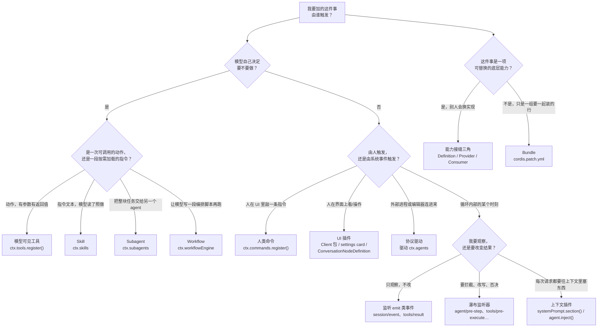

# 插件开发指南

> **本文定位**：`dev_docs` 是 deepseek-harness 的**中文导航层**，不是事实的归属地。**分步指南**归 [`docs/cookbook/`](../docs/cookbook/extension-cookbook.md)，**包级规则**归 [`packages/AGENTS.md`](../packages/AGENTS.md)，**扩展点清单**归 [`docs/architecture.md`](../docs/architecture.md)。本文一步都不重写，只补上游没有集中回答的问题：**我的需求应该做成哪种扩展，以及这条路上有哪些会让门禁拦住我的硬约束。**
>
> **与 `docs/` 冲突时一律以 `docs/` 为准**，并立即修正本文。

## 1. 本文定位与上游事实源

> **上游事实源**：[`docs/AGENTS.md` — The tier taxonomy: one home per fact](../docs/AGENTS.md#the-tier-taxonomy-one-home-per-fact)

这个仓库的文档治理规则是"一个事实一个归属地"：一条事实只在一处成文，其余位置一律链接过去。这决定了本文**刻意不写**下面这些内容——它们各有归属地，你应该直接去读：

| 你想找的东西 | 归属地 | 本文的处理 |
| --- | --- | --- |
| 新建一个 workspace 包的逐文件清单 | [`docs/cookbook/adding-a-package.md`](../docs/cookbook/adding-a-package.md) | 第 8 节只讲"落在哪个 group、叫什么名"的判据 |
| 写一个模型可见工具的完整契约 | [`docs/cookbook/adding-a-tool.md`](../docs/cookbook/adding-a-tool.md) | 第 6 节只列"工具比普通插件多出来的义务" |
| 第一个工具的手把手教程 | [`docs/user/develop/basic/tool.md`](../docs/user/develop/basic/tool.md) | 只链接 |
| 接入一个新模型提供方 | [`docs/cookbook/adding-an-llm-adapter.md`](../docs/cookbook/adding-an-llm-adapter.md) | 第 2 节判据表指过去 |
| 在 Web 设置页放一张自己的卡片 | [`docs/cookbook/adding-a-settings-card.md`](../docs/cookbook/adding-a-settings-card.md) | 第 2 节判据表指过去 |
| 新增一个 Remote API（Typert RPC） | [`docs/cookbook/adding-a-remote-api.md`](../docs/cookbook/adding-a-remote-api.md) | 第 2 节判据表指过去 |
| 引入一个新的 vendored Cordis 包 | [`docs/cookbook/adding-a-vendored-package.md`](../docs/cookbook/adding-a-vendored-package.md) | 只链接 |
| 各类扩展点的最小代码骨架 | [`docs/cookbook/extension-cookbook.md`](../docs/cookbook/extension-cookbook.md) | 全文一律链接，不复制骨架 |
| Cordis 的插件、服务、事件、effect 概念 | [`docs/cordis-primer.md`](../docs/cordis-primer.md) 与 [Cordis 教程](../docs/cordis-tutorial/index.md) | 第 4 节引用其结论 |
| 全部扩展点 → 机制的对照表 | [`docs/architecture.md` — Where new behavior goes](../docs/architecture.md#where-new-behavior-goes) | 第 2 节做选型，不复制表 |
| 每个服务的方法签名与事件契约 | [`docs/subsystems/`](../docs/subsystems/README.md) 各页的生成 Cordis API 区块 | 一律链接 |
| 包发布与安装（bundle / profile 清单） | [`docs/user/develop/basic/publish.md`](../docs/user/develop/basic/publish.md) | 第 2 节判据表指过去 |
| 测试分层与门禁命令 | [`docs/testing.md`](../docs/testing.md)、[`AGENTS.md` — Commands](../AGENTS.md#commands) | 第 9、10 节只讲"插件作者必须交什么" |

本文的读者是"手上有一个需求、准备往 `packages/` 里加东西"的开发者与 AI。它回答两个上游没有集中回答的问题：**这个需求应该长成哪一种扩展点**，以及**从选型到提交，哪些约束一定会在门禁上把我拦下来**。

---

## 2. 第一个决策：我的需求是什么形态

> **上游事实源**：[`docs/architecture.md` — Where new behavior goes](../docs/architecture.md#where-new-behavior-goes)、[`docs/cookbook/extension-cookbook.md` — The feature → mechanism map](../docs/cookbook/extension-cookbook.md#the-feature--mechanism-map)

上游的两张表回答的是"做 X 用什么机制"。它们**不回答**"我的需求到底是 X 还是 Y"。这一节就是那个缺口。

整个 harness 是全插件架构：没有可打补丁的特权内核，新行为一律以插件形式挂在已文档化的扩展点上（[`docs/architecture.md` — Cordis](../docs/architecture.md#cordis)）。所以选型不是"改哪个文件"，而是"挂哪个点"。

### 2.0 先问一句：这真的需要新东西吗

在进决策树之前先做一次排除。[`AGENTS.md` — Conventions](../AGENTS.md#conventions) 有一条硬规则：**新行为走已文档化的扩展点，改 `agent-loop` 必须同时更新 `docs/architecture.md`**。所以如果你的方案里出现了"在循环里加一个判断"，先回到 [Turn flow](../docs/architecture.md#turn-flow) 找那一刻对应的事件——绝大多数情况下它已经存在。

同理，[`packages/AGENTS.md`](../packages/AGENTS.md) 要求"**每一处抽象都要有当前的所有者和需求**"：抽象、状态机、配置项、防御性拷贝、兼容路径都必须绑定到一个当前契约或生产消费者。为"以后可能有人要"而预留的扩展点会在评审时被删掉。

### 2.1 决策树



### 2.2 判据表

每一行给出：**什么时候选它**、**去哪看步骤**、**照着哪个包写**。

| 形态 | 判据（满足才选它） | 步骤指南 | 范例包 |
| --- | --- | --- | --- |
| **模型可见工具** | 模型需要在一次 step 内**主动调用**它并拿到结构化返回值；它有参数、有可验证的输出、失败要能被模型看见并重试。 | [adding-a-tool.md](../docs/cookbook/adding-a-tool.md)、[Build a tool](../docs/user/develop/basic/tool.md) | [`packages/todo/tool-todo`](../packages/todo/tool-todo)（最小完整）、[`packages/shell/tool-bash`](../packages/shell/tool-bash)（生产级三包） |
| **人类命令** | 由人在界面上敲一条 `/xxx`，**不经过模型轮次**就直接产生效果或返回一段展示内容。 | [commands 子系统](../docs/subsystems/commands.md#definition) | [`packages/interaction/commands`](../packages/interaction/commands)、[`packages/plan/plan-mode`](../packages/plan/plan-mode) |
| **服务（能力接缝）** | 同一件事**存在多种实现**，且部署时需要换（本地 / 沙箱 / 远程 / 另一家厂商）；接口稳定而实现会变。 | [`docs/architecture.md` — Capability seams](../docs/architecture.md#capability-seams)、[能力接缝设计](./capability_seams.md) | [`packages/shell`](../packages/shell)（模板三角）、[`packages/web`](../packages/web) |
| **事件监听器（拦截）** | 你要在循环已有的某一步上**改变结果**：改写模型看到的消息、否决一次工具调用、包住 dispatch 加超时、在 turn 结束时续跑。 | [extension-cookbook — A hook plugin](../docs/cookbook/extension-cookbook.md#a-hook-plugin-permission-gate-example)、[事件图谱](../docs/event-producer-consumer.md) | [`packages/guard/repeat-tool-reminder`](../packages/guard/repeat-tool-reminder)、[`packages/guard/timeout-policy`](../packages/guard/timeout-policy) |
| **上下文插件** | 你要往模型请求里**稳定地加一段内容**（时间、AGENTS.md、被引用的文件、人格），而不是加一个动作。 | [`docs/architecture.md` — Where new behavior goes](../docs/architecture.md#where-new-behavior-goes) | [`packages/context/time-context`](../packages/context/time-context)、[`packages/context/agent-instructions`](../packages/context/agent-instructions) |
| **subagent provider** | 你要提供一种**新的"把任务交给另一个 agent"的后端**（进程内 fork、ACP、Codex、Claude Code、DSH SDK……），接口已经定好。 | [subagent 子系统 — provider 契约](../docs/subsystems/subagent.md#the-provider-contract-subagentprovider) | [`packages/subagent/subagent-spawn-in-process`](../packages/subagent/subagent-spawn-in-process) |
| **workflow** | 模型需要**写一段脚本**来编排多个子代理（扇出、汇总、条件分支），而不是逐个调用工具。 | [workflow 子系统](../docs/subsystems/workflow.md#the-start-request) | [`packages/workflow/workflow-worker-thread`](../packages/workflow/workflow-worker-thread) |
| **skill** | 你要提供的是**按需加载的指令文本**（做某类任务的规程），不是可执行动作；模型读到摘要后自己决定要不要展开。 | [skills 子系统 — Provider registry](../docs/subsystems/skills.md#provider-registry) | [`packages/skill/skill-filesystem`](../packages/skill/skill-filesystem)、[`packages/skill/tool-skill`](../packages/skill/tool-skill) |
| **bundle** | 你没有新行为，只是要把**一组已有插件行按固定顺序装在一起**，并让上层 patch 还能改它。 | [Package and install a plugin](../docs/user/develop/basic/publish.md#the-bundle-manifest)、[`docs/architecture.md` — Profiles and bundles](../docs/architecture.md#profiles-and-bundles) | [`packages/bundle/base`](../packages/bundle/base)、[`packages/bundle/web-app`](../packages/bundle/web-app) |
| **UI 插件** | 人要在浏览器里**看到或操作**这件事：设置卡片、Chat 里的业务行、侧栏面板。 | [adding-a-settings-card.md](../docs/cookbook/adding-a-settings-card.md)、[Conversation 子系统](../docs/subsystems/conversation.md) | [`packages/client/ui-theme`](../packages/client/ui-theme)、[`packages/client/ui-settings-plugins`](../packages/client/ui-settings-plugins) |

需要在浏览器与 Host 之间新增一条类型化 RPC 时，走 [adding-a-remote-api.md](../docs/cookbook/adding-a-remote-api.md)；需要接入一个上游 Cordis 包时，走 [adding-a-vendored-package.md](../docs/cookbook/adding-a-vendored-package.md)。这两条不是"扩展点选择"问题，而是既定路径。

### 2.3 四个最容易选错的分叉

**工具 vs 人类命令。** 判据是"谁决定要不要执行"。模型决定 → 工具；人决定 → 命令。同一件事两者都要时，做成两个 Consumer 共用一个服务，不要让命令去伪造一次工具调用——`/goal` 就是这么拆的（[extension-cookbook 特性表](../docs/cookbook/extension-cookbook.md#the-feature--mechanism-map)）。命令的执行是**不经过模型轮次**的直接派发，它自己会记 `command/run` / `command/done` 日志（[commands 子系统](../docs/subsystems/commands.md#ctxcommands--commandruntime)）。

**工具 vs skill。** 判据是"产出是效果还是文本"。工具执行后世界变了（文件被写、进程被跑、状态被记）；skill 被加载后只是模型的上下文里多了一段指令，世界没变。如果你发现自己在写一个"返回一大段 markdown 教模型怎么做事"的工具，那它应该是 skill。反过来，如果 skill 正文里全是"请调用 X 工具"，那真正缺的是那个工具。

**拦截器 vs 把逻辑写进工具里。** [`packages/AGENTS.md`](../packages/AGENTS.md) 的规则是"**在做出决定的那个操作里执行该决定**"：schema 省略、prompt 过滤、facade、包装器、监听器顺序都不算强制，因为直接调用方或替代调用方能绕过去。所以权限、沙箱、超时这类**部署策略**放拦截器（可重排、可换、能被 `ctx.tools.guard()` 单调收口）；而"这个工具本身在什么输入下无意义"这类**领域约束**放工具的 `execute` 里，并且要能在 executor 层被测出拒绝。选拦截点的规则在 [adding-a-tool.md — Execution policy and observation](../docs/cookbook/adding-a-tool.md#execution-policy-and-observation)。

**subagent vs workflow。** 判据是"编排逻辑由谁写"。模型在自己的轮次里逐个决定要不要再派一个子代理 → subagent 工具就够了；编排逻辑本身复杂到需要一段有循环、有条件、有汇总的脚本 → workflow。workflow 引擎在一个 worker 线程里跑模型写的脚本，脚本启动的每个子代理仍然走 subagent 接缝（[workflow 子系统](../docs/subsystems/workflow.md)）。详见第 7 节。

**能力接缝 vs 直接实现。** 判据是"会不会有第二个实现，以及它会不会独立演化"。一个接缝是 Service Definition / Service Provider / Consumer **三个角色一起**，只做其中一个不叫加了一项能力（[`docs/architecture.md` — Capability seams](../docs/architecture.md#capability-seams)）。所以先问：现在就有第二个 provider 吗？没有的话，[adding-a-package.md — 决定包拓扑](../docs/cookbook/adding-a-package.md#3-decide-the-package-topology)的答案是"单一用途的插件就是一个包"，等角色真的开始独立演化再拆。拆早了的代价在 [`packages/AGENTS.md`](../packages/AGENTS.md) 里也写明了——**Service Definition 要为所有当前 Consumer 设计**，不能让某一个 Consumer 的需要（工具 schema、Loader、UI、传输）反过来决定服务契约；它的反向气味是"一个只有一个内部调用方的公开服务方法"。完整的设计方法见[能力接缝设计](./capability_seams.md)。

---

## 3. 插件的两种形态

> **上游事实源**：[`packages/AGENTS.md`](../packages/AGENTS.md)、[事故复盘 0001](../docs/postmortem/0001-acp-default-export-drops-inject.md)、[`docs/cordis-primer.md` — Cordis In Five Ideas](../docs/cordis-primer.md#cordis-in-five-ideas)

一个 harness 包只有两种合法的插件形态，选错会在**装载期**炸，而不是在编译期。

### 3.1 函数插件：具名导出，且**没有** default export

```ts
export const name = 'tool-todo'
export const inject = ['tools', 'sessionProjections']
```
（`packages/todo/tool-todo/src/index.ts:22-23`，symbol：`name`、`inject`）

```ts
export function apply(ctx: Context, config: Config): void {
  const allowParallel = config.allowParallelInProgress
```
（`packages/todo/tool-todo/src/index.ts:128-129`，symbol：`apply`）

`name` / `inject` / `Config` / `apply` 四个具名导出构成插件的命名空间。`inject` 列出的服务必须全部就绪，Cordis 才会调用 `apply`——加载顺序是用服务依赖表达的，不是手工排的。

### 3.2 服务包：default-export 服务类

```ts
export class CommandRuntime extends TypertRemoteService {
```
（`packages/interaction/commands/src/index.ts:258`，symbol：`CommandRuntime`）

```ts
export default CommandRuntime
```
（`packages/interaction/commands/src/index.ts:528`）

服务包 default-export 它的服务类，Cordis 把类的生命周期挂进当前 context，并占住 `ctx.<key>` 这个运行时槽位。`ctx.tools`（`packages/core/tools/src/index.ts:1937`）、`ctx.skills`（`packages/skill/skill/src/index.ts:869`）、`ctx.subagents`（`packages/subagent/subagent/src/index.ts:640`）、`ctx.workflowEngine`（`packages/workflow/workflow/src/index.ts:203`）都是这个形态。

### 3.3 混用的代价：Loader 丢掉整个命名空间

**两种形态不能混。** 一个函数插件多写一行 `export default apply`，Loader 的 `unwrapExports` 就只会拿到 `apply`，`name` / `inject` / `Config` 全部丢失——插件照常装载，然后在第一次访问注入服务时抛 `cannot get property "agents" without inject`。

这不是假想。ACP 服务器就是这样在 178 个绿色单测、100% 行覆盖的情况下，一连上真实编辑器就崩的：完整经过与两个独立根因见[事故复盘 0001](../docs/postmortem/0001-acp-default-export-drops-inject.md)。

因为单测里手工 `ctx.plugin(...)` 挂载**根本不经过 Loader**，这个 bug 在单测里不可见。[`docs/testing.md` — Test the real entry path](../docs/testing.md#test-the-real-entry-path) 因此规定：没有 `inject` 的插件（bundle / 组合类插件）必须显式断言导出形状，并且要证明这个断言真能失败。tool-todo 的做法可以直接照抄：

```ts
  it('has the namespace-plugin export shape (no stray default) so the Loader keeps name/inject/apply', () => {
    // A default export would make Loader unwrap only apply and drop `inject`.
    expect('default' in tool).toBe(false)
    expect(tool.name).toBe('tool-todo')
    expect(tool.inject).toEqual(['tools', 'sessionProjections'])

    const loader = Object.create(Loader.prototype) as Loader
    const unwrapped = loader.unwrapExports(tool) as Record<string, unknown>
    expect(unwrapped).toBe(tool)
```
（`packages/todo/tool-todo/tests/tool-todo.spec.ts:225-233`）

### 3.4 同一份复盘的第二条规则：可选服务用 `ctx.get(name)`

`ctx.<name>` 属性代理是**拓扑敏感**的，跨 shadow 边界会解析失败；`ctx.get(name)` 走的是全局服务库。所以：**`ctx.<name>` 只用于 `inject` 里声明过的服务，可选服务一律 `ctx.get(name)`**（[`packages/AGENTS.md`](../packages/AGENTS.md)）。这条与 3.3 是同一次事故的两个根因。

---

## 4. 注册即效果

> **上游事实源**：[`AGENTS.md` — Conventions](../AGENTS.md#conventions)、[`docs/cordis-primer.md` — Practical Rules](../docs/cordis-primer.md#practical-rules)、[Cordis 教程 02 生命周期与 effect](../docs/cordis-tutorial/02-lifecycle-and-effects.md)

仓库约定只有一句话：**每一处贡献都经由 `ctx.effect()` / `ctx.on()`，registry 的 `register()` 返回 disposer。** 但它背后是一个统一心智模型，值得展开一次，因为它决定了你能不能通过第 9 节的义务清单。

### 4.1 三个入口，同一个模型

| 入口 | 你贡献了什么 | 谁负责撤销 |
| --- | --- | --- |
| `ctx.on(event, listener)` | 一个事件监听器 | Cordis：fiber 销毁即摘除 |
| `ctx.effect(generator)` | 一段自定义的可逆副作用（可组合多个 yield） | 你在 generator 里 `yield` 出的每个 disposer，按逆序执行 |
| `registry.register(x)` | 一条注册表条目（工具、命令、provider、skill、prompt section…） | registry 内部已建立 effect；同时把 disposer 返回给你 |

三者的共同点是：**没有"注册后就永久存在"的东西**。你能拿到的一切贡献都绑定在当前 fiber 上，fiber 一销毁，贡献就消失。

`ctx.effect()` 的真实用法是一个 generator，`yield` 出来的每一项都是一个可撤销单元：

```ts
    const dispose = ctx.effect(function* (this: ToolRuntime) {
      yield this.layers.effect(
        ctx,
        (layer) => {
```
（`packages/core/tools/src/index.ts:943-946`，symbol：`ToolRuntime.presentAs`）

registry 的 `register()` 则把这件事包好，只把 disposer 交出来：

```ts
  register(definition: CommandDefinition): () => void {
    const registered = normalizeDefinition(definition)
    return this.layers.effect(
      this.ctx,
      layer => layer.commands.insert(registered.definition.name, registered),
      { label: 'commands.register()' },
    )
  }
```
（`packages/interaction/commands/src/index.ts:280-287`，symbol：`CommandRuntime.register`）

各注册表返回的 disposer 都在 JSDoc 里被明确写成"**the exact disposer**"：`ctx.tools.register()`、`ctx.tools.restrict()`、`ctx.tools.guard()`（[tools 子系统](../docs/subsystems/tools.md#ctxtools--toolruntime)）、`ctx.skills.registerProvider()`（[skills 子系统](../docs/subsystems/skills.md#ctxskills--skillregistry)）、`ctx.subagents.registerProvider()`（[subagent 子系统](../docs/subsystems/subagent.md#ctxsubagents--subagentruntime)）。"exact"是有意义的：你可以把它 `yield` 进外层复合 effect，从而精确控制拆卸顺序。**如果拆卸顺序有讲究，就把相关工作放进同一个 effect**（[`docs/cordis-primer.md` — Practical Rules](../docs/cordis-primer.md#practical-rules)）。

### 4.2 为什么 registry 贡献必须能被 dispose

热重载是这个仓库的一等能力：`dsh` 的 `web` profile 默认 live patch reload，用户改一行 `cordis.patch.yml`，对应的插件树就地重挂（[`docs/architecture.md` — Profiles and bundles](../docs/architecture.md#profiles-and-bundles)）。agent preset 也依赖同一机制：per-session 的组合把插件挂在该 agent 的 scope 上，会话结束就整体卸掉。

所以"插件热重载"在特性表里的机制栏只有一句：**每一处注册都是 `ctx.effect` → vendored HMR 就直接工作**（[extension-cookbook 特性表](../docs/cookbook/extension-cookbook.md#the-feature--mechanism-map)）。反过来说，只要有一处贡献漏了 disposer，重载后旧的工具、旧的监听器、旧的 provider 就会和新的并存——表现为"改了配置不生效"、"工具重复出现"、"事件被处理两次"，而且极难定位。

### 4.3 HMR 安全测试是义务，不是加分项

[`packages/AGENTS.md`](../packages/AGENTS.md) 写死了：**registry 贡献必须通过 HMR 安全测试证明可销毁——销毁 fiber，观察条目消失**；[`docs/testing.md` — Tiers](../docs/testing.md#tiers) 在单元层重申"每个 registry 都要有 HMR 安全测试"。

最小可照抄形态：

```ts
  it('unregisters the tool when its contributing fiber is disposed (HMR-safety)', async () => {
    const ctx = new Context()
    await ctx.plugin(SystemPrompt)
    await ctx.plugin(ToolRuntime)
    await ctx.plugin(SessionProjectionRegistry)
    const fiber = await ctx.plugin(tool, { allowParallelInProgress: true })
    expect(ctx.tools.schemas().some(s => s.name === 'todo_write')).toBe(true)
    await fiber.dispose()
    expect(ctx.tools.schemas().some(s => s.name === 'todo_write')).toBe(false)
  })
```
（`packages/todo/tool-todo/tests/tool-todo.spec.ts:214-223`）

注意断言的对象：不是"disposer 被调用了"，而是**从注册表的公开读取面上观察到条目消失了**。前者只证明你写了代码，后者才证明贡献真的被撤销。

### 4.4 同一个 `register()`，落在哪一层取决于调用它的 context

上面所有 `register()` 都还有一个隐含参数：**调用它的 context 属于哪个 scope**。工具、skill、命令注册表都是 host + per-scope 分层的（底层原语是 [`packages/core/scope`](../packages/core/scope)，一个库而不是 Cordis 服务——见 [Scoped Registration](../docs/subsystems/scope.md#scoped-registry-layer)）：

- 从**普通 context** 调用 → 落在全局层，所有 agent 都看得到。
- 从**某个 agent 的 `agent.ctx`** 调用 → 只对那个 agent 生效（[`docs/architecture.md` — Where new behavior goes](../docs/architecture.md#where-new-behavior-goes) 最后一行）。
- 从 **agent preset 的常驻组合**里挂载 → 落在那个 preset 的层，preset 下的所有 agent 共享。

读取时把全局层与视图 scope 链合并，**最近的层直接赢下同名冲突**；同名重复只在同一层内部才按 rank 规则解决。这条规则解释了两类常见困惑："我注册的工具为什么别的会话看不见"（你注册在了某个 scope 层），以及"我的 provider 为什么被同名的顶掉了"（更近的层赢了，不是先后顺序问题）。

对插件作者的直接含义是：**你写的是同一份 `apply`，它落在全局还是 scope，由部署方的组合方式决定，不由你决定。** 所以不要在 `apply` 里假设"我是全局唯一的那一份"，也不要用模块级单例保存 per-agent 状态——那份状态会在 preset 组合下被多个 scope 共享。

---

## 5. 配置契约

> **上游事实源**：[`AGENTS.md` — Conventions](../AGENTS.md#conventions)、[Plugin configuration](../docs/user/develop/basic/config.md#design-principles)

仓库约定：**插件里不许有硬编码可调参数；随部署变化的选择必须是可从 `cordis.yml` 修改的、经过校验的 `Config` 字段；一个 `DEFAULT_*` 常量或测试钩子不算可配置性。**

### 5.1 `Config` 的两层含义

`Config` 这个名字同时是**类型**和**schemastery 校验器**，两者同名导出：

```ts
/** Model-facing todo tool configuration. */
export interface Config {
```
（`packages/todo/tool-todo/src/index.ts:28-29`）

```ts
/** Schemastery configuration for the todo tool consumer. */
export const Config: z<Config> = z.object({
  allowParallelInProgress: z.boolean().required(),
})
```
（`packages/todo/tool-todo/src/index.ts:40-43`）

Loader 会用这个校验器检查 `cordis.yml` 里该行的 `config`，并在声明的注入激活后对 `!!js` 表达式做插值（[`docs/cordis-primer.md` — Loader Configuration](../docs/cordis-primer.md#loader-configuration)）。密钥就是这样进来的：schemastery 字段 + `!!js process.env.MY_KEY`，而不是在代码里读某个约定路径的密钥文件（[adding-an-llm-adapter.md](../docs/cookbook/adding-an-llm-adapter.md)）。

### 5.2 哪些常量**可以**固定

约定明确留了三个口子（[`AGENTS.md` — Conventions](../AGENTS.md#conventions)）：**协议常量、外部规范、安全不变量**保持固定。判断方法是问一句"换一个部署环境，这个值有理由不同吗"：

- 协议常量：SSE 的字段名、JSON-RPC 的方法名、`SESSION_FORMAT_VERSION` —— 改了就不是同一个协议，不是配置。
- 外部规范：landlock 的能力位、ACP 的消息种类 —— 由外部标准定义，不由部署定义。
- 安全不变量：sandbox 允许的路径推导规则、"model-visible ⟺ logged" 的断言 —— 可配置就等于可关闭，那是漏洞不是灵活性。

反面同样明确：[`packages/AGENTS.md`](../packages/AGENTS.md) 要求"**公开选择需要证据**"——可配置性本身不能证明一个默认值、一组公开操作、一种格式或一个引进的外部概念是合理的。没有当前消费者的证据或相关先例时，**要求显式取值**（像 `allowParallelInProgress` 那样 `.required()`），而不是随手给一个默认值。

### 5.3 误配置要在最早可解析处炸

[`AGENTS.md` — Conventions](../AGENTS.md#conventions)：**误配置要响亮地失败**——自包含的在 load 时失败，否则在最早能解析的时点失败，绝不静默跳过缺失的引用目标。`repeat-tool-reminder` 的 Config JSDoc 直接写明了这一点：空 `thresholds`、非整数、小于 2 的值、重复项都在插件加载时抛出，而不是回退到默认值（`packages/guard/repeat-tool-reminder/src/index.ts:20-28`，symbol：`Config`）。

### 5.4 怎么证明它真的是"可配置"

单测里传两个不同的 config 值只能证明代码分支存在，不能证明这个字段**从 `cordis.yml` 改得动**。tool-todo 用一个专门的组合测试来证明，它的开头两行注释就是判据本身：

```ts
// Proves `allowParallelInProgress` is real configurability and not a constant:
// the flag is set in a cordis.yml booted through the real Loader, and both faces
// it controls — the model-facing description and the accepted input — follow it.
```
（`packages/todo/tool-todo/tests/loader-composition.spec.ts:1-3`）

这同时满足了 [`packages/AGENTS.md`](../packages/AGENTS.md) 的"产品可见插件必须有非单元的 REAL-composition 测试"。

---

## 6. 模型可见工具的额外义务

> **上游事实源**：[`docs/cookbook/adding-a-tool.md`](../docs/cookbook/adding-a-tool.md)、[tools 子系统](../docs/subsystems/tools.md)、[`packages/core/tools/README.md` — Extension points](../packages/core/tools/README.md#extension-points)

工具是普通插件的超集：第 3、4、5 节的一切都适用，另外还有五条只属于工具的义务。**这里不重写工具的写法**，只列出"比普通插件多背的债"。

**其一，schema 是写给模型看的。** [`packages/AGENTS.md`](../packages/AGENTS.md)：模型可见契约——prompt、工具 schema、结果、诊断信息——**只包含与任务相关的概念，不含 UI、传输或实现词汇**。参数描述里不要出现"前端"、"HTTP 状态码"、"缓存键"，除非模型确实需要据此决策。tool-todo 的描述是个好参照：它只讲这份清单是什么、怎么用、状态各是什么意思（`packages/todo/tool-todo/src/index.ts:45-66`，symbol：`DESCRIPTION_HEAD` 等）。

**其二，`presentCall` / `presentResult` 必须是纯函数。** 它们既在实时流上跑，也在**会话日志重放**上跑，所以不能有 I/O、不能读会话状态、不能用时钟或随机数。这是 [adding-a-tool.md — How your tool renders in a UI](../docs/cookbook/adding-a-tool.md#how-your-tool-renders-in-a-ui) 里标注"broken 会咬人"的第一条硬规则。需要结果时刻的事实（比如 diff 的实际 hunk），走 `output.presentationMeta` 持久化，而不是在 presenter 里去读文件。

**其三，UI 专用的格式化不许混进模型结果。** ```console 围栏、diff 文本、相对化过的路径都不属于 canonical value 或 Native content。`output.render` 拥有模型侧措辞，`presentationMeta` + card presenter 拥有可重放的 UI 状态。

**其四，`output.schema` 要当成程序 API 来设计。** PTC 模式下每个可见工具都自动可用为 `await tools.<name>(args)`，成功调用解析到的是**最终 canonical JSON 值**，不是渲染后的 Native 内容（[adding-a-tool.md — PTC mode](../docs/cookbook/adding-a-tool.md#ptc-mode-reaches-your-tool-for-free)）。所以句柄和字段要直接返回，人类解释留在 `output.render` 里；不要让调用方从散文里解析 id。

**其五，README 的 Model Experience 章节是门禁项。** 包 README 必须用 [adding-a-package.md — 写 README](../docs/cookbook/adding-a-package.md#4-write-the-package-readme) 定义的规范格式记录模型、token 与 KV cache 影响，由 [`scripts/verify-package-readme-model-experience.ts`](../scripts/verify-package-readme-model-experience.ts) 检查结构。完全没有上下文影响的包用审计过的 `None, as ` / `Indirectly, through ` 句式，不要自己发明写法。

工具的执行策略（超时、重试、权限、审计）**不要写进工具本体**，选点规则在 [adding-a-tool.md — Execution policy and observation](../docs/cookbook/adding-a-tool.md#execution-policy-and-observation)，各扩展点的输入、顺序、返回值与失败行为定义在 [`packages/core/tools/README.md`](../packages/core/tools/README.md#extension-points)。

---

## 7. subagent / workflow / skill 三条链路

> **上游事实源**：[subagent 子系统](../docs/subsystems/subagent.md)、[workflow 子系统](../docs/subsystems/workflow.md)、[skills 子系统](../docs/subsystems/skills.md)

这三条链路经常被放在一起考虑，因为它们都在回答"怎么让模型处理超出一次 step 的工作"。它们解决的其实是三个不同问题。

| | **subagent** | **workflow** | **skill** |
| --- | --- | --- | --- |
| 解决的问题 | 把一段工作**委派**给另一个 agent | 让模型**写一段编排脚本**去驱动多个子代理 | 给模型**按需加载**一段做事的指令 |
| 加进去的是 | 一个新的委派后端 | 一个新的脚本执行基底 | 一个新的技能来源 |
| 服务键 | `ctx.subagents` | `ctx.workflowEngine` | `ctx.skills` |
| 多实现共存？ | **是**，具名注册表，同一 context 里多个 provider 并存 | **否**，一个 context 一个引擎（换引擎靠配置替换） | **是**，多个 provider 的目录会被合并 |
| Service Definition | [`packages/subagent/subagent`](../packages/subagent/subagent) | [`packages/workflow/workflow`](../packages/workflow/workflow) | [`packages/skill/skill`](../packages/skill/skill) |
| 现成 Provider | `subagent-spawn-in-process` / `subagent-fork-in-process` / `subagent-acp` / `subagent-codex` / `subagent-claude-code` / `subagent-dsh-sdk` | [`workflow-worker-thread`](../packages/workflow/workflow-worker-thread) | [`skill-filesystem`](../packages/skill/skill-filesystem)、[`skill-badge`](../packages/skill/skill-badge) |
| 模型侧 Consumer | [`tool-subagent`](../packages/subagent/tool-subagent)、[`tool-subagent-control`](../packages/subagent/tool-subagent-control) | [`tool-workflow`](../packages/workflow/tool-workflow) | [`tool-skill`](../packages/skill/tool-skill) |
| 入口文档 | [provider 契约](../docs/subsystems/subagent.md#the-provider-contract-subagentprovider) | [start request](../docs/subsystems/workflow.md#the-start-request) | [provider registry](../docs/subsystems/skills.md#provider-registry) |

**什么时候用哪个。** 任务本身可以由另一个 agent 独立完成、父 agent 只需要拿回结论 → subagent。任务需要"起 5 个子代理各查一块、失败的重试、最后合并"这种**有结构的编排** → workflow。你要给的不是执行能力而是**做法**（"重构 React 组件时按这个顺序"） → skill。

**三条链路各自的坑。**

subagent 的能力是**两级发现**的：一次性 `start()` 路径的能力写在静态描述符上，服务在委派前就检查，不支持的请求**直接响亮拒绝**（`SubagentError('UNSUPPORTED_CAPABILITY')`），绝不"接受了再忽略"；而可延续子代理由延续管理器自己组装，靠 `prepareContinuable` 这个可选方法**存在与否**来表达能力，用 TS 收窄作为发现机制（[两种能力，两种发现方式](../docs/subsystems/subagent.md#two-kinds-of-capability-discovered-two-ways)）。写 provider 时不要在这两条路径之间抄近路。

workflow 的 `meta` 和 `args` 是**纯 JSON 数据**：引擎在跑任何东西之前先按 schema 校验 `meta` 并响亮拒绝——**绝不为了拿到它去求值脚本文本**（[workflow — start request](../docs/subsystems/workflow.md#the-start-request)）。脚本也不能观察或替换引擎级的 `subagentProvider` / `maxTotalAgents` 策略。

skill 注册表是 **host + per-scope 分层**的，和 tools 注册表同构：注册落在调用 context 所在 scope 的层里，读取时把全局层与视图 scope 链合并，**最近的层直接赢下同名冲突**，rank 顺序只在同一层内部决定重复项（[skills — Provider registry](../docs/subsystems/skills.md#provider-registry)）。所以"我的 skill 被另一个同名的盖掉了"通常不是 bug，是分层规则。

---

## 8. 包落位与命名

> **上游事实源**：[adding-a-package.md](../docs/cookbook/adding-a-package.md)、[`packages/AGENTS.md`](../packages/AGENTS.md)、[`docs/development.md` — TypeScript project layout](../docs/development.md#typescript-project-layout)

**逐文件清单在 [adding-a-package.md](../docs/cookbook/adding-a-package.md#1-create-the-package)，这里只讲判据。**

**放哪个 group。** 路径是 `packages/<group>/<pkg>/`，包名是 `@deepseek-ai/dsh-<name>`。当前有 50 个能力组、255 个包。**组的完整清单以 [`packages/README.md`](../packages/README.md) 为准**（本 fork 已于 2026-09-07 补登漏掉的 `mcp/`，现为完整的 50 行）；[`AGENTS.md` — Repository layout](../AGENTS.md#repository-layout) 的树只列 35 项，是选列而非全集——上游原树还含 `self-modification/` 与 `support/` 两个磁盘上已不存在的路径，本 fork 已改为 `extensions/` 与 `test-support/`，并把树尾指针改写为 `Complete group list:` 以标明其非完整性（见 [`UPSTREAM_DOC_ISSUES.md`](../UPSTREAM_DOC_ISSUES.md) U2/U3/S1/S4）。**能匹配到已有组就用已有组**；新建组是允许的，但它是纯容器——没有 `package.json`、没有源文件，包仍然恰好在它下面一层。

**叫什么名。** [Name the role that exists](../docs/cookbook/adding-a-package.md#name-the-role-that-exists) 有一张 17 行的词表（`Controller` / `Store` / `Registry` / `Runtime` / `Resolver` / `Engine` / `Policy` / `Executor` / `Gateway` / `Provider` / `Backend` / `Handle` / `Service` …），每个词都写清了"什么时候用"和"什么时候不许用"。命名当前稳定的职责，**不要**命名第一个实现、可能的未来扩展，或者 Cordis 基类。`ctx` key 的单复数要和类的角色一致：一个引擎/策略/控制器用单数，注册表或拥有多个具名成员的服务用复数。

**包内布局的硬约束。**

- `src/types.ts` **只放类型**，不许有运行时代码。
- 测试放在**包级 `tests/`**，不是 `src/__tests__/`。
- `tsconfig.json` extends `tsconfig.base.json`（Client 包用 `tsconfig.base.client.json`），`rootDir: src`、`outDir: lib/types`，为每个 workspace 依赖加 `references`，并且**注册进恰好一个聚合配置**（Host 包进 `tsconfig.host.json`，Client 包进 `tsconfig.client.json`，不许两边都进）。同时有 Host 与 Client 编译面的包用 `tsconfig.host.json` / `tsconfig.client.json` 叶子加一个纯 solution 根；普通的双入口 Client 插件**不拆**。
- 包内相对 import 用显式 `.ts` 后缀，跨包一律用包名。

**`./invariant` 什么时候该发布。** [`packages/AGENTS.md`](../packages/AGENTS.md)：**只在独立观察可能分歧时发布 `./invariant`**，并且要在 manifest 名字下检查一条自己拥有的关系。否则**省掉源文件和接线，并在包 README 里写明理由**。空的伴生文件和被忽略的 reporter 会被 [`scripts/verify-package-invariants.ts`](../scripts/verify-package-invariants.ts) 判失败；检查"服务存在"、"插件元数据"、"effect 存在"或固定样例都不是合法的不变量。只有发布 `./invariant` 的包才在 tsconfig 里 reference `runtime-diagnostics/invariants`。

---

## 9. 提交前的义务清单

> **上游事实源**：[`packages/AGENTS.md`](../packages/AGENTS.md)、[`docs/testing.md`](../docs/testing.md)、[`docs/AGENTS.md` — Writing rules](../docs/AGENTS.md#writing-rules)

按"会被哪个门禁拦下"排序，不按重要性。

**代码侧**

- [ ] 导出形状正确：函数插件无 default export（第 3 节），并有断言证明。
- [ ] 每处注册可 dispose，且有 HMR 安全测试从公开读取面观察到条目消失（第 4 节）。
- [ ] 可选服务用 `ctx.get(name)`，`inject` 声明过的才用 `ctx.<name>`。
- [ ] 随部署变化的值是 `Config` 字段；误配置在最早可解析点响亮失败（第 5 节）。
- [ ] 瀑布监听器**调用了 `next()`**——不调用就是短路，语义见 [`docs/cordis-primer.md` — Waterfall semantics](../docs/cordis-primer.md#cordis-waterfall-semantics)。
- [ ] 跨边界的不透明 id 用 `Branded<B>`，不是裸 `string`。
- [ ] 模型可见的输入都能从会话日志重建；新的模型可见输入意味着新的 session event。

**测试侧**（[`docs/testing.md`](../docs/testing.md)）

- [ ] 产品可见插件有**非单元的 REAL-composition 测试**：把测试专用 `cordis.yml` 通过 Loader 与 app/进程启起来，只 mock 外部服务或不确定性输入，断言模型可见 / 持久化 / 用户可见的输出。手搭的 `ctx.plugin(...)` 套件**不算**。
- [ ] 每个 registry 有 HMR 安全测试。
- [ ] 非平凡的模型可见、协议可见或人类可见变更，在**同一个 PR 里**更新一份无密钥的录制会话快照（[When a snapshot test is required](../docs/testing.md#when-a-snapshot-test-is-required)）。
- [ ] 规格在并发 fork worker 里跑：自己获取的端口、路径、子进程都在 teardown 里归还；**只有单独跑才能通过的 spec 是 spec 的缺陷**（[How specs execute](../docs/testing.md#how-specs-execute)）。
- [ ] 覆盖率门禁是 `pnpm run test:coverage`（`packages/*/*/src` 逐文件 100%），不是 `pnpm run test`。

**文档侧**（与代码**同一个 commit**）

- [ ] 包 README：服务 API / 配置 / 事件 / 扩展点 / 设计说明，加上规范格式的 `## Model Experience`。
- [ ] 包 README 的 `## Known Limitations and Deferred Work`：记录持久的消费者缺口与不显然的维护约束；确实没有的包走 [`scripts/verify-package-readme-limitations.ts`](../scripts/verify-package-readme-limitations.ts) 的白名单并写明理由。
- [ ] 每个模块和导出都有 JSDoc；函数式导出带 `@param` / `@returns`（[`scripts/verify-export-jsdoc.ts`](../scripts/verify-export-jsdoc.ts)）。新事件的 JSDoc 需要 `@mode` 与 payload 的 `@param`。
- [ ] Agent Note：非平凡变更**必须**在同一个 PR 里带一篇（只有机械/局部编辑豁免）。
- [ ] 双语配对：`docs/`、`python/`、`.agents/notes/` 下的文档，**以及任意路径的 `README.md`（含你刚新建的包 README）**，都要同步 `.zh.md` 与 `.i18n.yaml`，由 [`scripts/verify-translation-pairing.ts`](../scripts/verify-translation-pairing.ts) 检查。漏掉包 README 是最常见的红灯。
- [ ] 一段一行（`verify-md-wrap`），当前状态叙述、不写变更史。

**跑什么。** 命令清单在 [`AGENTS.md` — Commands](../AGENTS.md#commands)；证据要匹配改动面，**不要默认跑全量**：文档改动跑 `pnpm run doc-sync`，包行为改动跑聚焦的行为测试与快照，发布路径改动跑构建后的 smoke。

---

## 10. 常见错误与它们的门禁

> **上游事实源**：[`AGENTS.md` — Commands](../AGENTS.md#commands)、[`docs/development.md` — CI gates](../docs/development.md#ci-gates)

| 你可能会犯的错 | 症状 | 拦住你的门禁 |
| --- | --- | --- |
| 函数插件多写了 `export default` | 单测全绿，真实 Loader 装载后访问注入服务抛 `cannot get property … without inject` | 无静态门禁——**只有** REAL-composition 测试 + 显式导出形状断言能拦（[testing.md](../docs/testing.md#test-the-real-entry-path)） |
| 注册漏了 disposer | 热重载后条目重复、旧监听器仍在跑 | HMR 安全测试（[`packages/AGENTS.md`](../packages/AGENTS.md)） |
| 把可调参写成 `DEFAULT_*` 常量 | 部署方改不动 | 评审 + Loader 组合测试（第 5.4 节） |
| `cordis.yml` 里引用了 manifest `dependencies` 之外的裸插件名 | 装载期找不到插件 | [`scripts/verify-cordis-config.ts`](../scripts/verify-cordis-config.ts) |
| 包 README 缺 `## Model Experience` 或格式不对 | — | [`scripts/verify-package-readme-model-experience.ts`](../scripts/verify-package-readme-model-experience.ts) |
| 包 README 缺 `## Known Limitations and Deferred Work` | — | [`scripts/verify-package-readme-limitations.ts`](../scripts/verify-package-readme-limitations.ts) |
| 发布了空的 `./invariant` 伴生文件 | — | [`scripts/verify-package-invariants.ts`](../scripts/verify-package-invariants.ts) |
| 导出缺 JSDoc / 缺 `@param` | — | [`scripts/verify-export-jsdoc.ts`](../scripts/verify-export-jsdoc.ts) |
| 组 README 没声明子系统归属 | — | [`scripts/verify-subsystem-pages.ts`](../scripts/verify-subsystem-pages.ts) |
| 文档里的相对链接或锚点失效 | — | [`scripts/verify-md-links.ts`](../scripts/verify-md-links.ts) |
| 文档一段写成多行 | — | [`scripts/verify-md-wrap.ts`](../scripts/verify-md-wrap.ts) |
| 英文页改了没改 `.zh.md` | — | [`scripts/verify-translation-pairing.ts`](../scripts/verify-translation-pairing.ts) |
| package.json 少了 `private: true` / `type: module` / peer+dev 双写 `@deepseek-ai/cordis` | — | [`scripts/check-workspace-constraints.ts`](../scripts/check-workspace-constraints.ts)（`pnpm run constraints`） |
| 给包加了 `bin` 当成应用入口 | — | [`scripts/verify-application-entrypoints.ts`](../scripts/verify-application-entrypoints.ts)——只有 `dsh` profile 能启动受支持的 Node 应用（[`docs/architecture.md` — Application launch](../docs/architecture.md#application-launch)） |
| Client UI 里硬编码文案 | — | `verify-client-ui-i18n`（[`scripts/verify-client-ui-i18n.ts`](../scripts/verify-client-ui-i18n.ts)） |
| 包同时注册进 `tsconfig.host.json` 与 `tsconfig.client.json` | 类型解析出双份声明 | `pnpm run typecheck` + [layout 规则](../docs/development.md#typescript-project-layout) |

两个**没有**静态门禁、只能靠测试和评审兜住的类别值得单独记住：**导出形状**（表格第一行）和**"决定必须在做出决定的操作里执行"**——schema 省略、prompt 过滤、包装器、监听器顺序都不是强制手段，因为直接调用方能绕过；拒绝必须**通过 executor** 测出来（[`packages/AGENTS.md`](../packages/AGENTS.md)）。

---

## 11. 延伸阅读

- [`docs/cookbook/extension-cookbook.md`](../docs/cookbook/extension-cookbook.md) —— 各类扩展点的最小骨架与"特性 → 机制"全表，本文第 2 节的主上游。
- [`docs/architecture.md` — Where new behavior goes](../docs/architecture.md#where-new-behavior-goes) —— 扩展点权威清单；改动 agent-loop 本身要同步更新它。
- [`docs/architecture.md` — Turn flow](../docs/architecture.md#turn-flow) —— 一个 turn 里事件的确切顺序，选拦截点时先看它。
- [`docs/event-producer-consumer.md`](../docs/event-producer-consumer.md) —— 每个事件的生产者与消费者对照（生成产物）。
- [`docs/cordis-primer.md`](../docs/cordis-primer.md) —— 插件、服务、`inject`、五种派发模式、瀑布语义、Loader 配置。
- [Cordis 教程](../docs/cordis-tutorial/index.md) —— 同样的概念动手走一遍，其中 [02 生命周期与 effect](../docs/cordis-tutorial/02-lifecycle-and-effects.md) 与 [06 组合与 HMR](../docs/cordis-tutorial/06-composition-and-hmr.md) 对应本文第 4 节。
- [`docs/user/develop/basic/tool.md`](../docs/user/develop/basic/tool.md) —— 有序的第一个工具教程；[`config.md`](../docs/user/develop/basic/config.md) 与 [`publish.md`](../docs/user/develop/basic/publish.md) 分别对应本文第 5、8 节。
- [`docs/subsystems/tools.md`](../docs/subsystems/tools.md) —— 工具定义、schema DSL、执行瀑布与单调策略的完整契约。
- [`packages/core/tools/README.md`](../packages/core/tools/README.md#extension-points) —— 各扩展点的输入、顺序、返回值与失败行为。
- [`docs/postmortem/0001-acp-default-export-drops-inject.md`](../docs/postmortem/0001-acp-default-export-drops-inject.md) —— 本文第 3 节两条规则的完整事故经过。
- [`docs/testing.md`](../docs/testing.md) —— 测试分层、REAL-composition 要求、快照义务、并发执行模型。
- [`packages/AGENTS.md`](../packages/AGENTS.md) —— 包级规则的归属地，本文第 3、4、5、8、9 节的主上游。
- [`AGENTS.md`](../AGENTS.md) —— 仓库级约定：注册即效果、无硬编码调参、瀑布必须 `next()`、model-visible ⟺ logged。
- [能力接缝设计](./capability_seams.md) —— 本文第 2 节"服务"分支的展开：三角角色怎么划、request/spec 怎么拆。
- [架构总览](./architecture_overview.md) —— 插件树、profile/bundle 分层与核心包的中文导航。
- [测试指南](./testing_guide.md)、[质量门禁](./quality_gates.md) —— 本文第 9、10 节的展开。
