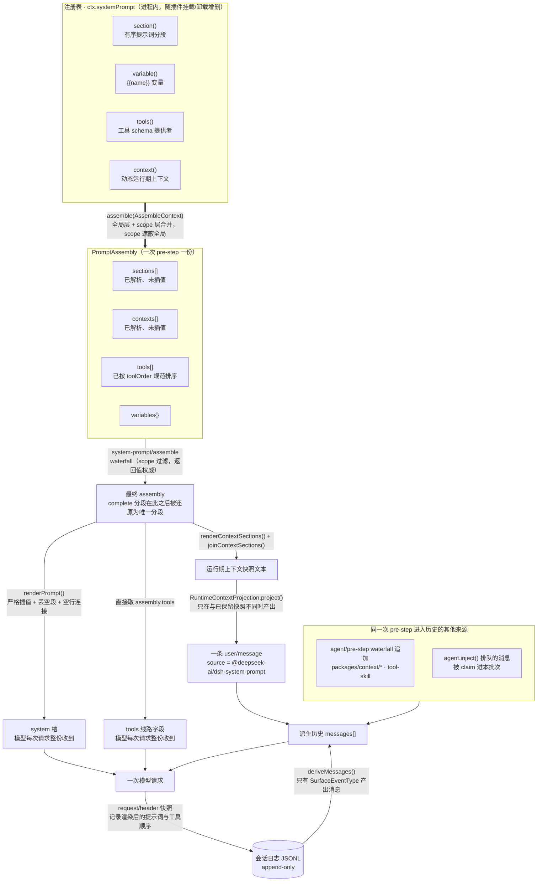

# 系统提示词与上下文组装

> **本文定位**：`dev_docs` 是 deepseek-harness 的**中文导航层**，不是事实的归属地。提示词组装的权威说明归 [`docs/subsystems/system-prompt.md`](../docs/subsystems/system-prompt.md)，各上下文插件的契约归其包 README，工具清单归生成产物 [`docs/tool-catalog.md`](../docs/tool-catalog.md)。本文不复述它们，只回答一个上游分散在多处、没有横向比较的问题：**我想让某个信息进入模型上下文，有哪几条路，该选哪条。**
>
> **与 `docs/` 冲突时一律以 `docs/` 为准**，并立即修正本文。

## 1. 本文定位与上游事实源

> **上游事实源**：[`docs/subsystems/system-prompt.md`](../docs/subsystems/system-prompt.md)（中文版：[`system-prompt.zh.md`](../docs/subsystems/system-prompt.zh.md)）、[`packages/core/system-prompt/README.md`](../packages/core/system-prompt/README.md)、[`docs/AGENTS.md`](../docs/AGENTS.md)

"我想让某个信息进入模型上下文"是这个仓库里出现频率最高的问题之一，而它的答案被上游按 one-home-per-fact 原则拆在了至少五处：注册接口在 [`docs/subsystems/system-prompt.md`](../docs/subsystems/system-prompt.md) 与 [`packages/core/system-prompt/README.md`](../packages/core/system-prompt/README.md#use-this-package)，工具 schema 的可见性规则在 [`docs/subsystems/tools.md`](../docs/subsystems/tools.md)，逐请求上下文插件的范例在 [`packages/context/`](../packages/context/README.md) 各包 README，`agent.inject()` 在 [`docs/subsystems/core.md#the-agent-handle`](../docs/subsystems/core.md#the-agent-handle)，而"这条信息会不会被压缩掉"在 [`docs/subsystems/compaction.md`](../docs/subsystems/compaction.md)。每一处都只讲自己那一条路，没有一处告诉你这几条路互相如何取舍。

本文补的就是这块横向比较，具体形态是[第 6 节的决策表](#6-我想让-x-进入模型上下文决策表)。前面几节是为读懂那张表所需的最小背景（组装管线长什么样、每条路挂在管线的哪个位置），后面几节是选完之后必须跟着做的两件事（更新快照、确认压缩行为）。

有两条贯穿全文的判据，先说在前面，后面每条路径都会回来对照它们。

**第一条：模型可见 ⟺ 已记录。** 仓库根 [`AGENTS.md`](../AGENTS.md) 的约定是"anything that reaches a model request must be reconstructable from the session log; a new model-visible input requires a session event"，[`docs/architecture.md#session-log`](../docs/architecture.md#session-log) 补充了这条由运行期 invariant 断言。**但这不意味着每条路都要你新增事件类型**——渲染后的系统提示词与组装后的工具 schema 已经由 `request/header` 事件整段快照（见 [`docs/subsystems/session.md#the-request-header-event-requestheader`](../docs/subsystems/session.md#the-request-header-event-requestheader)），注入的上下文消息本身就是 `user/message`。真正需要你扩展 `SessionEventMap` 的只有一种情况：你要让模型看见的是一个**新的状态**，而不是一条新的消息。

**第二条：提示词位 vs 历史位。** 一次请求在线路上的形态是"`system` 槽（渲染后的提示词组装）+ 派生历史"（[`docs/subsystems/llm-streaming.md#the-request-envelope-llmcallconfig-and-the-logged-header`](../docs/subsystems/llm-streaming.md#the-request-envelope-llmcallconfig-and-the-logged-header)）。落在提示词位的内容每次请求整份重发、KV cache 前缀稳定、**压缩碰不到**；落在历史位的内容只追加一次、随对话累积、**会被压缩吞掉**。你选哪条路，本质上就是在选这两个位置之一。

## 2. 一次请求的上下文由什么组成

> **上游事实源**：[`docs/subsystems/system-prompt.md#assembly-context`](../docs/subsystems/system-prompt.md#assembly-context)、[`docs/subsystems/llm-streaming.md#the-model-request`](../docs/subsystems/llm-streaming.md#the-model-request)、[`docs/subsystems/session.md#derived-history-derivemessages-and-deriveeventmessage`](../docs/subsystems/session.md#derived-history-derivemessages-and-deriveeventmessage)、[`docs/agent-lifecycle.md`](../docs/agent-lifecycle.md)

下图把四条上游线索叠在同一次 pre-step 上：提示词注册表如何组装（system-prompt 包）、组装结果如何被循环消费（agent-loop）、历史如何从日志派生（session）、以及上下文快照为什么会变成一条 `user/message`（runtime-context 投影）。上游按 one-home-per-fact 各自拆开，这里是它们的交汇点。



图里有三个容易读错的地方，值得单独点出来。

**`contexts` 不是提示词的一部分。** 它和 `sections` 是两个独立的组装输入：`sections` 渲染进 `system` 槽，`contexts` 渲染成一条**用户角色的快照消息**放在保留历史之后。这也是为什么切换沙箱模式或审批策略不会打断 KV cache 前缀——完整的当前值走历史位，而不是改写系统提示词。

**每次 pre-step 都会重新组装一遍，但快照只在变化时才落地。** 这是 `RuntimeContextProjection` 的职责，见[第 6 节 C 行](#6-我想让-x-进入模型上下文决策表)。

**工具 schema 属于组装的一部分，尽管线路上是独立字段。** [`packages/core/system-prompt/README.md`](../packages/core/system-prompt/README.md) 的设计说明写得很直白："what the model is told it can do" 是一件完整的事，所以工具 schema 和提示词分段一起过 `system-prompt/assemble` waterfall。

循环侧消费这份组装的代码在 `packages/core/agent-loop/src/agent.ts` 的 `Agent.preStep()`：

```ts
// packages/core/agent-loop/src/agent.ts:242-254（Agent.preStep）
    const assembly = await this.loopCtx.systemPrompt.assemble(assembleContextFor(this, signal))
    signal.throwIfAborted()
    const sections = renderContextSections(assembly)
    const context = this.runtimeContext.project(joinContextSections(sections), sections)
    const decision = await this.dispatch.waterfall(
      'agent/pre-step', { messages: claimed, ...position, signal },
      (): Promise<PreStepDecision> => Promise.resolve<PreStepDecision>({
        kind: 'enter',
        messages: context === undefined ? claimed : [...claimed, context],
      }),
    )
    signal.throwIfAborted()
    return decision.kind === 'reject' ? decision : { ...decision, assembly }
```

这十三行同时给出了三条路径的相对顺序：**组装先于 waterfall**，所以 `systemPrompt.context()` 产出的快照消息排在 `agent/pre-step` 监听器追加的任何消息**之前**；而 `agent.inject()` 排队的消息在更早的 `this.inbox.claim()` 里就已经进入 `claimed`，排在最前。想控制注入内容的相对位置，看的就是这个顺序。

## 3. 提示词分段注册

> **上游事实源**：[`docs/subsystems/system-prompt.md#prompt-sections`](../docs/subsystems/system-prompt.md#prompt-sections)、[`docs/subsystems/system-prompt.md#ctxsystemprompt--systemprompt`](../docs/subsystems/system-prompt.md#ctxsystemprompt--systemprompt)、[`packages/core/system-prompt/README.md#use-this-package`](../packages/core/system-prompt/README.md#use-this-package)

`PromptSection` 的字段语义、`complete` 的含义、变量插值的严格性规则都在上游，本节只讲三件"读完上游仍需要摸索"的事：位次从哪来、scope 遮蔽怎么用、条件渲染怎么写。

**位次不是你自己编的数字。** 仓库自有的分段位次集中分配在 `packages/core/system-prompt/src/index.ts:121-152` 的 `SECTION_ORDERS` 常量里（从 `HARNESS_IDENTITY: -1000` 到 `STRUCTURED_OUTPUT: 9900`，稀疏留空），通过 `ctx.systemPrompt.getSectionOrder(name)` 解析；运行期上下文有一套完全独立的分配：

```ts
// packages/core/system-prompt/src/index.ts:157-164
const CONTEXT_ORDERS = {
  SANDBOX_POLICY: 110,
  APPROVAL_POLICY: 115,
  SUBAGENT_DELEGATION: 120,
} as const

/** Name of a centrally allocated runtime-context position. */
export type PromptContextOrderName = keyof typeof CONTEXT_ORDERS
```

仓库内的贡献者**必须**走这两个具名分配（新增一个位次就是在这两个常量里加一行，类型会强制你加），仓库外的扩展可以用任意有限数字。相同 `order` 按名字的 code-unit 序排列，因此顺序在每台机器上一致。

**scope 遮蔽是"每 agent 覆盖"的唯一正确写法。** 通过 `agent.ctx`（而非全局 `ctx`）注册的分段会遮蔽同名全局分段；这也是重复注册报错信息里直接建议的路径（`packages/core/system-prompt/src/index.ts:367-369`）。子 agent 的人格替换就是这么实现的：`packages/subagent/subagent/src/child-agent.ts:210-216` 用 `deployment:persona` 这个**同名** section 在子 scope 里覆盖部署级人格——两边命名相同才构成替换而非重复。

**条件渲染写在 `text` provider 里，不要写在注册处。** 注册是效果（effect），生命周期跟着 fiber；而"这个 agent 当前有没有 `read` 工具"是逐次组装才知道的事实。`file-reference-local` 是这个模式的标准范例：

```ts
// packages/context/file-reference-local/src/index.ts:66-76
    const installPrompt = (agent: Agent): void => {
      if (this.promptFibers.has(agent)) return
      const fiber = agent.ctx.inject(['systemPrompt', 'tools'], (scope) => {
        scope.systemPrompt.section({
          name: 'context:file-reference',
          order: scope.systemPrompt.getSectionOrder('FILE_REFERENCE'),
          text: () => agent.ctx.tools.get('read', agent) === undefined ? '' : FILE_REFERENCE_PROMPT,
        })
      })
      this.promptFibers.set(agent, fiber)
    }
```

返回空串的分段在 `renderPrompt()` 里被直接丢弃，所以"当前不适用"的正确表达是空串，而不是卸载注册。

**变量由拥有该事实的插件注册。** 循环自己只提供三个最基础的：

```ts
// packages/core/agent-loop/src/index.ts:421-423
    ctx.systemPrompt.variable('provider', context => context.agent?.options.provider)
    ctx.systemPrompt.variable('model', context => context.agent?.options.model)
    ctx.systemPrompt.variable('cwd', context => context.agent?.session.header.cwd)
```

其余变量谁拥有事实谁注册。注意插值是**严格**的：引用未注册的名字、引用了但解析为 `undefined`、或写出畸形的 `{{` 组，都会让整次渲染抛错而不是静默留空。

## 4. 工具 schema 如何并入

> **上游事实源**：[`docs/subsystems/tools.md`](../docs/subsystems/tools.md)、[`docs/subsystems/system-prompt.md#tool-provider-result`](../docs/subsystems/system-prompt.md#tool-provider-result)、生成产物 [`docs/tool-catalog.md`](../docs/tool-catalog.md)

绝大多数情况下这一节**不需要你做任何事**：`ToolRuntime` 在构造时就把自己注册成了唯一的 schema 提供者，注册一个工具（`ctx.tools.register()`）就自动进入组装。

```ts
// packages/core/tools/src/index.ts:825-829（ToolRuntime 构造函数）
    ctx.systemPrompt.tools(context => this.wireSchemas(context.scope))
    if (this.defaultMode !== 'native') {
      ctx.systemPrompt.section(this.collapseSection())
      ctx.systemPrompt.section(this.sdkSection())
    }
```

需要留意的只有三点，各自的权威说明在上游，这里只给指路。

**可见集与名字全集是两回事。** 提供者返回的 `ToolProviderResult` 里，`schemas` 是本次组装的模型可见集（已经过 [`ToolRestriction`](../docs/subsystems/tools.md#toolrestriction--one-scopes-live-filter-over-what-it-inherits) 过滤），`knownNames` 是过滤**之前**的名字全集。区分二者是为了让 `toolOrder` 能分辨"配错了一个不存在的工具名"（失败）和"这个工具在当前 scope 里被故意隐藏了"（正常）。

**分段和 schema 是独立输入。** 限制掉一个工具会移除它的整份 schema 开销，但**不会**移除该工具单独注册的提示词分段——那是另一个注册项。反过来说，如果你的工具带了一段"怎么用这个工具"的提示词，条件渲染必须自己写（参见[第 3 节](#3-提示词分段注册) `file-reference-local` 的写法：`text` provider 里查一次 `ctx.tools.get()`）。

**顺序是配置的，不是注册顺序。** `toolOrder` 在 waterfall **之前**对收集到的工具做规范排序（注册顺序只是插件加载的偶然产物），列表里必须恰好出现一次 `'<unlisted-tools>'` 这个 rest 标记。形状错误在配置加载时失败，而列了一个从未注册的名字则要到**第一次组装**（也就是第一个回合）才失败——这是 [`packages/core/system-prompt/README.md`](../packages/core/system-prompt/README.md) 明确记录的已知限制。

工具本身有多少个、各自 schema 长什么样，一律看生成产物 [`docs/tool-catalog.md`](../docs/tool-catalog.md)，不要在任何手写文档里重述。新增工具的完整步骤在 [`docs/cookbook/adding-a-tool.md`](../docs/cookbook/adding-a-tool.md)。

## 5. 请求上下文插件：`packages/context/` 的几种范例

> **上游事实源**：[`packages/context/README.md`](../packages/context/README.md)，以及各包 README（每包的 `Model Experience` 小节给出模型**逐字**看到什么）

[`packages/context/`](../packages/context/README.md) 这一组包的共同定义是"往请求里加模型可见内容、但不定义任何工具"。它们值得放在一起读，因为**五个包用了四种不同的机制**——上游各包 README 只讲自己那一种，这里做横向对照。

| 包 | 解决的问题 | 用的机制 | 进入位置 | 默认是否挂载 |
|---|---|---|---|---|
| [`agent-instructions`](../packages/context/agent-instructions/README.md) | 把 `AGENTS.md`/`CLAUDE.md` 工作区指令喂给模型，并随文件系统操作发现更深层目录的指令 | `agent/pre-step` 追加 + 会话投影对账 | 历史位（`user/message`，带类型化 source） | 是（`dsh-base` 默认含，profile patch 可关） |
| [`time-context`](../packages/context/time-context/README.md) | 让模型能解释"明天下午"这类未限定时间，并知道距上一条消息过了多久 | `agent/pre-step` 追加 + 会话投影调度 | 历史位（每次注入一条三行读数） | 否（Schedule Web overlay 挂载） |
| [`tmux-context`](../packages/context/tmux-context/README.md) | 告诉模型自己跑在哪个 tmux 会话/窗口/窗格 | `agent/pre-step` 追加，仅在状态变化的回合 | 历史位 | 否 |
| [`session-reference`](../packages/context/session-reference/README.md) | 让一次对话引用**另一个会话**的有界只读快照 | 消息准备期展开 mention，附加第二条消息 | 历史位（带"不可信背景"固定警告） | 是（`dsh-web-app` bundle 含，即 `web` profile 默认挂载；`headless` / `sdk` / `acp` 不含） |
| [`file-reference`](../packages/context/file-reference/README.md) + [`file-reference-local`](../packages/context/file-reference-local/README.md) | `@file` 提及的路径补全；并在 agent 确实有 `read` 工具时给一句用法说明 | 提及只是普通提示词文本；那一句说明走 `systemPrompt.section()` | 提示词位（仅那一句说明） | 是（`dsh-web-app` bundle 含 `file-reference-local`，即 `web` profile 默认挂载） |

读这张表要抓住三个反直觉的点。

**"上下文插件"里只有一个真的碰系统提示词。** `file-reference-local` 注册的是 `context:file-reference` 分段（[第 3 节](#3-提示词分段注册)已引用其源码），落在提示词位；其余四个都走历史位。命名容易误导，机制才是判据。

**`packages/context/` 里没有一个用 `systemPrompt.context()`。** 那个 API 的真实使用者是 [`sandbox-policy`](../docs/subsystems/sandbox.md)、[`user-approval`](../docs/subsystems/approval.md) 与[子 agent 委派](../docs/subsystems/subagent.md)——共同点是它们表达的都是**当前策略状态**（一个随时可能翻转、只有最新值有意义的值），而不是**累积的对话内容**。这是选 C 行还是 D 行的核心判据，见[第 6 节](#6-我想让-x-进入模型上下文决策表)。

**注入的内容是耐久对话内容，不是渲染期装饰。** [`packages/context/README.md`](../packages/context/README.md) 把这点写成了组约定：注入的指令与引用作为用户角色消息进入会话历史，因此它们会**重放、会恢复、会被压缩**，和其他对话内容一模一样。这直接决定了它们的 token 行为——见各包 README 的 `Token effect` 与 `KV Cache effect` 小节（例如 [`agent-instructions`](../packages/context/agent-instructions/README.md#model-experience)）。

`agent/pre-step` 追加的标准写法（先 `await next()` 拿到下游决定，再在 `enter` 决定上追加消息）见 `packages/context/time-context/src/index.ts:180-220`（完整块，含 `await next()` 与 `{ prepend: true }`）。**必须先 `next()` 再追加**——waterfall 语义要求委派，直接返回会短路整条链。

## 6. "我想让 X 进入模型上下文"决策表

> **上游事实源**：本节是横向索引，每一行的权威定义在其"上游"列指向的页面；两条判据本身归 [`docs/architecture.md#session-log`](../docs/architecture.md#session-log) 与仓库根 [`AGENTS.md`](../AGENTS.md)

先用三个问题把候选缩到一两行，再看表。

1. **这条信息每次请求都需要在场吗？** 需要 → A/B/C 行（提示词位或快照位）；只需要在某个时刻出现一次 → D/E/F 行（历史位）。
2. **它是"当前值"还是"历史事件"？** 当前值（旧值一旦过时就是噪音甚至有害）→ C 行；历史事件（旧值本身是对话的一部分）→ D/E 行。
3. **模型需要主动去取，还是必须被动看见？** 主动取 → F 行（做成工具）；被动看见 → 其余各行。

| # | 路径 | 适用场景 | 落在哪 | 代价 | 是否需要新增会话事件 | 上游 |
|---|---|---|---|---|---|---|
| A | **静态系统提示词分段**<br/>`ctx.systemPrompt.section()` | 稳定的行为准则、工具用法说明、人格；内容只随配置与 scope 变化 | 提示词位 | 每次请求整份重发；一旦文本或顺序变化，KV cache 从第一个变化的 token 起失效 | **否**——渲染后的提示词由 `request/header` 整段快照，请求已是日志的纯函数 | [`system-prompt.md#prompt-sections`](../docs/subsystems/system-prompt.md#prompt-sections) |
| B | **提示词变量**<br/>`ctx.systemPrompt.variable()` | 分段文本里要嵌一个逐组装解析的事实（`{{model}}`、`{{cwd}}`） | 提示词位 | 同 A；且插值严格，未注册/无值/畸形引用直接抛错 | **否**（同 A） | [`system-prompt.md#ctxsystemprompt--systemprompt`](../docs/subsystems/system-prompt.md#ctxsystemprompt--systemprompt) |
| C | **动态运行期上下文**<br/>`ctx.systemPrompt.context()` | **随时可翻转的当前策略状态**：沙箱模式、审批策略、委派身份 | 保留历史之后的一条用户角色快照消息 | 只在快照文本**变化**时新增一条消息；不改写提示词前缀，因此策略切换不打断 KV cache | **否**——快照落成 `user/message`（source 为 `@deepseek-ai/dsh-system-prompt`）。但若该状态本身是新的，见 G 行 | [`system-prompt.md#dynamic-prompt-context`](../docs/subsystems/system-prompt.md#dynamic-prompt-context) |
| D | **`agent/pre-step` waterfall 追加消息** | 在**即将进入的这一步**里补充内容：工作区指令、时钟读数、技能正文 | 历史位，排在 C 行快照之后 | 随对话累积直到被压缩；先 `await next()` 否则短路整条链 | **否**——进入批次的消息本身就被记录为 `user/message`；但你**必须**给它一个可识别的类型化 `source` | [`core.md#agentpre-step--waterfall`](../docs/subsystems/core.md#agentpre-step--waterfall) |
| E | **`agent.inject()`** | 从循环**外部**、异步地排队上下文：文件监视器通知、会话启动时的种子上下文 | 历史位，排在本批次最前（随 `claim()` 一起进入） | 不唤醒 driver：running 的 agent 在下一个 step 边界领取，idle 的 agent 一直挂着直到 follow-up/steering 唤醒；**可能错过一个 pre-step 已经领完批次的请求**；取消或销毁可能丢弃待处理项 | **否**（同 D） | [`core.md#the-agent-handle`](../docs/subsystems/core.md#the-agent-handle)、[`core.md#agentsession-start--emit`](../docs/subsystems/core.md#agentsession-start--emit) |
| F | **工具返回值** | 信息**很大**、**不总是需要**、或需要模型自己决定何时取：文件内容、搜索结果、会话查询 | 历史位（工具结果消息），且只在模型调用后才产生 | schema 常驻提示词位（每请求重发），结果只在调用后进历史；结果可被 tool-result pruner 单独裁剪 | **否**——工具调用与结果已是日志事件 | [`tools.md`](../docs/subsystems/tools.md)、[`docs/cookbook/adding-a-tool.md`](../docs/cookbook/adding-a-tool.md) |
| G | **会话事件驱动的投影**<br/>新 `SessionEventMap` 事件 + `ctx.sessionProjections` + C 行 | 你要让模型看见的是一个**此前不存在的持久状态**，且该状态必须能从日志重建（含 resume、fork、replay） | 状态进日志（log-only 事件），文本经 C 行进快照位 | 最重的一条：要动 `SessionEventMap`、写投影、同时更新两个 SDK 的期望输出 | **是**——这正是"新的模型可见输入需要一个会话事件"所指的情况 | [`session-projection.md`](../docs/subsystems/session-projection.md)、[`session.md#surfaceeventtype--the-message-producing-subset-of-event-types`](../docs/subsystems/session.md#surfaceeventtype--the-message-producing-subset-of-event-types) |

### 怎么读"是否需要新增会话事件"这一列

这一列最容易被误读成"A 到 F 都绕过了 model-visible ⟺ logged 的约定"。恰恰相反：**它们都已经满足了约定，只是靠已有的事件类型**。

A/B 靠的是 `request/header`：`EpochHeader` 记录调用配置、适配器默认值标记、**渲染后的提示词**与权威的工具顺序，因此每次会话请求都是日志的纯函数。C/D/E 靠的是 `user/message`：它是 `SurfaceEventType`，会产出模型消息。F 靠的是工具调用与结果事件。

G 行不同：你要记录的是一个**状态**而不是一条消息。log-only 事件（不属于 `SurfaceEventType`，因此自己不产出任何模型消息）负责让状态在日志里可重建，投影负责把事件流折叠成当前值，C 行负责把当前值渲染给模型。`sandbox-policy` 是这条路的完整范例——它注册一个消费 `sandbox/mode` 事件的投影，再把投影结果渲染进运行期上下文：

```ts
// packages/sandbox/sandbox-policy/src/index.ts:140-151
    ctx.inject(['systemPrompt'], (scope: Context) => {
      scope.systemPrompt.context({
        name: 'sandbox:policy',
        order: scope.systemPrompt.getContextOrder('SANDBOX_POLICY'),
        text: (context) => {
          const session = context.agent?.session
          return session === undefined
            ? ''
            : renderPolicyContext(this.resolve({ session }))
        },
      })
    })
```

注意 `context.agent === undefined` 时返回空串——一次裸 `assemble()`（测试、诊断）没有会话可陈述。C 行的每个 `text` provider 都要处理这个分支。

### C 行为什么"只在变化时"才落一条消息

这是 `RuntimeContextProjection` 的全部职责，也是 C 行代价栏那句话的实现：

```ts
// packages/core/agent-loop/src/runtime-context.ts:64-75（RuntimeContextProjection.project）
  project(current: string, sections: readonly ContextSnapshotSection[]): UserMessage | undefined {
    if (this.retained === undefined && current.length === 0) return
    const snapshot = current.length === 0 ? CLEARED : current
    if (this.retained?.text === snapshot) return
    return createUserMessage({
      content: [{ type: 'text', text: snapshot }],
      // The cleared marker has no contributions left to attribute.
      source: sections.length === 0
        ? { kind: 'plugin', plugin: SOURCE }
        : { kind: 'plugin', plugin: SOURCE, form: 'snapshot', sections },
    })
  }
```

两个后果值得记住。其一，快照文本一字不变时**不会**新增消息，所以策略稳定的长会话不会被快照刷屏。其二，压缩把已保留的那条快照消息遮蔽掉之后，投影会把 `retained` 置空，下一次 pre-step 会**重新落一条完整的当前快照**——这就是[第 8 节](#8-压缩compaction对上下文的影响)所说的"C 行能自愈"。

### 逃生舱

有两个开关会整体改变上面的图景，选路径前先确认自己没踩到它们。`suppressRuntimeContext()`（或配置 `includeRuntimeContext: false`）会移除调用 scope 内的**全部**运行期上下文贡献，而不改变拥有这些事实的服务本身——多个抑制器互相独立，都释放后上下文恢复。`complete: true` 的分段会在 waterfall 跑完之后被还原为**唯一**的提示词分段（工具、上下文、变量仍然保留），同时有两个生效的 complete 分段会让组装直接失败。两者的完整语义在 [`packages/core/system-prompt/README.md#use-this-package`](../packages/core/system-prompt/README.md#use-this-package)。

## 7. 快照如何锁定提示词

> **上游事实源**：[`docs/testing.md#when-a-snapshot-test-is-required`](../docs/testing.md#when-a-snapshot-test-is-required)、[`snapshots/AGENTS.md`](../snapshots/AGENTS.md)、[`packages/test-support/session-snapshot/README.md#pinning-request-headers`](../packages/test-support/session-snapshot/README.md#pinning-request-headers)

**改了提示词就必须更新快照**——这不是流程洁癖，而是提示词组装唯一的端到端回归证据。仓库根 `AGENTS.md` 的约定是每个非平凡的模型可见变更都要在同一个 PR 里更新一份无密钥的录制会话快照，包 README、单测和 e2e 都不能替代这份组装后的记录。

机制是这样的。会话 JSONL 里的请求头把提示词与 schema 替换成了 `"system":"{{system}}","tools":"{{tools}}"` 两个令牌，真正的内容存在同目录的 sidecar 文件里；`snapshot.yml` 中 `header.pin: true` 的场景**拥有**这两个 sidecar，每个 header class 恰好一个 pin（多于一个会被 fixture guard 判失败）。以 `snapshots/session/text-turn/` 为例，[`snapshot.yml`](../snapshots/session/text-turn/snapshot.yml) 声明了 `header.class: default` 与 `pin: true`，于是目录里就有 [`system-prompt.expected.md`](../snapshots/session/text-turn/system-prompt.expected.md) 和 [`tool-schemas.expected.json`](../snapshots/session/text-turn/tool-schemas.expected.json)。内容完全相同的另一个 pin 用 `systemPromptSource` / `toolSchemasSource` 指过来，保证每份不同的提示词只提交一次。

用 `find snapshots -name "*system-prompt*"` 可以定位当前所有被锁定的提示词，它们分布在 `acp` / `sdk` / `session` / `web` 四类下（分类规则见 [`snapshots/AGENTS.md`](../snapshots/AGENTS.md)）。改完提示词后，重录按这个顺序判断：

**重放输入仍然有效（绝大多数提示词改动属于这类）→ `pnpm run test:snapshot:refresh`。** 它不需要 API key，跑选中的最高代重放输入，重写 stdout、**自己拥有的提示词与工具 schema sidecar**，以及一份新的当代会话输出。

**模型 transcript 本身变了（提示词改动导致模型行为不同）→ `pnpm run test:snapshot:record`。** 它调用真实 LLM，需要 `DEEPSEEK_API_KEY`。

**只是想看有没有漂移 → `pnpm run test:snapshot`**，只重放不写。

两条必须记住的纪律。第一，record 与 refresh **从不重命名或删除**已完成的代次，只会按规范化的版本文件名写新的一代。第二，产生的每一份 JSONL、提示词、schema、协议、UI 与工作区 diff 都要人工审阅后再提交——快照的价值全在这次审阅上；无人审阅地 `--update` 一把等于把回归证据清零。另外，agent-loop、会话生命周期与 `SessionEventMap` 的变更要**同时**更新 TypeScript 与 Python 两个 SDK 的期望输出，`pnpm run test` 覆盖不到它们。

## 8. 压缩（compaction）对上下文的影响

> **上游事实源**：[`docs/subsystems/compaction.md`](../docs/subsystems/compaction.md)（中文版：[`compaction.zh.md`](../docs/subsystems/compaction.zh.md)）、[`packages/compaction/compaction-basic/README.md`](../packages/compaction/compaction-basic/README.md)、[`packages/compaction/compaction-tool-result-pruner/README.md`](../packages/compaction/compaction-tool-result-pruner/README.md)

对第 6 节的决策表来说，压缩只有一句话是决定性的：**它只压缩派生历史，压不动系统提示词、工具 schema 和会话前缀**（[`compaction-basic` README](../packages/compaction/compaction-basic/README.md) 的表述）。

于是各行的命运分成两半。A/B 行（提示词位）与 F 行的 schema 部分**永不被压缩**——它们是每请求的固定成本，唯一的减法是重写文本或用 `ToolRestriction` 限制工具。D/E/F 行（历史位）会被压缩：选中的历史区间被替换成一条摘要节点，原节点被遮蔽。这意味着**你注入的工作区指令、时钟读数、会话引用快照，都可能在长会话里消失**，各包 README 的 `Token effect` 小节对此有明确说明（例如 `agent-instructions` 的"remains in derived history until compaction"）。想让它们回来，要么依赖插件自己的对账逻辑（`agent-instructions` 在 resume 时会对账基线），要么重新注入。

C 行是唯一自愈的：压缩遮蔽掉运行期上下文快照后，`RuntimeContextProjection` 的 `retained` 被置空，下一次 pre-step 自动重新落一条完整的当前快照（见[第 6 节的 `project()` 源码](#c-行为什么只在变化时才落一条消息)）。**如果一条信息是"当前状态"且必须在压缩后仍然在场，C 行是唯一不需要你写恢复逻辑的路径。**

还有两个细节会影响你的选择。摘要本身不是新的消息类型：`compaction/*` 三个事件全是 log-only，摘要骑在一条带 `surfaceOp: { op: 'replace', start, end }` 的 `user/message` 上。可选的 [tool-result pruner](../packages/compaction/compaction-tool-result-pruner/README.md) 在选区之前先裁剪超预算的工具结果，因此 F 行的结果可能在整段历史被摘要之前就先被截短了中段——如果你的工具结果里有必须完整保留的内容，这是要考虑的。

## 9. 延伸阅读

**同层中文导航**：[`architecture_overview.md`](./architecture_overview.md)（整体脉络与扩展点导航）、[`session_and_events.md`](./session_and_events.md)（会话日志、`SessionEventMap`、投影——第 6 节 G 行的前置知识）、[`agent_loop_and_tools.md`](./agent_loop_and_tools.md)（回合/步骤生命周期与工具执行管线）、[`capability_seams.md`](./capability_seams.md)（能力接缝三角色）、[`plugin_development_guide.md`](./plugin_development_guide.md)（写一个插件的完整路径）、[`model_configuration.md`](./model_configuration.md)（模型路由与请求配置）、[`cost_optimization.md`](./cost_optimization.md)（token 与 KV cache 的成本视角）、[`testing_guide.md`](./testing_guide.md) 与 [`quality_gates.md`](./quality_gates.md)（快照与其他门禁）、[`troubleshooting.md`](./troubleshooting.md)。

**上游权威页**：[`docs/subsystems/system-prompt.md`](../docs/subsystems/system-prompt.md)（跨包类型与生成的 Cordis API）、[`docs/subsystems/tools.md`](../docs/subsystems/tools.md)、[`docs/subsystems/core.md`](../docs/subsystems/core.md)、[`docs/subsystems/session.md`](../docs/subsystems/session.md)、[`docs/subsystems/llm-streaming.md`](../docs/subsystems/llm-streaming.md)、[`docs/subsystems/compaction.md`](../docs/subsystems/compaction.md)、[`docs/subsystems/session-projection.md`](../docs/subsystems/session-projection.md)、[`docs/subsystems/scope.md`](../docs/subsystems/scope.md)（scope 遮蔽与过滤式派发）。

**包 README**：[`packages/core/system-prompt/`](../packages/core/system-prompt/README.md)、[`packages/context/`](../packages/context/README.md) 组内各包、[`packages/preset/persona/`](../packages/preset/persona/README.md)（预设人格如何遮蔽部署人格）、[`packages/test-support/session-snapshot/`](../packages/test-support/session-snapshot/README.md)（快照存储与 pin 规则）。

**生成产物**（只链接，永不复制）：[`docs/tool-catalog.md`](../docs/tool-catalog.md)、[`docs/config-catalog.md`](../docs/config-catalog.md)（本文涉及的配置：[`dsh-system-prompt`](../docs/config-catalog.md#deepseek-aidsh-system-prompt)、[`dsh-agent-instructions`](../docs/config-catalog.md#deepseek-aidsh-agent-instructions)、[`dsh-time-context`](../docs/config-catalog.md#deepseek-aidsh-time-context)、[`dsh-tmux-context`](../docs/config-catalog.md#deepseek-aidsh-tmux-context)、[`dsh-session-reference`](../docs/config-catalog.md#deepseek-aidsh-session-reference)）、[`docs/event-producer-consumer.md`](../docs/event-producer-consumer.md)。

**步骤指南**：[`docs/cookbook/adding-a-tool.md`](../docs/cookbook/adding-a-tool.md)（工具及其提示词分段与 UI 呈现）、[`docs/cookbook/extension-cookbook.md`](../docs/cookbook/extension-cookbook.md)（扩展点全景）。
