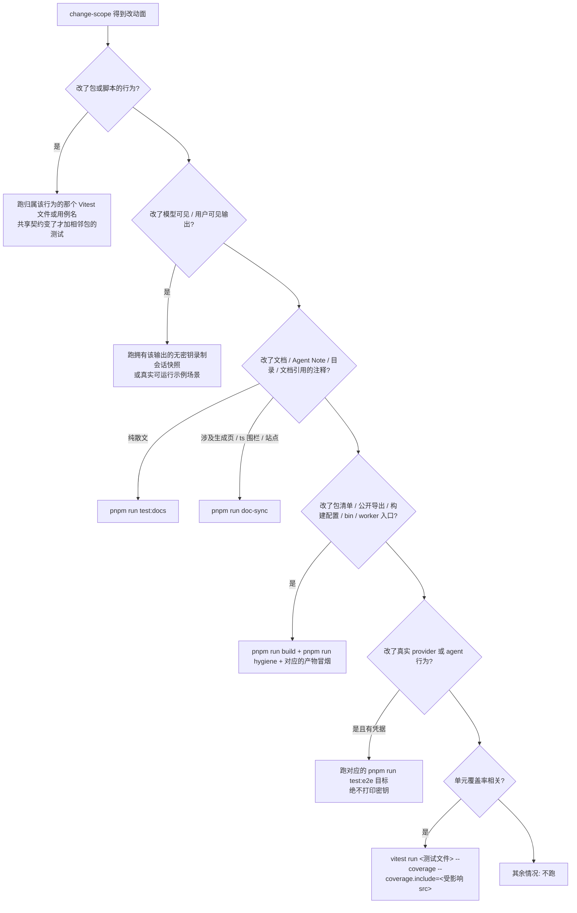

# 质量门禁导航

> **本文定位**：`dev_docs` 是 deepseek-harness 的**中文导航层**，不是事实的归属地。门禁的**权威清单**是 [`package.json`](../package.json) 的 scripts 与 [`scripts/run-gates.ts`](../scripts/run-gates.ts) 的编排——那是会随代码变化的活清单，**本文刻意不复制它**，因为手工重述清单必然漂移，也正是 [`docs/AGENTS.md`](../docs/AGENTS.md) 的 slop checklist 点名要删的内容。检查选择策略归 [`dsh-pre-push-checks`](../.agents/skills/dsh-pre-push-checks/SKILL.md)。
>
> 本文只做一件上游没做的事：**从你看到的报错反查该改哪里。**
>
> **与 `docs/` 冲突时一律以 `docs/` 为准**，并立即修正本文。

## 1. 本文定位与上游事实源

> **上游事实源**：[`.agents/skills/dsh-pre-push-checks/SKILL.md`](../.agents/skills/dsh-pre-push-checks/SKILL.md)、[`AGENTS.md` 的 `## Commands`](../AGENTS.md#commands)、[`scripts/run-gates.ts`](../scripts/run-gates.ts)

这个仓库有 100 多个 `package.json` 脚本，其中六十余个是 `verify-*` / `gen-*` 门禁（2026-09-06 实测 142 个脚本中 `verify-*` 48 个、`gen-*` 14 个；实时计数用 `jq -r '.scripts|keys[]' package.json | grep -cE '^(verify|gen)-'`）。你不需要记住它们，也不应该在任何文档里维护它们的清单——`pnpm run` 会打印当前真实的脚本集合，[`scripts/run-gates.ts`](../scripts/run-gates.ts) 的 `gatesForMode`（第 230 行）则给出它们被编排成哪些聚合。

本文回答的是清单回答不了的三个问题：**这堆门禁大致分几类、我这次改动该跑哪几个、报错之后该动哪个文件。**

需要先建立的一个心智模型：本地 Git 钩子是**故意做窄的**。按 [`dsh-pre-push-checks`](../.agents/skills/dsh-pre-push-checks/SKILL.md) 的说明，pre-commit 只修复暂存区的 lint、检查暂存区空白字符、守卫 vendored 源的元数据；pre-push 只跑增量的仓库 typecheck。**穷尽覆盖与平台矩阵由 CI 拥有**，本地不承担。因此"钩子过了"不等于"CI 会绿"，而"想让本地更保险所以跑全量"恰恰是被禁止的行为。

## 2. 门禁体系的形状

> **上游事实源**：[`scripts/run-gates.ts`](../scripts/run-gates.ts) 的 `Mode`（第 24 行）与 `gatesForMode`（第 230 行）、[`AGENTS.md` 的 `## Commands`](../AGENTS.md#commands)、[`docs/development.md` 的 `### CI gates`](../docs/development.md#ci-gates)

门禁不是一个扁平的列表，而是**叶子（单个脚本）+ 聚合（一个 mode）** 两层结构。`scripts/run-gates.ts` 是聚合层的唯一实现：它持有每个 mode 的叶子集合、叶子之间的依赖图（`needs` / `after`）、并发度与进程诊断，而 `package.json` 只暴露聚合的公开名字。想知道某个聚合到底跑了什么，读 `gatesForMode` 的对应分支，不要读任何文档里的转述。

按职责，叶子大致落在四类：

| 类别 | 大致职责 | 典型入口 | 本地 / CI |
|---|---|---|---|
| 静态检查 | 类型、lint、重复代码、依赖与工作区约束、入口点分类、Client/i18n 规则 | `typecheck`、`lint`、`duplication`、`constraints` | 本地按需；CI 在 `ci-static` / `ci-primary` 里穷尽 |
| 测试 | 单元、覆盖率、录制会话快照、owner-local 期望输出、浏览器快照、真实 API e2e | `test`、`test:coverage`、`test:snapshot`、`test:expected`、`test:web`、`test:e2e` | 本地只跑归属该行为的那一个；CI 拥有全量与平台矩阵 |
| 文档 | 链接/锚点、硬换行、字数预算、双语配对、Agent Note 格式与分类、生成目录新鲜度、`ts` 围栏编译、站点构建 | `doc-sync`（全量）、`test:docs`（快速子集） | 改文档时本地跑；CI 跑全量 |
| 包卫生 | publint、包依赖与许可、invariant 配套、README 章节、NodeNext 消费者、构建产物不变量 | `hygiene` | 改包清单/导出/构建配置时本地跑 |

三个聚合值得记住，因为它们的边界是最常被误解的地方：

- **`pnpm run doc-sync`** 跑**全部**文档门禁，其中包含 VitePress 站点构建与 `doc-typecheck`，因此它慢。
- **`pnpm run test:docs`** 是同一批叶子里被标记 `quick: true` 的子集（见 `docSyncLeafGates` 第 707 行与 `docQuickLeafGates` 第 767 行）：**不构建、不跑生成器再生、不构建站点**。它覆盖散文规则、配对、README、预算与 Agent Note 这几类纯文本门禁。改的是纯散文时用它；改的是被生成器拥有的页面或 `ts` 围栏时必须回到 `doc-sync`。
- **`pnpm run hygiene`** 在**独立运行时不会先构建**。`hygieneLeafGates`（第 683 行）只有在 `check-all` 这类聚合里被传入 `artifactNeeds` 时才声明 `needs: ['build']`；单独运行时 `publint`、`verify-node-next-types`、`verify-built-package-invariants` 直接读磁盘上现存的 `lib/`。**干净树或产物过期时先跑 `pnpm run build`**，否则这几个叶子的结论没有意义。

需要构建产物的门禁还有：`test:snapshot` 与 `test:expected`（在聚合里带 `DSH_EXAMPLE_MODE=lib` 并 `needs: ['build']`）、built-bin 冒烟、`test:web`。不需要**预先**构建的：全部纯文本文档门禁、`test`、`test:coverage`、以及大部分 `verify-*` 静态检查。`lint` 与 `typecheck` 也不需要你预先跑 `build`，但**它们自己会跑一遍完整 Host lib 阶段**——`package.json` 里两者都是 `npm run build:lib:host && …`，所以它们不是秒级纯检查（见 [`monorepo_and_build.md`](monorepo_and_build.md)）。

## 3. 提交前该跑什么：判断流程

> **上游事实源**：[`dsh-pre-push-checks` 的 `## Select relevant evidence`](../.agents/skills/dsh-pre-push-checks/SKILL.md)、[`AGENTS.md` 的 `### Run relevant checks locally`](../AGENTS.md#run-relevant-checks-locally)

规则只有一条，但很容易违反：**为改动面选择最小的、能在回归时变红的证据集；不要反射式跑全量套件。** `AGENTS.md` 把它写成硬约束——"Never default to the full suite or repeat a passing check for commit or push. CI owns exhaustive coverage and the platform matrix."

第一步永远是看清改动面本身，而不是凭记忆：

```sh
pnpm --silent run change-scope --base <verified-base-ref>
```

这个命令**不会猜也不会 fetch base**，你必须把从远端或 stack 状态确认过的 ref 交给它。它输出的 JSON 区分"相对合并基的已提交路径"与"当前工作树的暂存/未暂存/未跟踪路径"。

拿到改动面之后按下图选择：



几条容易踩的边界：

- **测试选择与覆盖率选择是两件事。** Vitest 的文件过滤只决定"跑哪些测试"，覆盖率范围默认仍是 `packages/*/*/src/**/*.ts`。要让覆盖率结论有意义，必须同时点名归属测试**和**受影响源文件，用 `--coverage.include` 收窄。
- **不知道归属测试时用依赖图找候选**：`pnpm exec vitest related <changed>.ts --run`。但它发现不了只通过配置、动态加载、子进程、worker、构建产物或外部 provider 才到达的行为——这些必须手动点名。
- **不要为了让选中范围变绿而收窄 `--coverage.include` 或加 `--passWithNoTests`**，那是在掩盖未覆盖的受影响文件。
- **不要重复已经通过的检查。** 特别是不要在 push 前单独跑一次 typecheck 去复制 pre-push 钩子。
- **全量本地彩排**（`pnpm run check:all`）只在三种情况下做：用户明确要求、正在诊断 CI 失败、或改动确实跨越整个仓库以致任何更窄的集合都不可信。

关于 stacked PR：`gh stack sync` 会把"fetch + 级联 rebase + push"合成一步，无法在重写和发布之间插入本地验证。它是**唯一**允许先发布后验证的例外——返回后立刻按 [`## Post-sync validation`](../.agents/skills/dsh-pre-push-checks/SKILL.md) 重新查询每个分支头、逐层检查改动面、跑选中的证据，并在全部通过前把验证状态报告为 pending、不合并任何 PR。

## 4. 门禁报错反向索引

> **上游事实源**：各门禁脚本本身（[`scripts/`](../scripts/run-gates.ts) 目录）、[`docs/AGENTS.md`](../docs/AGENTS.md)、[`docs/testing.md`](../docs/testing.md)、[`packages/AGENTS.md`](../packages/AGENTS.md)

下面按**你会在终端看到的东西**组织。每条给：报错大意 → 它在检查什么 → 该改哪里 → 权威文档。

### 4.1 覆盖率不足

**报错大意**：Vitest 的 coverage reporter 报某个文件未达阈值。

**在检查什么**：`pnpm run test:coverage`（即 `vitest run --coverage`）是 CI 的覆盖率门禁，**不是 `pnpm run test`**。它要求 `packages/*/*/src` 下**每个文件 100%**，而不是仓库聚合百分比。

**该改哪里**：先判断这行代码是不是死代码。[`docs/testing.md` 的 `## Tiers`](../docs/testing.md#tiers) 明确说：未覆盖的行往往是门禁替你标出来的待删代码，而不是待补的测试。确实需要覆盖时，补的是归属该行为的测试文件，然后用 `--coverage.include` 收窄到受影响源文件复跑。`packages/shell/pwsh-local/src` 是特例——它需要真实的 `pwsh`，没有时其执行器套件自跳过并由 `vitest.config.ts` 的 `pwshCoverageExclusions` 豁免——豁免范围是 `pwsh-local/src/index.ts` **加上 `pwsh-sandbox/src/**`**，CI runner 上则强制满格。

**权威**：[`docs/testing.md` 的 `## Tiers`](../docs/testing.md#tiers)、[`dsh-pre-push-checks` 的 `### Focus unit coverage on the affected source`](../.agents/skills/dsh-pre-push-checks/SKILL.md)。

### 4.2 快照不匹配

**报错大意**：`pnpm run test:snapshot`（或 `test:web`）报告持久化结果与期望输出不一致。

**在检查什么**：顶层 `snapshots/` 下某个场景的最高录制代次同时充当"用户输入 + 模型重放"与"期望持久化结果"。差异意味着你的改动改变了模型可见或用户可见的输出。

**该改哪里**：分两种情况。**模型 transcript 变了**（提示词、工具 schema、模型请求内容改变）用 `pnpm run test:snapshot:record` 重录，需要密钥；**重放输入仍然有效、只是产出格式变了**用 `pnpm run test:snapshot:refresh`。两者都必须**逐条 review 产生的 diff**——重录不是消错手段，diff 里出现你没预期的变化就说明你改坏了。跨平台差异的处理方向是**修 fixture，不是修 normalizer**。

另外注意 `AGENTS.md` 的硬规则：每个非平凡的模型可见或产品用户可见改动都**必须**在同一个 PR 里更新无密钥录制会话快照；agent-loop、session 生命周期、`SessionEventMap` 的改动还要同时更新 TypeScript 与 Python 两个 SDK 的期望输出——`pnpm run test` 覆盖不到它们。

**权威**：[`docs/testing.md` 的 `## When a snapshot test is required`](../docs/testing.md#when-a-snapshot-test-is-required)、[`snapshots/AGENTS.md`](../snapshots/AGENTS.md)。

### 4.3 双语配对失败

**报错大意**：`verify-translation-pairing` 报 `in-scope documentation must merge bilingual (docs/i18n/README.md); add the counterpart and record the pair`，或报某一对 out-of-sync、结构签名不匹配。

**在检查什么**：作用域内每个文档都必须是**三个同目录兄弟文件**：`foo.md`、`foo.zh.md`、`foo.i18n.yaml`。第三个文件记录两侧最后一次被确认一致时的 git blob 哈希。改了任何一侧而不重新记录，就会红。

**该改哪里**：不要整篇重译。用记录的哈希取回上次确认的文本，按被改一侧的 diff **最小地**补另一侧，然后 `pnpm run verify-translation-pairing --write <pair>` 重新记录——那份 yaml diff 就是"我确认过一致"这个动作本身。定位问题用 `--list`（打印每个文档的 missing / out-of-sync / ok，且从不失败），单对快速验证用 `verify-translation-pairing <pair>`。

**权威**：[`docs/i18n/README.md` 的 `## The pairing contract`](../docs/i18n/README.md#the-pairing-contract) 与 [`## The gate: verify-translation-pairing`](../docs/i18n/README.md#the-gate-verify-translation-pairing)。作用域见本文第 6 节。

### 4.4 文档链接或锚点失效

**报错大意**：

```
verify-md-links: broken relative cross-links found:
  <file>:<line>  <url>  (target does not exist)
  <file>:<line>  <url>  (no such anchor in target)
```

**在检查什么**：仓库自有 Markdown 里的相对交叉链接与 `#fragment` 锚点。作用域是 [`scripts/verify-md-links.ts`](../scripts/verify-md-links.ts) 的 `PATTERNS`（第 18-29 行）。

**该改哪里**：`target does not exist` 通常是文件被移动或重命名——改链接，或者如果移动本身是错的就改回去。`no such anchor in target` 是目标文档的标题被改了——按目标文档**当前的**标题重新生成锚点，不要凭记忆写。仓库规则要求所有仓库内引用都用相对 Markdown 路径，**不许用裸文件名或 Agent Note 编号**，就是为了让这个门禁能查。

**已验证**（2026-09-06 本仓库实测）：`pnpm run verify-md-links` 通过，输出 `2273 file(s) checked, all relative cross-links and fragments resolve.`

**权威**：[`docs/AGENTS.md` 的 `## Cross-reference with machine-checkable links, never free prose`](../docs/AGENTS.md#cross-reference-with-machine-checkable-links-never-free-prose)。

### 4.5 硬换行

**报错大意**：

```
verify-md-wrap: hard-wrapped prose paragraphs found (write one physical line per paragraph):
```

**在检查什么**：散文段落必须**一段一物理行**，靠编辑器软换行阅读。代码块、表格、列表结构保持自身格式。

**该改哪里**：把被折断的段落合并成一行。这条规则对 `.zh.md` 同样生效。

**权威**：[`docs/AGENTS.md` 的 `## Writing rules`](../docs/AGENTS.md#writing-rules)。

### 4.6 字数预算超限

**报错大意**：

```
verify-doc-budgets failed:
  <path>: <words> words exceeds the <ceiling>-word ceiling — relocate or condense per docs/AGENTS.md (raising the ceiling requires justification in the PR)
```

**在检查什么**：[`scripts/doc-budgets.manifest.json`](../scripts/doc-budgets.manifest.json) 给若干常驻文档设了字数上限。文件被改名或删除而清单没同步更新，也会红（报 `budgeted file does not exist`）。

**该改哪里**：**严格按三步顺序**，不要跳到第三步：

1. **Relocate** —— 把属于别的层级的内容搬走，必要时留一行链接。
2. **Condense** —— 属于这里但可以更短的内容，压缩。
3. **Raise** —— 只有当这些字确实需要这些空间时才抬高上限，并**在 PR 里解释这个 manifest diff**。上限定得太低本身是一个 bug。

上限是护栏不是削减目标：在目标以下要留至少 5% 余量；已在目标以上时上限冻结，直到搬迁或压缩把文档降回目标以下。

**已验证**（2026-09-06 本仓库实测）：`pnpm run verify-doc-budgets` 通过，输出 `8 budgeted docs within ceiling.`

**权威**：[`docs/AGENTS.md` 的 `## Wordcount Budgets`](../docs/AGENTS.md#wordcount-budgets)。

### 4.7 导出缺 JSDoc

**报错大意**：

```
verify-export-jsdoc: N JSDoc completeness violation(s) (see AGENTS.md):
```

**在检查什么**：每个包 API 里的每个导出名都有 JSDoc；函数型导出还要有 `@param` / `@returns`。

**该改哪里**：补在**声明处**。注意继承声明的成员、插件协议槽位、构造函数的文档留在声明它们的 Service Definition、协议或类上，不要在实现里重复。写的内容是**完整契约**（行为、失败、时序、归属、安全使用），不是推理过程，也不是对代码的复述。

**权威**：[`AGENTS.md` 的 `## Type safety and documentation`](../AGENTS.md#type-safety-and-documentation)、[`dsh-prose-standard`](../.agents/skills/dsh-prose-standard/SKILL.md)。

### 4.8 类型等价漂移

**报错大意**：

```
verify-type-equiv: type-equiv verification failed:
  ...
(checked N primary block(s) across M doc(s), K paired derivative(s); manifest at scripts/type-equiv.manifest.json)
```

也可能是 `use the concise \`ts public-api\` fence`、`unterminated type-equivalence fence`、`type-equiv block has no parseable interface/type/class declaration`。

**在检查什么**：文档里逐字粘贴的类型声明必须与源码保持一致。粘贴的类型声明及其原始 JSDoc 用 ` ```ts type-equiv ` 围栏，去掉方法体的公开类声明用 ` ```ts public-api ` 围栏，两者都要登记在 [`scripts/type-equiv.manifest.json`](../scripts/type-equiv.manifest.json) 里，否则可能漂移。

**该改哪里**：**先改源码，再同步文档粘贴块**——文档是投影，不是事实源。重塑了一个已被文档化的类型时，拥有它的 [subsystems 页面](../docs/subsystems/README.md)必须在同一个改动里更新。注意这个门禁只能抓"已粘贴但漂移"的块，抓不到"新类型从未被文档化"——后者靠 review。

**权威**：[`docs/AGENTS.md` 的 `## Writing rules`](../docs/AGENTS.md#writing-rules)、[`docs/development.md` 的 `### Documenting types verbatim (ts type-equiv)`](../docs/development.md#documenting-types-verbatim-ts-type-equiv)。

### 4.9 包 README 缺 Model Experience

**报错大意**：`verify-package-readme-model-experience` 报某个 `README.md` 缺少 `## Model Experience`、标题非规范、出现多份、或不是最后的 H2。

**在检查什么**：每个包 README 必须用**规范格式**记录该包对模型、token、KV cache 的影响。格式是硬性的：`## Model Experience` 与 `## Known Limitations and Deferred Work` 必须是最后两个 H2 且按此顺序；每个 model-context 条目要有非空 H3 标题和恰好三个有序 H4 字段。

**该改哪里**：照抄 [`docs/cookbook/adding-a-package.md` 的 `## 4. Write the package README`](../docs/cookbook/adding-a-package.md#4-write-the-package-readme) 里的规范骨架。确实与模型无关的包走审计过的豁免名单（在 [`scripts/verify-package-readme-model-experience.ts`](../scripts/verify-package-readme-model-experience.ts) 里，`NO_MODEL_EXPERIENCE_SECTION` 第 32 行是整节省略的名单；另有 `SENTENCE_MODEL_EXPERIENCE` 第 46 行是允许短句形式的名单，两份互斥），**豁免条目必须带理由**，光加名字会被门禁拒绝。

**权威**：[`packages/AGENTS.md`](../packages/AGENTS.md)。

### 4.10 包 README 缺 Known Limitations

**报错大意**：

```
verify-package-readme-limitations: violations found:
  <readme>: missing the `## Known Limitations and Deferred Work` section (a package with genuinely nothing to declare joins NO_LIMITATIONS in scripts/verify-package-readme-limitations.ts instead)
```

**在检查什么**：每个包 README 都要有恰好一个规范拼写的 `## Known Limitations and Deferred Work`，且该节至少有一条顶层 `- ` 项。

**该改哪里**：把**持久的消费者缺口和非显然的维护者约束**写进这一节；普通的待清理项留在 TODO 或 Agent Note 里，不要塞进来。确实没有可声明内容的包加进 [`scripts/verify-package-readme-limitations.ts`](../scripts/verify-package-readme-limitations.ts) 的 `NO_LIMITATIONS`（第 18 行），同样**必须写理由**——门禁会因为条目没有 justification 而红。

**权威**：[`packages/AGENTS.md`](../packages/AGENTS.md)。

### 4.11 包 invariant 配套不合规

**报错大意**：`verify-package-invariants` 或 `verify-built-package-invariants` 报某个包路径的 invariant 配套违规。

**在检查什么**：`./invariant` 导出**只在"独立观测可能发散"时才该发布**。空的 installer、只检查服务是否存在、只检查插件元数据、只检查 effects 或固定示例的"不变量"都是无效的，会被门禁拒绝。同时包的 tsconfig 只有在发布 `./invariant` 时才引用 `runtime-diagnostics/invariants`。

**该改哪里**：要么让 invariant 真正断言一个**被拥有的关系**（在 manifest 名称下检查），要么**整套删掉**——删源码、删接线、删 tsconfig 引用——并在该包 README 里写明为什么不需要。注意 `verify-built-package-invariants` 读构建产物：单独跑 `hygiene` 前先 `pnpm run build`。

**权威**：[`packages/AGENTS.md`](../packages/AGENTS.md)、[`AGENTS.md` 的 `## Conventions`](../AGENTS.md#conventions)。

### 4.12 应用入口点违规

**报错大意**：

```
verify-application-entrypoints: unsupported launcher(s):
  <path>: package bin bypasses the dsh launcher; applications use apps/cli profiles
```

也可能是 `executable source has no application/build/test classification`，或 `package.json scripts.<name>: application demo must launch apps/cli/src/bin.ts`。

**在检查什么**：**只有 `dsh` profile 可以启动受支持的 Node 应用**。包的 `bin`、demo 脚本、公开 SDK 的 argv 逃逸都不允许自己成为应用入口。每个可执行源文件都要有 application / build / test 的分类。

**该改哪里**：把入口改回 `apps/cli` 的 profile 路径（demo 包装器要启动 `apps/cli/src/bin.ts`，且不能直接启动某个包的入口）。如果这个可执行文件本来就是构建脚本或测试驱动，给它正确的分类。判定逻辑在 [`scripts/verify-application-entrypoints.ts`](../scripts/verify-application-entrypoints.ts) 的 `applicationEntrypointViolations`（第 171 行）与 `executableSourceViolations`（第 110 行）。

**权威**：[`AGENTS.md` 的 `## Pre-stable APIs and released Session data`](../AGENTS.md#pre-stable-apis-and-released-session-data) 中的 Application launch 段、[`docs/architecture.md` 的 `## Application launch`](../docs/architecture.md#application-launch)。

### 4.13 生成产物过期

**报错大意**：

```
gen-tool-catalog: docs/tool-catalog.md is stale. Run `pnpm run gen-tool-catalog` and commit docs/tool-catalog.md.
gen-tool-catalog: first difference at line N
  committed: "..."
  generated: "..."
```

`verify-tool-catalog`、`verify-config-catalog`、`verify-module-graph`、`verify-doc-graphs`、`verify-cordis-catalog`、`verify-persistence-catalog`、`verify-session-format-catalog`、`verify-scoped-events` 等等，全部是同一个模式：`tsx scripts/gen-<x>.ts --check`。

**在检查什么**：提交进仓库的生成文件是否等于当前源码重新生成的结果。

**该改哪里**：**永远不要手改生成文件**去消掉 diff。跑对应的 `pnpm run gen-<x>` 并提交产物。真正要判断的是那条 first difference 是不是你**预期中的**变化——如果不是，问题在源码，不在生成器。生成的英文页面参与双语配对时还有一层后果：重新生成会让配对变成 out-of-sync，直到经过 review 的中文对照被更新并重新记录。

**权威**：`package.json` 里每个 `verify-*` 对应的 `gen-*`（该映射是权威，本文不复制）、[`docs/AGENTS.md` 的 `## The tier taxonomy: one home per fact`](../docs/AGENTS.md#the-tier-taxonomy-one-home-per-fact) 中的 Generated reference 行。

### 4.14 Agent Note 格式或分类不合规

**报错大意**：`verify-agent-note-format` 或 `verify-agent-note-classification` 报某个笔记的头部块、`Status:` 行、骨架章节或路径分类不合法。

**在检查什么**：文件路径必须是 `{lifecycle}/{class}/yyyy-mm-dd-topic-title.md`，class 取自 `scripts/agent-note-tree.ts` 的封闭集合；前三行必须精确是 `# Agent Note: <title>`、空行、`Status: <status>`；`Status:` 值必须与所在 lifecycle 目录一致；`implemented/` 笔记**不许**出现 `## Proposal` / `## Plan` / `## Migration plan` / `## Acceptance criteria`；每个笔记都必须有 `## Alternatives considered`。

**该改哪里**：见第 5 节。

**权威**：[`.agents/notes/README.md` 的 `## The file format`](../.agents/notes/README.md#the-file-format) 与 [`## Classification`](../.agents/notes/README.md#classification)。

## 5. Agent Note 义务

> **上游事实源**：[`.agents/notes/README.md` 的 `## When to write one`](../.agents/notes/README.md#when-to-write-one)

这是最容易被漏掉的"门禁"，因为它一半由脚本检查（格式、分类、归档封存），一半由 review 检查（该不该写）。

**什么算非平凡**：改动了行为、架构、跨文件或跨包共享的契约、流程或工具链、测试策略、磁盘/线上/配置格式，或任何维护者日后可能重新审视的决策。**只有纯机械或纯局部、不改变行为/契约/结构/流程/理由的编辑才豁免。** 非平凡改动**必须**在同一个 PR 里新增或更新至少一个 Agent Note。

**更新已拥有该决策的笔记就满足规则**，不要新建一个重复的。但 Agent Note **永远不被改写成另一个决策**：那种情况用一个新笔记取代它，并保持两者互链。相反，`implemented/` 笔记跟随代码更新事实（路径、名字、结构变了就同步）是**要求**，不是禁止。

**归档笔记为什么不能当权威**：`archived/` 是**冻结的历史**。一旦封存就不许编辑、翻译、重排、更新、移动或删除，也**不许当作当前行为的依据**。文档门禁跳过归档源（包括它们的出站链接），活跃散文只有在**有意引用历史**时才链进去。这条很重要——搜索仓库时很容易搜到一份归档笔记，把它当成现状，然后照着一个已经不存在的机制写代码。

**写在哪**：`{lifecycle}/{class}/` 下。lifecycle 是 `proposed/` / `implemented/` / `rejected/`；class 是 `feature` / `bug-fix` / `simplification` / `architecture` / `process` / `testing` 六选一。`architecture` 与 `process` 的分界线：**architecture 是我们发布的源码，process 是围绕代码的工具与工作流**（门禁、包管理器、vendoring 属于 process）。中文对照 `.zh.md` 逐节镜像英文兄弟，但机器检查的头部 token（`# Agent Note: ` 与 `Status:` 行）**保持英文原样**。

## 6. 双语配对的作用域

> **上游事实源**：[`docs/i18n/README.md` 的 `## Scope and exclusions`](../docs/i18n/README.md#scope-and-exclusions)

作用域是：根目录的 `CONTRIBUTING.md`、`BRAND_GUIDELINES.md`、`SAFETY.md`；**每一个非 vendor 的 README**；以及 `.agents/notes/**`、`docs/**`、`python/**` 下每一个活跃文档。README 的匹配对 basename **大小写不敏感**，并且覆盖未来新增的目录而无需再改 manifest。[`scripts/translation-pairing.manifest.json`](../scripts/translation-pairing.manifest.json) 里**只有显式排除项**，没有逐文件的灰度名单、没有日期分界线。

**`dev_docs` 当前的位置**，以及它的代价——以下两条为 2026-09-06 本仓库实测结论：

- **`dev_docs/*.md` 这类非 README 文件不在配对作用域内**：判定逻辑见 [`scripts/translation-pairing.ts`](../scripts/translation-pairing.ts) 的 `isTranslationScopeFile`（第 185 行），它只接受 README 制品、根级配对文档、以及 `.agents/notes/`、`docs/`、`python/` 前缀。因此本文这样的中文单语文档不会触发配对门禁。
- **但任意层级的 `README.md` 都在作用域内**：`README_ARTIFACT`（第 132 行）对 basename 做大小写不敏感匹配。在 `dev_docs/plans/` 下放一个 `README.md` 探针会让 `verify-translation-pairing` **失败**，报 `in-scope documentation must merge bilingual (docs/i18n/README.md); add the counterpart and record the pair`。**所以不要在 `dev_docs` 任何层级新建 `README.md`**，除非你打算连同 `.zh.md` 与 `.i18n.yaml` 一起补齐。用别的文件名做索引页。

代价是对称的：`dev_docs/` 也**不在** [`scripts/verify-md-links.ts`](../scripts/verify-md-links.ts) 的 `PATTERNS`（第 18-29 行）里。这意味着**本目录里的死链接和失效锚点不会被任何门禁拦住**。写 `dev_docs` 时必须自己逐条验证链接——`test -f` 验证文件、grep 验证锚点——没有安全网。

**已验证**（2026-09-06 本仓库实测）：`pnpm run verify-translation-pairing` 通过，输出 `1135 pair(s) checked across all in-scope documentation, all consistent.`

## 7. 沙箱阻塞时怎么办

> **上游事实源**：[`AGENTS.md` 的 `### Host sandbox failures`](../AGENTS.md#host-sandbox-failures)

有一类失败不是你的代码错了：`gh`、`pnpm`、构建、测试或生成器命令因为沙箱**拦截了凭据、网络、IPC、文件监视或嵌套 `sandbox-exec`** 而失败。

规则是：**原样重试，用最窄的宿主提权**。三个约束缺一不可——

1. **必须有沙箱证据**。要能指出这次失败确实来自沙箱拦截，而不是把任何不明失败都归因于环境。
2. **绝不绕过测试失败**。测试红了就是红了，提权不是消错手段。
3. **绝不绕过产品沙箱**。被提权的是宿主执行环境，不是产品自身的安全边界。

如果失败看起来是环境特有的，[`dsh-pre-push-checks` 的 `## Handle failures`](../.agents/skills/dsh-pre-push-checks/SKILL.md) 要求你**证明它**：记录确切的命令、失败的测试、平台相关的不匹配点；确认相关的非平台证据；并且当这个检查是必需项时，优先修跨平台的不确定性而不是绕过它。只有在用户明确要求或同意时才跳过本地钩子，并且必须报告到底什么失败了、为什么预期 CI 会不同。

同类原则也适用于 Windows：`pnpm run check:windows-wine` **只在诊断已知的 Windows 失败时用**（需要 wine），这个信号由 CI 拥有。

## 8. 延伸阅读

- [`AI_Coding_Context.md`](AI_Coding_Context.md) —— `dev_docs` 的总入口与阅读顺序。
- [`testing_guide.md`](testing_guide.md) —— 测试分层与写法的中文导航；本文只覆盖"测试作为门禁"的那一面。
- [`monorepo_and_build.md`](monorepo_and_build.md) —— 构建产物、工作区拓扑与 `lib/` 的来龙去脉，解释为什么某些门禁必须先构建。
- [`troubleshooting.md`](troubleshooting.md) —— 运行期故障排查；本文只覆盖门禁期报错。
- [`architecture_overview.md`](architecture_overview.md) —— 改 `packages/` 之前应先读的架构地图。
- [`docs/development.md`](../docs/development.md) —— 贡献者设置、日常工作流与 CI 概要（双语）。
- [`CONTRIBUTING.md`](../CONTRIBUTING.md) —— 贡献方式。注意：项目目前**不接受外部 PR**，参与方式是 GitHub Discussions、生态插件（打 `dsh-plugin` topic）与社区内容。
- [`.agents/skills/dsh-doc/SKILL.md`](../.agents/skills/dsh-doc/SKILL.md) —— 文档放置与校验工作流，含 slop checklist 审计。
- [`.agents/skills/dsh-ci-test-reliability/SKILL.md`](../.agents/skills/dsh-ci-test-reliability/SKILL.md) —— 并发执行、资源归属与 flake 诊断。
