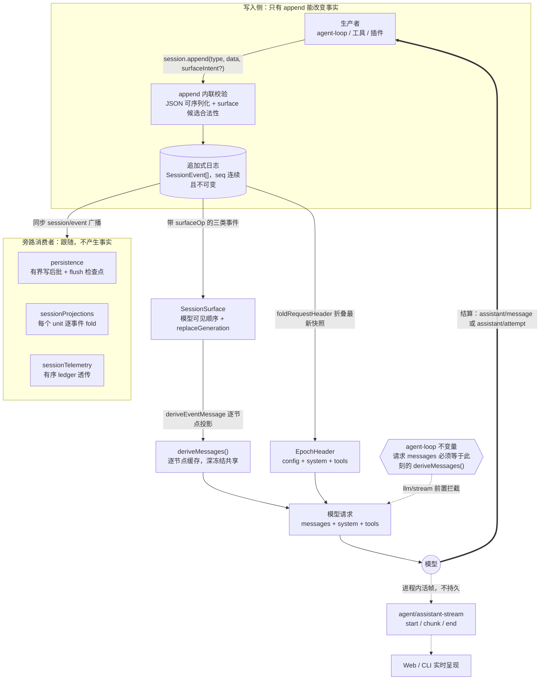

# 会话日志与事件系统

> **本文定位**：`dev_docs` 是 deepseek-harness 的**中文导航层**，不是事实的归属地。会话事件的**类型定义**归 [`docs/subsystems/session.md`](../docs/subsystems/session.md)，事件的**产消清单**归生成产物 [`docs/event-producer-consumer.md`](../docs/event-producer-consumer.md)，各后端的**契约**归包 README。本文不复述它们，只补上游没有集中讲的一件事：从 `session.append()` 到模型看到的 messages 这条完整链路，以及如何正确地往里加一个新事件。
>
> **与 `docs/` 冲突时一律以 `docs/` 为准**，并立即修正本文。

## 1 本文定位与上游事实源

> **上游事实源**：[`docs/subsystems/session.md`](../docs/subsystems/session.md)、[`docs/architecture.md#session-log`](../docs/architecture.md#session-log)、[`docs/subsystems/persistence.md`](../docs/subsystems/persistence.md)、[`docs/AGENTS.md`](../docs/AGENTS.md)

会话日志是 dsh 里唯一一处「事实」——模型看到的每一条消息、UI 渲染的每一张卡片、恢复与分叉重建出的每一段历史，都是同一份 `SessionEvent[]` 的不同投影。理解它的难点不在任何单个类型，而在这条链路被 one-home-per-fact 原则拆到了至少五个归属地：事件词表在 [`session.md`](../docs/subsystems/session.md)，持久化契约在 [`persistence.md`](../docs/subsystems/persistence.md)，投影接缝在 [`session-projection.md`](../docs/subsystems/session-projection.md)，冷读与查询在 [`session-query.md`](../docs/subsystems/session-query.md)，格式版本与迁移的决策理由在 Agent Notes 里。

本文做的两件事：**第 2 节**把这些碎片拼成一张从写入到模型请求的完整链路图；**第 8 节**把「新增一个会话事件」这条散落在声明合并、`ignorable` 语义、生成产物刷新、投影接缝、SDK 快照好几处的路径收成一份可执行清单。其余各节都是导航——每节开头的 `> **上游事实源**` 那一行就是这一节的权威归属地，需要精确类型签名时直接去那里，不要以本文为准。

三处**生成产物**在本文中一律只链接、不复制，因为它们由脚本从源码重新生成并由 `doc-sync` 校验新鲜度：[`docs/persistence-catalog.md`](../docs/persistence-catalog.md)（每一个可持久化事件的载荷、surface 徽章与声明位置）、[`docs/event-producer-consumer.md`](../docs/event-producer-consumer.md)（每个事件的产者与消费者矩阵）、[`docs/module-graph.md`](../docs/module-graph.md)（包依赖图）。想知道「现在到底有哪些会话事件」，答案永远在 `persistence-catalog.md`，不在这里。

相邻的中文导航层：整体结构见 [架构总览](architecture_overview.md)，回合与工具执行见 [Agent 循环与工具](agent_loop_and_tools.md)，能力接缝的通用形态见 [能力接缝](capability_seams.md)，请求头里那部分内容的组装见 [提示词管理](prompt_management.md)。

### 怎么用这篇文档

**第一次接触会话子系统**：顺序读第 2 到第 6 节。读完你会知道「一条事件从写入到进入模型请求经过了什么」，以及为什么这条链路上没有任何一处可以绕过日志。

**要往日志里加东西**：直接跳到 [第 8 节](#8-新增一个会话事件分步流程)，按 11 个小步走一遍，途中缺什么概念再回头看第 5、7、9 节。

**在排查一个「历史对不上」的问题**：从 [第 6 节](#6-模型可见--已记录) 的不变量开始（它会指名偏离类型），再看 [第 11 节](#11-分叉与恢复) 判断这是分叉切点、崩溃修复还是 seed 边界的问题。

**只想知道某个事件是什么**：不要读本文，直接查 [`docs/persistence-catalog.md`](../docs/persistence-catalog.md)——那是逐事件载荷与声明位置的唯一归属地。

## 2 一条链路：从 `session.append()` 到模型看到的 messages

> **上游事实源**：[`docs/architecture.md#session-log`](../docs/architecture.md#session-log)、[`docs/subsystems/session.md#derived-history-derivemessages-and-deriveeventmessage`](../docs/subsystems/session.md#derived-history-derivemessages-and-deriveeventmessage)、[`docs/subsystems/session.md#surface-types`](../docs/subsystems/session.md#surface-types)

下图把四条上游各自独立的线索叠在一起：**写入校验**（`append` 内部做了什么）、**surface 投影**（哪些事件成为模型消息、按什么顺序）、**请求重建**（`EpochHeader` 怎么从日志折叠出来）、**旁路消费**（持久化、投影、遥测如何在不改变事实的前提下跟随）。上游没有一张图同时画出这四段，因为它们分属四个归属地。



链路上有五个必须记住的性质。**第一**，只有 `append` 能改变事实：日志是私有的、每条事件在写入时深冻结，任何消费者拿到的都是快照或冻结引用。**第二**，模型消息不是存出来的而是**推出来的**——`deriveMessages()` 只走 surface 节点，一条没有 `surfaceOp` 的事件天然不进历史。**第三**，请求信封（系统提示词、工具 schema、调用配置）同样来自日志，靠 `request/header` 快照折叠，所以「一次请求」是日志的纯函数。**第四**，旁路消费者全部是**跟随者**：持久化、投影、遥测都订阅同一个 `session/event`，它们的失败不会让已提交的 append 回滚。**第五**，实时呈现走的是另一条完全不持久的通道（第 5 节），把它当持久证据是错的。

`append` 的签名本身就编码了 surface 规则——只有 `SurfaceEventType` 才被要求（且允许）传第三个参数：

```ts
  append<T extends SessionEventType>(
    type: T,
    data: SessionEventMap[T],
    ...opts: T extends SurfaceEventType ? [opts: SurfaceIntent<T>] : []
  ): SessionEvent<T> {
```

来源：`packages/core/session/src/index.ts:699`（symbol: `Session.append`）。日志只投影的一面（缓存与冻结策略）在 `packages/core/session/src/index.ts:820`（symbol: `Session.deriveMessages`），逐节点规则的完整清单在 [`session.md` 的派生历史一节](../docs/subsystems/session.md#derived-history-derivemessages-and-deriveeventmessage)。

链路上每一段的权威归属地如下表。这张表本身就是本文的主要用途：它把「我手上的问题」映射到「该读哪一页」。

| 链路环节 | 机制 | 权威归属地 |
|---|---|---|
| 写入与校验 | `Session.append`、JSON 可序列化强制、surface 候选校验 | [`session.md` 的 Session 公开 API](../docs/subsystems/session.md#session-public-api) |
| 模型可见顺序 | `surfaceOp`（`append` / `replace`）、`SessionSurface`、`replaceGeneration` | [`session.md` 的 surface 类型](../docs/subsystems/session.md#surface-types) |
| 逐节点投影 | `deriveEventMessage` / `deriveMessages()` | [`session.md` 的派生历史](../docs/subsystems/session.md#derived-history-derivemessages-and-deriveeventmessage) |
| 请求信封重建 | `request/header` 快照 + `foldRequestHeader` | [`session.md` 的请求头事件](../docs/subsystems/session.md#the-request-header-event-requestheader) |
| 路由容量记录 | `request/context`（不参与信封重建） | [`session.md` 的路由容量事件](../docs/subsystems/session.md#the-route-capacity-event-requestcontext) |
| 一致性断言 | `agent-loop` 的 `llm/stream` 前置不变量 | [`invariants.md`](../docs/subsystems/invariants.md) |
| 持久化 | 有界写后批、`session/flush` 检查点、句柄所有权 | [`persistence.md` 的 flush 检查点](../docs/subsystems/persistence.md#the-flush-checkpoint) |
| 派生状态服务 | `ctx.sessionProjections` 的 unit fold | [`session-projection.md` 的 unit](../docs/subsystems/session-projection.md#the-unit) |
| 遥测透传 | 有序 ledger 记录 + `(id, format_version, seq)` 去重 | [`session-telemetry.md` 的逻辑记录](../docs/subsystems/session-telemetry.md#the-logical-record) |
| 实时呈现 | `agent/assistant-stream` 三帧（不持久） | [`core.md` 的 `agent/assistant-stream`](../docs/subsystems/core.md#agentassistant-stream--emit) |

## 3 追加式日志：为什么是唯一事实源

> **上游事实源**：[`docs/subsystems/session.md`](../docs/subsystems/session.md)、[`docs/subsystems/session.md#durability-contract`](../docs/subsystems/session.md#durability-contract)、[`.agents/notes/implemented/architecture/2026-06-11-event-sourced-sessions.md`](../.agents/notes/implemented/architecture/2026-06-11-event-sourced-sessions.md)

一个 `Session` 是一串带类型的 `SessionEvent`，`seq` 是它在日志中的单调位置（等于写入时的日志长度），`time` 是 epoch 毫秒。它是普通类而不是 Service——活实例由 `ctx.sessions.create()` 产生，脱离存储的实例由静态工厂产生，用既有事件数组作为 seed 就得到回放或分叉。

「追加式 + 派生」这个选择带来的直接后果是：**消息历史没有第二份副本**。恢复不是把存下来的消息读回来，而是把同一批事件重新派生一遍；分叉不是复制会话，而是取一个事件前缀重新派生。任何试图在日志之外缓存一份「当前消息」的做法都会引入第二个事实源，而第 6 节的运行时不变量正是用来在这类偏离刚发生时就炸掉的。

日志里的位置有三个**互不等价**的数字类型，混用它们是个反复出现的错误：`SessionSeq` 是一条已存在事件的位置，`SessionLogOffset` 是一段前缀长度或读偏移（可以等于事件总数），二者都是品牌数字类型；`SessionSeqCursor` 是包含式水位，它本身不是独立品牌，而是 `SessionSeq | -1` 的联合（空日志时为 `-1`，见 `packages/core/session/src/types.ts:59`）。它们只加编译期品牌、不改变序列化后的数字；算术运算返回普通 `number`，调用方必须再通过构造器按预期角色重新准入。完整定义在 [`session.md` 的 `SessionEvent<T>` 一节](../docs/subsystems/session.md#sessioneventt--one-log-entry)。

写入侧的强制条件集中在 `append` 里，且**在日志改变之前**全部完成：事件数据必须是 JSON 可序列化的（一次遍历中同时校验并复制，所以有状态 getter 无法给校验和存储两个不同的值），surface 候选必须通过 surface 管理器的合法性检查，并且不允许在一次 append 的提交/广播窗口内重入另一次 append。

```ts
    const dataSnapshot = snapshotJsonValue(data)
    if (dataSnapshot === undefined) {
      throw new Error(`session event "${type}" carries non-JSON-serializable data`)
    }
    const surfaceMetadataSnapshot = snapshotJsonValue(surfaceMetadata)
    if (surfaceMetadataSnapshot === undefined) {
      throw new Error(`session event "${type}" carries non-JSON-serializable surface metadata`)
    }
```

来源：`packages/core/session/src/index.ts:709`（symbol: `Session.append`）。这条校验的意义是**在源头失败**：坏事件永远进不了日志，于是 `session.snapshotEvents()` 恒等于任何后端能持久化的东西，后端不需要再做一次防御。持久性契约（后端可以自选物理分帧，但 `read()` 必须原样返回追加过的事件）的完整表述在 [`session.md` 的持久性契约一节](../docs/subsystems/session.md#durability-contract)。

一个容易被忽略的结构事实：**回合不是日志的分区**。一个 `turn` 只圈定一次模型循环执行，插件自有的 log-only 事件完全可以落在 `turn/end` 与下一个 `turn/start` 之间，消耗 seq 而不推进回合号。核心只强制自己拥有的关系（回合与步骤编号、执行事件的嵌套、同一步内工具调用与结果的配对），并且把它放在可选的 `dsh-session/invariant` 伴生插件里；别人声明的关系由声明它的插件自己守。详见 [`session.md` 的执行封闭一节](../docs/subsystems/session.md#execution-enclosure-and-standalone-events) 与 [运行时不变量](../docs/subsystems/invariants.md#the-companion-contract)。

## 4 `assistant/message` 与 `assistant/attempt`：已结算的成功与失败

> **上游事实源**：[`docs/architecture.md#session-log`](../docs/architecture.md#session-log)、[`.agents/notes/implemented/architecture/2026-09-01-v2-embedded-assistant-streams.md`](../.agents/notes/implemented/architecture/2026-09-01-v2-embedded-assistant-streams.md)、[`docs/subsystems/llm-streaming.md#compact-assistant-streams`](../docs/subsystems/llm-streaming.md#compact-assistant-streams)

每一次模型尝试恰好落地为**一条**结算事件，两者的区别只有一个：这次尝试有没有向模型可见的历史提交一条消息。

`assistant/message` 是 surface 结算——成功响应，或者中途取消但已经产出了可见内容的响应。它同时携带装配好的消息、产生它的**精确紧凑时序流**、可选的 `usage`，以及取消时的 `interrupted: true` 标记。把 usage 放在这里而不是单独一条记账事件，是为了让模型输出和它的记账永远一起走。

`assistant/attempt` 是 log-only 结算——失败、重试、取消或流错误的尝试到达结算点，但没有提交任何 surface 消息。它保留同一份嵌入流，于是诊断、token 记账和回放都能拿到失败尝试的真实证据，而**不必伪造一条模型可见的助手消息**。这就是「不结算就没有记录」的对偶面：`assistant/attempt` 的存在让「保留证据」和「不污染历史」这两个要求同时成立。

两者的载荷都不再是逐 token 的顶层事件：连续的文本、推理或工具参数增量被压缩成一条带首时间戳与精确时间间隔的记录，每个原始增量各占数组一项，**压缩不合并增量边界**。需要逐 chunk 的消费者调用 `expandAssistantStream()` 严格展开，得到与当时字节一致的时序序列。压缩表示的完整语义归 [`llm-streaming.md` 的紧凑助手流一节](../docs/subsystems/llm-streaming.md#compact-assistant-streams)，这个设计的取舍归 [v2 嵌入式助手流 Agent Note](../.agents/notes/implemented/architecture/2026-09-01-v2-embedded-assistant-streams.md)。

派生规则上还有一条容易踩的细节：**空内容的 `assistant/message` 不进模型历史**。一个撞上输出上限、一个字都没吐出来的步骤仍然会记一条 `assistant/message` 来承载它的流、usage、provider 与 model，但把一条空内容的助手消息塞回 provider 的 transcript 是错的，所以投影会跳过它。

由此得到的取舍必须知道：**结算之前没有持久证据**。`agent/assistant-stream` 不是预写日志，硬进程丢失会让整个未结算的流消失。这是为「不引入第二个持久性所有者」付出的代价，写在同一篇 Agent Note 的 Consequences 里。

## 5 事件三域中的 session 域

> **上游事实源**：[`docs/architecture.md#events`](../docs/architecture.md#events)、[`docs/subsystems/session.md#sessionevent--emit`](../docs/subsystems/session.md#sessionevent--emit)、[`docs/subsystems/core.md#agentassistant-stream--emit`](../docs/subsystems/core.md#agentassistant-stream--emit)

dsh 的事件分三域，选错域是多数改动里第一个也是最贵的错误。**Session 事件**是追加进日志的持久事实，必须活过一次重载；**Agent 事件**（`agent/*`）携带活的 `Agent` 句柄，用来观察或拦截进行中的工作；**能力事件**（`fs/*`、`tools/*`、`session-telemetry/record` 等）把策略和适配器挂到某个接缝上而不必引入循环。判据只有一句：**这条信息重载后还必须存在吗？** 是则 session 域，否则不是。

这里有一个反复被误解的点，值得在导航层说清楚：**一条会话日志事件不是一个 Cordis 事件**。它不是通过独立的 `type` 名字派发的，而是全部经由**单一**的 `session/event` emit 到达监听者；持久化、投影、遥测三个订阅者都是在这一个事件上按 `event.type` 分流。所以给 `SessionEventMap` 加一个成员**不会**产生新的 Cordis 事件名，也不需要在 Cordis `Events` 接口里声明任何东西。这条事实的归属地在生成产物 [`persistence-catalog.md`](../docs/persistence-catalog.md) 的开头段落。

`session/event` 是**同步的**、提交后的、fire-and-forget 的通知：事件已经进日志了才广播，监听者失败会被记录并隔离，不会让已提交的 append 失败。想要一个真正的持久性屏障，得显式 `await ctx.sessions.flush(session)`——那是 `session/flush` 的用途。两者的完整语义在 [`session.md` 的 Cordis API 区](../docs/subsystems/session.md#sessionevent--emit) 与 [`sessionflush`](../docs/subsystems/session.md#sessionflush--parallel)。

与之相对，`agent/assistant-stream` 是**进程内活事件**，三帧一组：`start`（尝试开始）、`chunk`（瞬时增量，可丢弃）、`end`（结算完成）。顺序上有一条硬约束：**循环先 append 完整的 `assistant/message` 或 `assistant/attempt`，再发出已提交的 end 帧**，end 帧因此可以指名结算的类型与 seq；被放弃的尝试有 end 帧但没有结算。Web 跟随适配器正是靠这条顺序把 chunk 显示成仅客户端的临时条目，并在已提交的 end 到来时用一次命名的 delta 把临时条目换成持久条目。事件签名与调度模式在 [`core.md` 的 `agent/assistant-stream` 条目](../docs/subsystems/core.md#agentassistant-stream--emit)。

判断一条信息该进哪一域的实用对照：

| 你要做的事 | 域 | 载体 | 归属地 |
|---|---|---|---|
| 记录一条重载后必须还在的事实 | session | `SessionEventMap` 成员，经 `session/event` 广播 | [`session.md`](../docs/subsystems/session.md#sessioneventmap--the-event-vocabulary) |
| 观察或拦截进行中的一次模型调用 | agent | `agent/*` Cordis 事件（携带活 `Agent`） | [`core.md` 的 `agent/*` 事件](../docs/subsystems/core.md#agent-events) |
| 实时把增量推给 UI，丢了无所谓 | agent | `agent/assistant-stream` 三帧 | [`core.md`](../docs/subsystems/core.md#agentassistant-stream--emit) |
| 给某个能力挂策略或换适配器 | 能力 | 该接缝自己的事件与服务键 | [能力接缝](capability_seams.md)、[`capability-seams.md`](../docs/capability-seams.md) |
| 需要一个持久性屏障再往下走 | session | `await ctx.sessions.flush(session)` | [`session.md` 的 `session/flush`](../docs/subsystems/session.md#sessionflush--parallel) |

全量的产消对照永远查 [`docs/event-producer-consumer.md`](../docs/event-producer-consumer.md)，不要在任何手写文档里维护第二份。

## 6 模型可见 ⟺ 已记录

> **上游事实源**：[`docs/architecture.md#session-log`](../docs/architecture.md#session-log)、[`AGENTS.md` 的 Conventions 一节](../AGENTS.md#conventions)、[`docs/subsystems/invariants.md`](../docs/subsystems/invariants.md)

这条不变量是整个子系统的地基，一句话：**任何到达模型请求的东西，都必须能从会话日志重建出来**。它是双向的——日志里没有的不许出现在请求里，请求里有的必须在日志里找得到出处。

它的直接后果是一条设计约束：**新增一种模型可见的输入就必然要新增一个会话事件**。不能靠在构造请求时临时拼一段文本、临时插一条消息、或者从某个只存在于内存的服务里取值，因为那些东西重载之后就没了，恢复出来的会话会和刚才跑的那个会话看到不同的历史。想让模型看到新东西，就扩展 `SessionEventMap` 并从日志里渲染。

它由**运行时不变量**断言，而不是靠代码评审。`agent-loop` 的伴生不变量插件在 `llm/stream` 上以 `prepend` 方式挂了一个全局监听器（prepend 是为了防止短路的回放监听器把检查静音掉），对每一个循环构造的请求做四项检查：请求必须冻结、必须携带活会话 id、日志里必须已有 `step/start` 与 `request/header`，然后是核心的两条比对——请求的 `messages` 必须逐字节等于此刻的 `deriveMessages()`，请求的信封字段必须等于折叠出来的 `EpochHeader`。

```ts
    const expected = session.deriveMessages()
    if (JSON.stringify(options.messages) !== JSON.stringify(expected)) {
      fail(`llm request for session "${String(session.id)}" diverges from the dispatch-time durable derivation (log-reconstruction desync)`)
    }
```

来源：`packages/core/agent-loop/src/invariant.ts:39`（symbol: `install`）。

违反它会怎样：不变量在**派发时刻**就报告偏离（`log-reconstruction desync`），而不是等到某个用户明天恢复会话时才发现历史对不上。这正是不变量存在的判据——只有当「独立的两次观察可能分歧」时才发布 `./invariant` 入口；这里的两次独立观察就是「循环手上的 messages」和「日志派生出的 messages」。伴生插件的契约与选取规则在 [`invariants.md`](../docs/subsystems/invariants.md#the-companion-contract)。

反过来说，**log-only 事件不受这条不变量约束**：它们不进 surface、不产生消息，所以无论加多少条都不会让请求和日志分歧。这也是为什么绝大多数插件贡献的事件都是 log-only 的——见第 7 节和 [`persistence-catalog.md`](../docs/persistence-catalog.md) 里满屏的 `log-only` 徽章。

## 7 `SessionEventMap`：声明合并、required-on-read、`ignorable`

> **上游事实源**：[`docs/subsystems/session.md#sessioneventmap--the-event-vocabulary`](../docs/subsystems/session.md#sessioneventmap--the-event-vocabulary)、[`docs/subsystems/session.md#plugin-contributed-log-only-events`](../docs/subsystems/session.md#plugin-contributed-log-only-events)、[`.agents/notes/implemented/architecture/2026-08-10-session-log-version-mechanism.md`](../.agents/notes/implemented/architecture/2026-08-10-session-log-version-mechanism.md)

`SessionEventMap` 是可合并扩展的事件词表，`SessionEventType = keyof SessionEventMap`。插件通过 TypeScript 声明合并往里加自己的类型，目标模块是 `@deepseek-ai/dsh-session/types`：

```ts
declare module '@deepseek-ai/dsh-session/types' {
  interface SessionEventMap {
    /**
     * Whether plan mode is in force from this point on: log-only, non-surface,
     * whole-value replace. The last `plan/mode` wins; a log with none folds to
     * inactive through the projection unit's fold.
     */
    'plan/mode': { active: boolean }
  }
}
```

来源：`packages/plan/plan-mode/src/index.ts:39`（symbol: `SessionEventMap` 声明合并）。这段 JSDoc 不是装饰——生成器会把它原样搬进 [`persistence-catalog.md`](../docs/persistence-catalog.md#planmode--log-only)，所以它必须自足地说清三件事：这条记录是什么、它是否 surface、后续事件如何解释它（这里是「最后一条获胜、整值替换」）。

词表可合并带来一个必须遵守的编码约定：**对 `SessionEvent` 做 switch 时不许用 `assertNever`**。插件加进来的变体是完全合法的未知值，处理已知分支后必须走一个有文档的 `default`。这条与「闭合联合以 `assertNever` 收尾」的通则并列写在 [`AGENTS.md` 的 Conventions](../AGENTS.md#conventions) 里。

**required-on-read 是默认语义**。信封上的 `ignorable` 字段缺省时，读到一个自己不认识的 `type` 的读者**必须拒绝重建整个会话**，而不是悄悄跳过这条事件：

```ts
    /**
     * Marks an event a reader may safely skip when it does not recognize
     * `type`. Absent means required: a reader meeting an unrecognized type
     * without this marker MUST refuse to reconstruct the session instead of
     * silently dropping the event, because an unrecognized required event may
     * change how the rest of the log is interpreted. A writer sets `true` only
     * on purely informational records whose loss cannot affect reconstruction;
     * defaulting to required means a forgotten marker over-refuses (an
     * inconvenience) rather than silently resuming a gutted session.
     */
    ignorable?: true
```

来源：`packages/core/session/src/types.ts:455`（symbol: `SessionEvent.ignorable`）。这个默认方向是刻意选的：忘标 `ignorable` 的后果是「过度拒绝一个本可恢复的会话」（不便），而默认可忽略的后果是「静默地恢复出一个被掏空的会话」（安全故障）。判断哪个「不认识」算数的依据是生成的已知词表 `KNOWN_SESSION_EVENT_TYPES`（`packages/core/session/src/known-event-types.ts:22`，symbol: `KNOWN_SESSION_EVENT_TYPES`），它由 `gen-persistence-catalog` 从所有声明合并里抽出、由 `verify-persistence-catalog` 保持新鲜。仓库内的第一方写入者不通过 `Session.append` 设置 `ignorable`；它是给仓库外插件用的当前消费者机制。

关于 JSDoc 标签，这里有一处**必须区分清楚**的地方，因为它是新手最常搞混的：[`AGENTS.md`](../AGENTS.md#conventions) 里「Event JSDoc needs `@mode` and payload `@param`；scoped keys absent from payloads need `@dshScopeScan unsupported`」这条约定说的是 **Cordis 事件**（合并进 `@deepseek-ai/cordis` 的 `Events` 接口的那些，比如 `session/event`、`session/flush`、`agent/assistant-stream`），`@mode` 声明的是它们的派发模式（emit / waterfall / serial / parallel），由 `gen-cordis-catalog` 读取。**`SessionEventMap` 的成员不是 Cordis 事件，不写 `@mode`，也不写 `@param`**——它们的 JSDoc 是散文形式的记录语义说明，由 `gen-persistence-catalog` 搬进持久化目录。只有当你在加会话事件的同时**还**要发布一个新的 Cordis 事件时，那个 Cordis 事件才需要 `@mode` 与 `@param`。

下表按**事件族**（不是逐个事件）给出拥有者与语义归属页。生成产物 [`persistence-catalog.md`](../docs/persistence-catalog.md) 已经逐事件给出载荷与声明文件行号，但它不告诉你「这一族的语义该去哪一页读」——那正是这张表补的缺口。

| 事件族 | 拥有者 | 语义归属页 |
|---|---|---|
| `turn/*`、`step/*`、`user/message`、`assistant/*`、`tool/*` | `packages/core/session` | [`session.md`](../docs/subsystems/session.md#sessioneventmap--the-event-vocabulary) |
| `request/header`、`request/context`、`session/end-seed` | `packages/core/session` | [`session.md`](../docs/subsystems/session.md#the-request-header-event-requestheader) |
| `agent/inbox/spliced` | `packages/core/agent` | [`core.md`](../docs/subsystems/core.md#the-agent-handle) |
| `compaction/*` | `packages/compaction/compaction` | [`compaction.md`](../docs/subsystems/compaction.md#the-compaction-session-events) |
| `llm/retry`、`llm/retry-started` | `packages/llm/llm-retry` | [`llm-streaming.md`](../docs/subsystems/llm-streaming.md#llmfailure) |
| `approval/*`、`permission/preset` | `packages/interaction/*` | [`approval.md`](../docs/subsystems/approval.md)、[`permission-presets.md`](../docs/subsystems/permission-presets.md) |
| `command/run`、`command/done` | `packages/interaction/commands` | [`commands.md`](../docs/subsystems/commands.md) |
| `hook/invoked`、`hook/result` | `packages/hooks/hook-protocol` | [`session.md` 的插件贡献事件](../docs/subsystems/session.md#plugin-contributed-log-only-events) |
| `plan/mode` | `packages/plan/plan-mode` | [`plan.md`](../docs/subsystems/plan.md) |
| `session/title*` | `packages/session/session-title*` | [`session-title.md`](../docs/subsystems/session-title.md) |
| `subagent/*` | `packages/subagent/*` | [`subagent.md`](../docs/subsystems/subagent.md) |
| `goal/change`、`schedule/change`、`sandbox/mode`、`feedback/record` | 各自的能力包 | [`goal.md`](../docs/subsystems/goal.md)、[`schedule.md`](../docs/subsystems/schedule.md)、[`sandbox.md`](../docs/subsystems/sandbox.md)、[`feedback.md`](../docs/subsystems/feedback.md) |

最后一条约束来自 Web 客户端：当同一个插件家族的**多条**事件要装配成一个会话节点（start / update / result / resource / interruption）时，家族里每条事件都要携带或能独立推导出**同一个稳定业务 id**，让客户端不必靠相邻性或扫历史来分组。这只适用于相关联的节点家族，不是每条会话事件的义务，详见 [`conversation.md` 的可回放事件家族一节](../docs/subsystems/conversation.md#replayable-event-families)。

## 8 新增一个会话事件：分步流程

> **上游事实源**：[`docs/subsystems/session.md#plugin-contributed-log-only-events`](../docs/subsystems/session.md#plugin-contributed-log-only-events)、[`docs/subsystems/session-projection.md#the-unit`](../docs/subsystems/session-projection.md#the-unit)、[`AGENTS.md`](../AGENTS.md#conventions)、[`docs/cookbook/adding-a-package.md`](../docs/cookbook/adding-a-package.md)

这是本文最核心的一节。上游没有一处集中讲这条路径，因为它按 one-home-per-fact 拆到了词表声明、`ignorable` 语义、版本机制、投影接缝、生成产物刷新、SDK 快照六个归属地。下面把它们串成可执行顺序，每一步都指回它的权威页。

### 8.1 先确认它真的该是会话事件

按第 5 节的三域判据自问：这条信息重载后还必须存在吗？如果只是驱动一次 UI 刷新，用 `agent/*` 活事件；如果是给某个能力挂策略，用能力事件。**再问一次**：它会改变模型看到的东西吗？会的话它就是 surface 事件——而 surface 事件类型集合（`user/message`、`assistant/message`、`tool/result`）是**核心拥有的**，扩充它属于结构性改动，要走第 9 节的版本 bump，不是普通的词表增长。插件贡献的事件几乎总是 log-only。

### 8.2 声明合并，并把语义写进 JSDoc

在自己的包里 `declare module '@deepseek-ai/dsh-session/types'` 并合并 `SessionEventMap`（形式见第 7 节的 `plan/mode` 例子）。一个家族里的多条事件写在同一个声明块里，比如重试家族的两条：

```ts
declare module '@deepseek-ai/dsh-session/types' {
  interface SessionEventMap {
    /** Durable, non-surface record of one provider-routed retry scheduled after a failed request attempt. */
    'llm/retry': LlmRetryEventData
    /** Durable transition written after a retry wait succeeds and before the next request attempt starts. */
    'llm/retry-started': LlmRetryStartedEventData
  }
}
```

来源：`packages/llm/llm-retry/src/types.ts:6`（symbol: `SessionEventMap` 声明合并）。命名用 `域/名字`（`plan/mode`、`llm/retry-started`、`compaction/summary`），域名与拥有它的能力对齐。JSDoc 必须回答：这条记录是什么、log-only 还是 surface、后续读者如何折叠它（最后一条获胜？累加？开闭括号？）。

### 8.3 载荷设计：JSON 可序列化 + 整值语义

载荷必须是 JSON 可序列化的，`append` 在源头强制（第 3 节）。跨边界 id 用 `Branded<B>` 品牌类型而不是裸 `string`。最重要的一条是**整值规则**：一条承载状态的日志事件携带**变更后的完整状态**，绝不携带裸 delta——这让每次状态转移都廉价、让每个被服务的值自描述、让消费者可以简单地「最后一条获胜」。这条规则的归属地在 [`session-projection.md` 的 unit 一节](../docs/subsystems/session-projection.md#the-unit)。

### 8.4 决定 `ignorable`

默认**不写**这个字段（即 required-on-read）。只有当这条记录纯粹是信息性的、丢掉它不可能影响任何重建时才考虑 `true`。判据在第 7 节：不确定就别写，过度拒绝是不便，静默掏空是事故。

### 8.5 决定这条事件的关系约束由谁守

核心只强制自己的关系（回合/步骤编号、执行嵌套、同步工具调用与结果配对），**不会**因为一个未知事件出现在没有开放回合的位置就拒绝它。所以如果你的事件有自己的关系（比如必须成对出现的开闭括号、必须在某个回合内），那是**你的插件**的义务，实现在你自己的 `./invariant` 伴生里——并且只有当独立的两次观察可能分歧时才发布它（见 [`invariants.md`](../docs/subsystems/invariants.md#the-companion-contract)）。带开闭括号的事件家族还必须读 `session/end-seed`：括号之前的开标记来自构造 seed、属于已经结束的生命周期，见 [`session.md` 的 end-seed 一节](../docs/subsystems/session.md#the-end-seed-boundary-sessionend-seed)。

### 8.6 需要被读取的状态：注册一个投影 unit

如果这条事件承载的状态要被**读**（host 行为要用、或客户端要显示），不要让读者自己去扫日志——注册一个 `ProjectionDefinition`，让框架驱动、领域计算。unit 是纯同步 fold：`init` 给空日志的初值，`apply` 把「前一状态 + 一条已提交事件」变成下一状态（对不感兴趣的事件必须返回**同一个引用**，`Object.is` 不变就不产生任何下游工作），可选的 `wire` 块给出裁剪后的客户端视图。

```ts
/** Projection of logged plan selections and committed mode. */
export const planProjectionDefinition = {
  key: 'plan',
  stateVersion: 3,
  stateSchema: planUnitStateSchema,
  init: () => ({ active: false, wanted: null, running: null, activeAtLastHeader: null }),
```

```ts
    if (event.type === 'plan/mode') {
      return { ...state, active: event.data.active, wanted: null }
    }
```

来源：`packages/plan/plan-mode/src/index.ts:130` 与 `packages/plan/plan-mode/src/index.ts:148`（symbol: `planProjectionDefinition`）。注意 `stateVersion`：**序列化字段或 fold 语义一变就要 bump**，否则旧 unit 写下的持久缓存行会被前向应用成垃圾。注册是效果（`ctx.sessionProjections.register(...)` 返回 disposer），领域插件用 `ctx.inject(['sessionProjections'], ...)` 注册，读取方的义务见第 10 节。

### 8.7 刷新生成产物

事件加完后必须重新生成两个东西：`pnpm run gen-persistence-catalog` 会重写 [`docs/persistence-catalog.md`](../docs/persistence-catalog.md) **以及** `packages/core/session/src/known-event-types.ts` 里的 `KNOWN_SESSION_EVENT_TYPES`。忘了这一步会被 `verify-persistence-catalog` 拦下（它属于 `pnpm run doc-sync`）。产消矩阵 [`docs/event-producer-consumer.md`](../docs/event-producer-consumer.md) 同样是生成的，也在 `doc-sync` 里。**不要手改这些文件**。

### 8.8 更新文档与 Agent Note

包 README 记录本包的契约（配置、语义、限制、扩展点）；如果改动重塑了某个被文档化的类型，那个类型所属的 `docs/subsystems/*.md` 页面要在**同一次改动**里更新（`verify-type-equiv` 只能抓已文档化类型的漂移，抓不到从未文档化的新类型）。非平凡改动必须在同一个 PR 里附一篇 Agent Note，记录决策、放弃了什么、以及需要的验证。规则在 [`docs/AGENTS.md`](../docs/AGENTS.md) 与 [`AGENTS.md`](../AGENTS.md#conventions)，写作标准见 [质量门禁](quality_gates.md)。

### 8.9 补齐测试与快照

`SessionEventMap` 的改动会同时穿透两个 SDK 的外部事件表示，所以 **TypeScript 与 Python SDK 的期望输出要在同一个 PR 里更新**，而 `pnpm run test` 覆盖不到它们。另外，非平凡的模型可见或产品用户可见改动要更新一份无密钥的录制会话快照（`pnpm run test:snapshot`）。测试面的选取见 [测试指南](testing_guide.md)，门禁清单见 [质量门禁](quality_gates.md)。

### 8.10 检查是否需要 bump 版本

绝大多数情况**不需要**：普通的事件词表增长由 `ignorable` 机制覆盖，不动 `SESSION_FORMAT_VERSION`。需要 bump 的只有结构性改动——头部形状、`SessionEvent` 信封、核心事件语义、surface 机制（`SurfaceEventType` 集合或 `SurfaceOp` 变体）。判据与迁移义务见第 9 节。

### 8.11 常见错误对照

下面这些都是这条路径上真实存在的坑，每一条都能从上游某处推出来，但没有一处把它们放在一起。

| 症状 | 根因 | 正确做法 |
|---|---|---|
| 恢复后模型看到的历史和刚才不一样 | 在请求构造时临时拼了日志之外的内容 | 扩展 `SessionEventMap`，从日志渲染（第 6 节） |
| 新版本写的日志被旧版本静默读成残缺会话 | 该结构性改动没有 bump 版本 | 按第 9 节判据 bump；不确定就 bump |
| 旧版本拒绝打开一个本可恢复的会话 | 纯信息性记录忘了标 `ignorable` | 确认它真的不影响重建后再标 `true` |
| `append` 抛「non-JSON-serializable data」 | 载荷里混进了类实例、函数、`undefined` 之外的非 JSON 值 | 在事件边界上先转成纯 JSON（第 3 节） |
| 加了新事件类型后 switch 编译不过 / 运行时漏处理 | 用了 `assertNever` 收尾 | 可合并联合必须走有文档的 `default`（第 7 节） |
| CI 报 `verify-persistence-catalog` 失败 | 忘了跑 `gen-persistence-catalog` | 重新生成，并连同 `known-event-types.ts` 一起提交（8.7） |
| 某个 host 行为在部分组合里静默消失 | 读取方在投影 key 缺失时默认了一个值 | 读取方必须声明为必需注入，或首次访问即抛（第 10 节） |
| 投影缓存恢复出错乱状态 | 改了 unit 的序列化字段或 fold 语义却没 bump `stateVersion` | 同步 bump（8.6） |
| `fork()` 抛错而不是裁剪 | 传入的边界落在开放回合内 | 显式选一个回合之间的稳定切点（第 11 节） |
| SDK 快照在 CI 上红 | `SessionEventMap` 改动没更新两个 SDK 的期望输出 | 同 PR 内更新 TS 与 Python SDK（8.9） |

### 8.12 自检清单

声明合并写在 `@deepseek-ai/dsh-session/types` 且带自足 JSDoc；载荷 JSON 可序列化、id 已品牌化、承载状态时是整值；`ignorable` 已刻意决定（多数情况是不写）；关系约束有明确的守护者；需要被读的状态走了投影 unit 且 `stateVersion` 正确；`gen-persistence-catalog` 已跑；对 `SessionEvent` 的 switch 走 `default` 而非 `assertNever`；两个 SDK 的期望输出与录制快照已更新；Agent Note 已写。

## 9 版本与迁移

> **上游事实源**：[`AGENTS.md` 的 Pre-stable APIs and released Session data 一节](../AGENTS.md#pre-stable-apis-and-released-session-data)、[`.agents/notes/implemented/architecture/2026-08-10-session-log-version-mechanism.md`](../.agents/notes/implemented/architecture/2026-08-10-session-log-version-mechanism.md)、[`.agents/notes/implemented/architecture/2026-08-31-released-session-format-migrations.md`](../.agents/notes/implemented/architecture/2026-08-31-released-session-format-migrations.md)、[`docs/subsystems/persistence.md`](../docs/subsystems/persistence.md)

`SESSION_FORMAT_VERSION` 是**一个单调整数**，没有 major/minor 之分——「这一步能不能自动升级」是那一步自己的性质（体现为它的升级器存不存在），不该由编号方案提前承诺。常量与它的完整 bump 判据在 `packages/core/session/src/types.ts:86`（symbol: `SESSION_FORMAT_VERSION`）。

**bump 由写入方决定，不由读取方决定**，判据是「老运行时还能不能完全语义正确地读新日志」。「能解析不报错」不是及格线：静默跳过塑造重建的内容就是读错了。只有结构性改动够格（头部形状、事件信封、核心事件语义、surface 机制），普通加事件由 `ignorable` 覆盖。不确定时就 bump——近似恒等的升级步几乎免费，漏掉的 bump 会让老读者静默读错。

按方向的读规则有三条。**同版本**：正常读。**日志比读者新**：拒绝，并**指明方向**（「由更新的 harness 写入——请升级」），同时给出原始日志产物的路径让用户至少还能看到文本；这是 `SessionFormatUnsupportedError`，与「损坏」是两回事，因为什么都没坏。**日志比读者旧**：每一次读事件体都先在内存里跑完整条相邻迁移链，源路径、字节、inode 保持不变，只把**最终的当前世代**以规范版本文件名独占发布到旁边，再重新打开它。仅读头部的 `stat` 与 `list` 不迁移、不发布，只翻译头部并报告数值最高的规范世代。

**已提交的世代永不移动、覆盖或删除**。物理文件名编码世代：v0 是 `session.jsonl[.zstd]`，正世代是小写的 `session.vN.jsonl[.zstd]`。保留下来的低世代供人工检查或显式复制，但运行时永远选数值最高的规范名，**保留不等于自动回退，也不等于降级兼容承诺**。

责任划分很清楚：JSONL provider 拥有物理分帧、压缩、世代选择与独占发布；每个相邻迁移包只拥有恰好一个 `vN -> vN+1` 步骤（`packages/session/session-format-v0-to-v1/`、`packages/session/session-format-v1-to-v2/`）；`packages/session/session-format/` 提供纯粹的无损快照、唯一无缺口的规划与整件组合；`packages/session/session-format-catalog/` 在模块初始化时静态装配完整链条并检查无缺口，因此**不依赖挂载了哪些插件**。每个 edge 冻结自己的源与目标语义，而它的目标物理编解码器保持对事件词表中立——这正是普通事件增长能留在同一个格式版本内的原因。

责任分工一览（这张表是把上游两篇 Agent Note 与 `persistence.md` 的分工线索并到一处）：

| 关心什么 | 归谁 | 位置 |
|---|---|---|
| 当前写入方的版本整数与 bump 判据 | `dsh-session` | `packages/core/session/src/types.ts:86`（symbol: `SESSION_FORMAT_VERSION`） |
| 无损快照、唯一无缺口规划、整件组合 | `dsh-session-format` | [`packages/session/session-format/README.md`](../packages/session/session-format/README.md) |
| 恰好一步 `vN -> vN+1` 的转换 | 各 edge 包 | [`packages/session/session-format-v1-to-v2/README.md`](../packages/session/session-format-v1-to-v2/README.md) |
| 静态装配完整链条并检查无缺口 | `dsh-session-format-catalog` | [`packages/session/session-format-catalog/README.md`](../packages/session/session-format-catalog/README.md) |
| 物理分帧、压缩、世代选择、独占发布 | `dsh-session-persistence-jsonl` | [`packages/session/session-persistence-jsonl/README.md`](../packages/session/session-persistence-jsonl/README.md) |
| 拒绝一个更新格式的日志并指明方向 | 持久化读路径 | [`persistence.md` 的格式拒绝一节](../docs/subsystems/persistence.md#format-refusal--logs-a-build-cannot-faithfully-read) |
| 未知事件类型的读侧守卫 | `KNOWN_SESSION_EVENT_TYPES` | `packages/core/session/src/known-event-types.ts:22`（symbol: `KNOWN_SESSION_EVENT_TYPES`） |

会话日志的世代机制与 **SQLite 域的 `SCHEMA_VERSION`** 是两套独立的东西，别混：后者是每个存储域自己声明的单调版本，读取时按选定布局强制，归属地在 [`storage.md` 的域声明一节](../docs/subsystems/storage.md#declaring-a-domain)。投影缓存把每次检查点绑定到会话头部的格式世代上，所以世代变化不需要 bump unit 的 `stateVersion`。

## 10 投影接缝 `ctx.sessionProjections`

> **上游事实源**：[`docs/subsystems/session-projection.md`](../docs/subsystems/session-projection.md)、[`.agents/notes/implemented/architecture/2026-08-19-session-projection-mandatory-seam.md`](../.agents/notes/implemented/architecture/2026-08-19-session-projection-mandatory-seam.md)

投影接缝的分工是**框架驱动、领域计算**：注册表只订阅一次 `session/event`，把每条已提交事件喂给每个已注册 unit；领域插件不持有任何订阅，只拥有那个纯函数 fold；客户端从不 fold 领域事件，它们收到的是**成品值**。这三句话就是这个接缝存在的全部理由——否则每个领域都要自己订阅、自己扫日志、自己做增量，而客户端要认识每个领域的事件词表。

**为什么是强制接缝**：一个可选的注册表会让「读取投影状态」的插件在没有该状态的情况下照常激活，于是 host 行为或子代理目录字段**静默消失**。所以规则是——每个 host 读取方把注册表和它需要的 key 当作**强制状态**：要么在激活时把 `sessionProjections` 声明为必需注入，要么显式解析注册表和 key 并在第一次依赖访问时抛出。**绝不允许在注册表或 key 缺失时替换一个默认值**，因为那会让「缺失的 host 状态」和「合法的空值」变得无法区分。

领域**贡献方**则可以用 `ctx.inject(['sessionProjections'], ...)` 做可选注册——但可选注册只控制子生命周期，它**不授权读取方**在缺失时默认。这条区分是这个 Agent Note 的核心，也是最容易写错的地方。

读取方式有两个，别用错：`stateOf(session, key)` 读**一个** host 状态（不计算无关的客户端视图，借来的引用不许改），`snapshot(session)` 给**载体**用，同步返回一个跨所有客户端可见 unit 的一致读取切面（`asOfSeq` 是共享水位）。host 逻辑用 `stateOf`，不要为了省事去 `snapshot()` 里捞——那会计算一堆无关 wire 视图，还会让 host 逻辑依赖传输数据。

**host 读取方的义务**，逐条：在激活时声明 `sessionProjections` 为必需注入，或者显式解析并在首次依赖访问时抛出；不为缺失的注册表或 key 提供默认值；用 `stateOf` 读单个 host 状态而不是 `snapshot()`；不修改借来的状态引用；改动 unit 的序列化字段或 fold 语义时同步 bump `stateVersion`；`apply` 对不感兴趣的事件返回同一引用；对象值的 `view` 在内部状态变化但对外值不变时复用同一引用，以免产生无意义的推送。

一个实用事实：agent 循环自己注册了共享的 `turnBoundary` 状态供它的读者使用，所以「当前是否有开放回合」这类问题不需要你自己扫日志。签名与注册表语义在 [`session-projection.md` 的注册表一节](../docs/subsystems/session-projection.md#the-registry-ctxsessionprojections) 与 [生成的 Cordis API 区](../docs/subsystems/session-projection.md#ctxsessionprojections--sessionprojectionregistry)；缓存与持久化契约在包 README [`packages/session/session-projection/README.md`](../packages/session/session-projection/README.md)。

## 11 分叉与恢复

> **上游事实源**：[`docs/subsystems/session.md#live-session-fork-api`](../docs/subsystems/session.md#live-session-fork-api)、[`docs/subsystems/persistence.md#crash-recovery-preserves-an-interrupted-turn`](../docs/subsystems/persistence.md#crash-recovery-preserves-an-interrupted-turn)、[`docs/subsystems/session-query.md#session-lineage`](../docs/subsystems/session-query.md#session-lineage)

分叉和恢复是同一个原语的两种用法：**用一批既有事件作为构造 seed 新建 Session**。`ctx.sessions.create(id, { seed, meta })` 是底层原语；普通的活会话分叉走 `fork(source, boundary?, childSessionId?)`，它按包含式的 `SessionSeq` 边界选取前缀（默认最后一条事件），**要求选中的前缀结束在开放回合之外**，然后用深拷贝的 seed 事件创建子会话并带上父会话身份、`isSeeded: true`、精确的 `inheritedEventCount` 与继承的 cwd。API **拒绝**落在开放回合内的前缀，而不是悄悄裁剪。

`session/end-seed` 是这套机制的关键标记，也是本子系统里最容易被忽略的事件。它标记构造 seed 的结束：比它 seq 小的事件来自 seed（恢复、分叉或回放），本生命周期一条都没产生。新分叉的子会话在它精确的继承切点上拥有一条 `{ inherited: true }` 标记；恢复则在完整 seed 不以标记结尾时追加一条普通的 `{}` 标记。**`Session` 的构造函数是唯一合法的写入者**。

它存在的理由值得记住，因为它解释了一类真实的 bug：seed 历史和活工作在字节上是**完全一样**的，于是任何拥有开闭括号的插件都无法区分「写入方在压缩到一半时崩了」和「另一个进程正在压缩」。有了这条边界，位于它之前的未配对开标记来自构造 seed、属于已经结束的生命周期（无论是崩溃、后继进程还是从仍在运行的父会话分叉出来），它的所有者可以放心当它已死。注意它**不是**关于其他写入方的存活信号——并发存活的会话把自己的边界放在别处，容忍并发写入需要日志之外的信号。

崩溃恢复的分工同样值得记住：**持久化不修**。崩在回合中间的日志以一个开放的 `turn/start` 结尾，持久化返回物理上有效的连续日志（只丢弃从未完成的那次 append 留下的撕裂物理尾部片段），修复是**读取方**的活。`agent-loop` 在恢复时通过写句柄读日志、计算 `interruptedTurnClosers`（缺失的工具错误、开放的 `step/end`、以及一条合成的 `turn/end { reason: { kind: 'interrupted' } }`），作为普通批次追加回去再发布会话。`interrupted` 是唯一一个没有任何循环会实时发出的 `TurnEndReason`。只读观察者（session-query）用同样的 closers **只在内存里**平衡冷日志，不写回任何东西。

血缘查询（父子关系、分叉树）与有界事件读窗归 [`session-query.md`](../docs/subsystems/session-query.md#session-lineage)；工具时委派的子代理为什么保留自己的前缀裁剪策略，见 [`session.md` 的 fork 一节](../docs/subsystems/session.md#live-session-fork-api) 与 [子代理](../docs/subsystems/subagent.md)。

## 12 延伸阅读

> **上游事实源**：[`docs/subsystems/README.md`](../docs/subsystems/README.md)

**权威页（有精确类型定义时去这里）**：[`docs/subsystems/session.md`](../docs/subsystems/session.md)（事件词表、surface、派生历史、fork API）、[`docs/subsystems/persistence.md`](../docs/subsystems/persistence.md)（句柄、flush 检查点、崩溃恢复、`SessionHeader`）、[`docs/subsystems/session-projection.md`](../docs/subsystems/session-projection.md)（投影 unit 与注册表）、[`docs/subsystems/session-query.md`](../docs/subsystems/session-query.md)（冷读、全文检索、血缘）、[`docs/subsystems/session-telemetry.md`](../docs/subsystems/session-telemetry.md)（ledger 透传与去重）、[`docs/subsystems/compaction.md`](../docs/subsystems/compaction.md)（`compaction/*` 与 surface 替换）、[`docs/subsystems/llm-streaming.md`](../docs/subsystems/llm-streaming.md)（紧凑助手流与 `LlmFailure`）、[`docs/subsystems/conversation.md`](../docs/subsystems/conversation.md)（客户端会话节点装配）。

**生成产物（只查、不改、不复制）**：[`docs/persistence-catalog.md`](../docs/persistence-catalog.md)、[`docs/event-producer-consumer.md`](../docs/event-producer-consumer.md)、[`docs/module-graph.md`](../docs/module-graph.md)、[`docs/tool-catalog.md`](../docs/tool-catalog.md)、[`docs/config-catalog.md`](../docs/config-catalog.md)。

**包 README（实现契约）**：[`packages/core/session/README.md`](../packages/core/session/README.md)、[`packages/session/README.md`](../packages/session/README.md)、[`packages/session/session-persistence/README.md`](../packages/session/session-persistence/README.md)、[`packages/session/session-persistence-jsonl/README.md`](../packages/session/session-persistence-jsonl/README.md)、[`packages/session/session-projection/README.md`](../packages/session/session-projection/README.md)、[`packages/session/session-format/README.md`](../packages/session/session-format/README.md)、[`packages/session/session-format-catalog/README.md`](../packages/session/session-format-catalog/README.md)。

**Agent Notes（决策理由）**：[事件溯源会话](../.agents/notes/implemented/architecture/2026-06-11-event-sourced-sessions.md)、[会话表面](../.agents/notes/implemented/architecture/2026-06-18-session-surface.md)、[会话日志版本机制](../.agents/notes/implemented/architecture/2026-08-10-session-log-version-mechanism.md)、[已发布会话格式迁移](../.agents/notes/implemented/architecture/2026-08-31-released-session-format-migrations.md)、[v2 嵌入式助手流](../.agents/notes/implemented/architecture/2026-09-01-v2-embedded-assistant-streams.md)、[投影为强制读取接缝](../.agents/notes/implemented/architecture/2026-08-19-session-projection-mandatory-seam.md)、[保留外部插件的 ignorable 事件](../.agents/notes/implemented/architecture/2026-08-30-retain-ignorable-external-session-events.md)、[基于句柄的会话持久化](../.agents/notes/implemented/architecture/2026-08-27-handle-based-session-persistence.md)。

**同目录中文导航层**：[AI 编码上下文](AI_Coding_Context.md)、[架构总览](architecture_overview.md)、[能力接缝](capability_seams.md)、[Agent 循环与工具](agent_loop_and_tools.md)、[提示词管理](prompt_management.md)、[模型配置](model_configuration.md)、[插件开发指南](plugin_development_guide.md)、[Monorepo 与构建](monorepo_and_build.md)、[质量门禁](quality_gates.md)、[测试指南](testing_guide.md)、[CLI 与 Web 应用](apps_cli_and_web.md)、[SDK 与协议](sdk_and_protocols.md)、[安全与沙箱](security_and_sandbox.md)、[部署指南](deployment_guide.md)、[成本优化](cost_optimization.md)、[评测指标](evaluation_metrics.md)、[故障排查](troubleshooting.md)。
